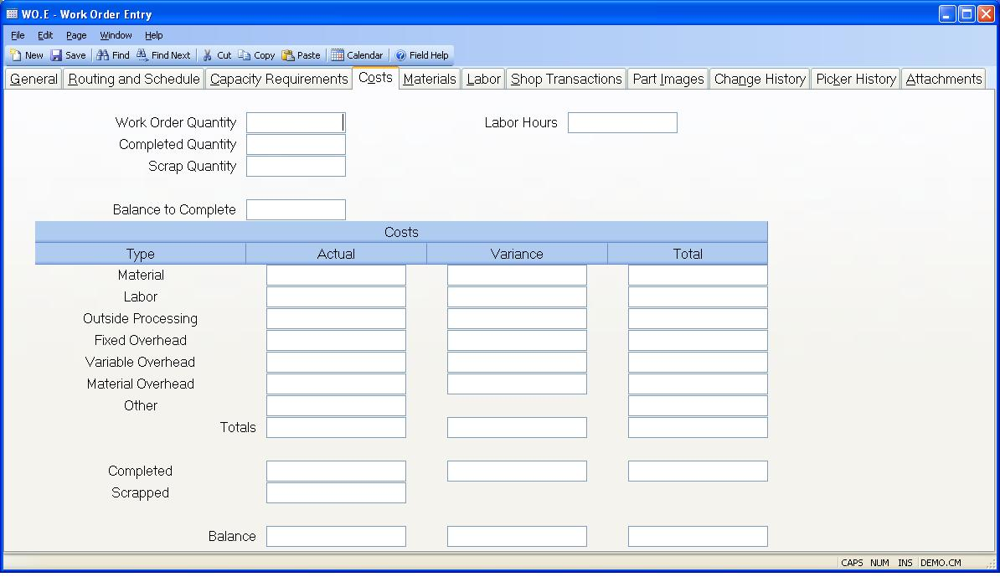

##  Work Order Entry (WO.E)

<PageHeader />

##  Costs

**WO Quantity** The number of items to be produced on the work order when it
is completed.  
  
**Completed Quantity** The number of items completed on the work order.  
  
**Scrap Quantity** The number of items scrapped against the work order.  
  
**Balance** The number of items remaining to be completed on the work order.  
  
**Labor Hours** The total labor hours posted to the work order.  
  
**Material Amount** The total material dollars applied to the work order.  
  
**Labor Amount** The total labor dollars posted to the work order.  
  
**Outside Processing Amount** The total dollars for outside processing charged
to the work order.  
  
**Fixed Overhead Amount** The amount of fixed overhead posted to the work
order.  
  
**Variable Overhead Amount** The amount of variable overhead applied to the
work order.  
  
**Material Overhead Amount** The total material overhead posted to the work
order.  
  
**Completed Amount** The total dollar amount consumed for completions made
from the work order.  
  
**Scrap Amount** The total dollars consumed from final assemblies which were
scrapped from the work order.  
  
**Material Variance** If standard cost is being used then this field will
contain the variance between the actual material and the standard material. A
negative number indicates a favorable variance, a positive number is
unfavorable.  
  
If average cost is being used, a variance may appear if material dollars were
posted to the work order after it was completed. The finalization process will
show any dollars that were not consumed during the completion process as a
variance. In average cost, the unit cost of the assembly is re-calculated when
the work order is completed. All costs, therefore, should be applied to the
work order before this step or the resulting cost may not be accurate.  
  
**Labor Variance** If the standard cost is being used then this field will
contain the variance between the actual labor and the standard labor. A
negative number indicates a favorable variance, a positive number is
unfavorable.  
  
**Outside Process Variance** If the standard cost is being used then this
field will contain the variance between the actual outside processing cost and
the standard. A negative number indicates a favorable variance, a positive
number is unfavorable.  
  
**Fixed Overhead Variance** If the standard cost is being used then this field
will contain the variance between the actual fixed overhead and the standard.
A negative number indicates a favorable variance, a positive number is
unfavorable.  
  
**Variable Overhead Var** If the standard cost is being used then this field
will contain the variance between the actual variable overhead and the
standard. A negative number indicates a favorable variance, a positive number
is unfavorable.  
  
**Material Overhead Var** If the standard cost is being used then this field
will contain the variance between the actual material overhead and the
standard. A negative number indicates a favorable variance, a positive number
is unfavorable.  
  
**Completion Variance** This figure indicates the net difference between the
total dollars completed and scrapped, and the total of all other amounts
applied to the work order. It is posted when the work order is finalized to
remove any remaining dollars from the work in process account.  
  
**Total Material** The total of actual material posted plus variance.  
  
**Total Labor** The total of actual labor posted plus variance.  
  
**Total Outside Processing** The total of actual outside processing posted
plus variance.  
  
**Total Fixed Overhead** The total of actual fixed overhead posted plus
variance.  
  
**Total Variable Overhead** The total of actual variable overhead posted plus
variance.  
  
**Total Material Overhead** The total of actual material overhead posted plus
variance.  
  
**Total Completions** The total of actual completions plus scrap plus
completion variance.  
  
**Total Actual Costs** The total of all actual amounts including material,
labor, outside processing, fixed overhead, variable overhead, material
overhead and other.  
  
**Total Variance** The total of all variance amounts including material,
labor, outside processing, fixed overhead, variable overhead and material
overhead.  
  
**Total Actual and Variance** The total of all actual costs less variances.  
  
**Actual Cost Balance** The total of all actual amounts including material,
labor, outside processing, fixed overhead, variable overhead, material
overhead and other, less completion and scrap amount.  
  
**Variance Balance** The total of all variance amounts including material,
labor, outside processing, fixed overhead, variable overhead and material
overhead less completion variance.  
  
**Net Balance** The net dollar balance currently present in the work order.  
  
**Other Cost Amt** The total of "other amounts" applied to the work order at finalization time as defined in [ COST.E ](../../../../ENG-OVERVIEW/ENG-ENTRY/COST-E/README.md) .   
  
**Other Amount** The total of "other amounts" applied to the work order at finalization time as defined in [ COST.E ](../../../../ENG-OVERVIEW/ENG-ENTRY/COST-E/README.md) .   
  
  
<badge text= "Version 8.10.57" vertical="middle" />

<PageFooter />