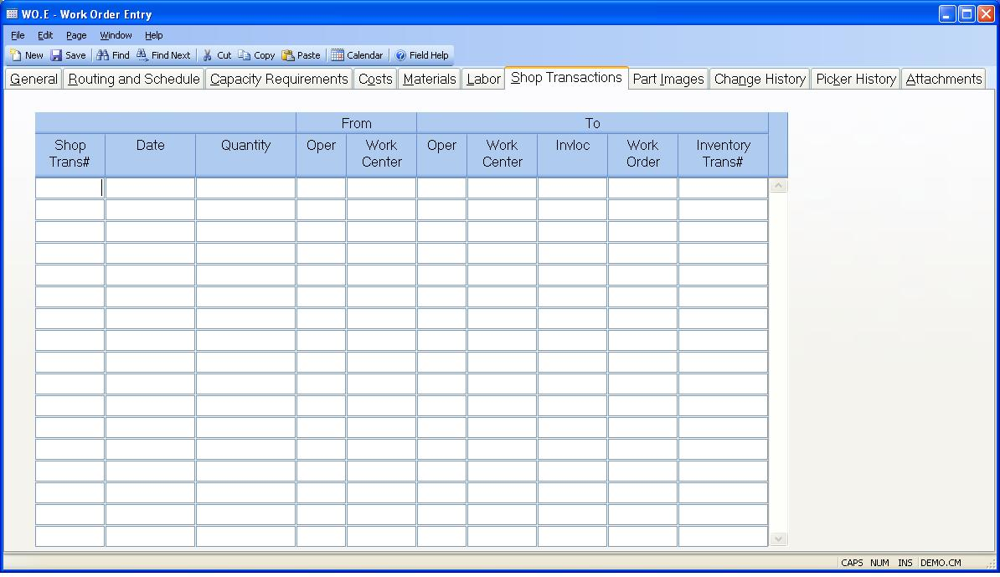

##  Work Order Entry (WO.E)

<PageHeader />

##  Shop Transactions

**Shop Trans#** The shop transaction number.  
  
**Shop Trans Date** The shop transaction date.  
  
**Trans Quantity** The shop transaction quantity.  
  
**From Oper** The operation number from which this work order was moved on
this shop transaction.  
  
**From Work Center** The work center from which this work order was moved on
this shop transaction.  
  
**To Oper** The operation number to which this work order was moved on this
shop transaction.  
  
**To Work Center** The work center to which this work order was moved on this
shop transaction.  
  
**Inv Location** The inventory location to which this work order was moved on
this shop transaction.  
  
**To Work Order** The work order to which this work order was moved on this
shop transaction.  
  
**IT ID** The inventory transaction number. To see detail, use the added help
options.  
  
  
<badge text= "Version 8.10.57" vertical="middle" />

<PageFooter />