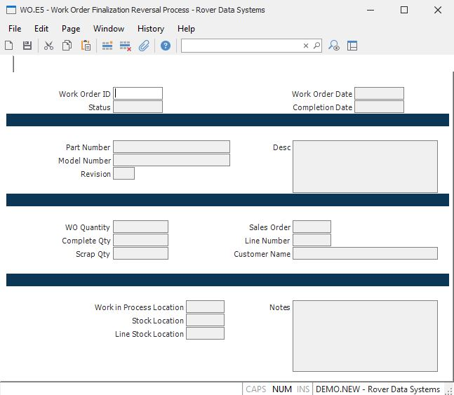

##  Work Order Finalization Reversal Process (WO.E5)

<PageHeader />

##

**Work order ID** Enter the ID of the work order that is to be finalized. The
status of the work order must be closed.  
  
**Status** The status of the work order. When the record is saved, the status
will be changed from "F" for finalized to "C" for closed.  
  
**Work order date** The date on which this work order was created.  
  
**Completion Date** The date on which this work order was completed.  
  
**Part number** The part number of the assembly to be built by this work
order.  
  
**Model Number** The model number of the assembly.  
  
**Revision** The revision level of the assembly.  
  
**Description** The description of the assembly.  
  
**WO Quantity** The quantity to be built on the work order.  
  
**Quantity Completed** The quantity completed on the work order.  
  
**Quantity Scrapped** The quantity scrapped on the work order.  
  
**Sales order number** The sales order number, if any, associated with the
work order.  
  
**Sales order line number** The line item on the sales order associated to the
work order.  
  
**Customer name** The name of the customer who ordered the assembly.  
  
**Work in process location** The work in process location where the work order
was processed.  
  
**Stock location** The inventory location from which materials were pulled.  
  
**Line stock location** The location from which line stock items are were
pulled.  
  
**Notes** Contains any notes applicable to the work order.  
  
  
<badge text= "Version 8.10.57" vertical="middle" />

<PageFooter />