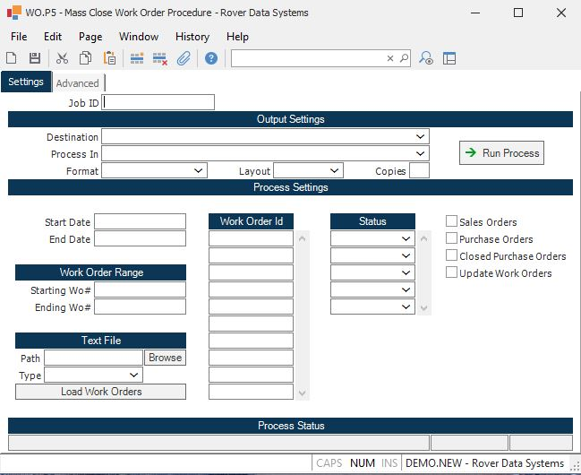

##  Mass Close Work Order Procedure (WO.P5)

<PageHeader />

##

**Job ID** Enter a unique ID if you wish to enter and save the parameters to
this procedure for future use. If you only need to run the procedure and do
not want to save your entry then you may leave this field empty.  
  
**Destination** Select the destination for the output from this procedure.  
  
**Process** Select the method to be used for processing the report. Foreground
is always available and must be used when output is directed to anything other
than a system printer (i.e. printers spooled through the database on the host
computer.) Depending on your setup there may be various batch process queues
available in the list that allow you to submit the job for processing in the
background or at a predefined time such as overnight. A system printer must be
specified when using these queues.  
  
**Format** Select the format for the output. The availability of other formats
depends on what is allowed by each procedure. Possible formats include Text,
Excel, Word, PDF, HTML, Comma delimited and Tab delimited.  
  
**Layout** You may indicate the layout of the printed page by specifying the
appropriate setting in this field. Set the value to Portrait if the page is to
be oriented with the shorter dimension (usually 8.5 inches) at the top or
Landscape if the longer dimension (usually 11 inches) is to be at the top.
Portrait will always be available but Landscape is dependent on the output
destination and may not be available in all cases.  
  
**Copies** Enter the number of copies to be printed.  
  
**Run Process** Click on the button to run the process. This performs the save
function which may also be activated by clicking the save button in the tool
bar or pressing the F9 key or Ctrl+S.  
  
**Last Status Message** Contains the last status message generated by the
program.  
  
**Last Status Date** The date on which the last status message was generated.  
  
**Last Status Time** The time at which the last status message was generated.  
  
**Start Date** If you wish to limit this process to a date range, enter the
starting date in this field. The date used in this procedure is the date the
work order was created.  
  
**End Date** If you wish to limit this process to a date range, enter the
ending date in this field. The date used in this procedure is the date the
work order was created.  
  
**Starting Work Order** If you wish to close a range of work order numbers,
enter the starting work order number in this field. Only open work orders that
fall within this range will be selected. When selecting a range of work
orders, both a starting and ending work order number must be entered.  
  
**Ending Work Order Number** If you wish to close a range of work order
numbers, enter the starting work order number in this field. Only open work
orders that fall within this range will be selected. When selecting a range of
work orders, both a starting and ending work order number must be entered.  
  
**Path** If you wish to load in records from a text file, enter the path for
the file in this field. Once the path and file name have been entered, select
the LOAD WORK ORDER option. The work orders found in this file will be laoded
into the work order field for you so that you can delete and add to the list
before processing this update.  
  
**File Name**  
  
**Load Work Orders** This option should only be selected when updaiting work
orders entered into a text file.  
  
**Work Orders** If you wish to close individual work orders, enter the work
order numbers in this field. Please note that if dollars/material/labor have
been posted to the work order, the material/labor may need to be reversed. If
it is not reversed, the dollars associated with these transactions may be
moved to a variance account when the work order is finalized.  
  
**Status** If you wish to limit this process to work orders with a specific
status, enter the status in this field.  
  
**Delete Sales Order Work Ordrs** Check this box if you wish to close work
orders that were generated for a sales order.  
  
**Purchase Orders** Check this box if you only wish to select work orders that
were created for purchase orders.  
  
**Closed Purchase Orders** Check this box if you only wish to select work
orders that were created for purchase orders that have been closed.  
  
**Update** When the procedure has finished processing, a listing of all work
orders that have been selected will be presented to you. If you wish to review
the list before actually closing the work orders, do not check this box. Check
the box when you are ready to close them.  
  
  
<badge text= "Version 8.10.57" vertical="middle" />

<PageFooter />