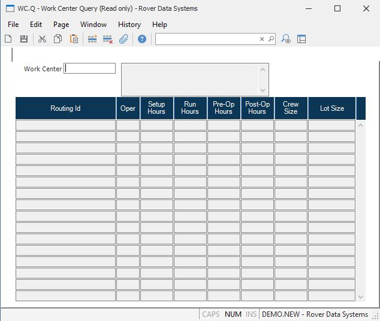

##  Work Center Query (WC.Q)

<PageHeader />

##

**Work Center** Enter the work center you wish to inquire against. All
routings which use this work center will be selected.  
  
**Description** The description contained in the WC file. This is for
reference only and cannot be updated.  
  
**Routing Id** The routing id on which the selected work center appears.  
  
**Operation** The operation for this work center/routing.  
  
**Setup Hours** The setup hours for this wc/routing.  
  
**Run Hours** The run hours for this wc/routing.  
  
**Pre-Operation Hours** The pre-operaton hours for this wc/routing.  
  
**Post Operation Hours** The post operation hours for this wc/routing.  
  
**Crew Size** The crew size for this wc/routing.  
  
**Lot Size** The lot size for this routing.  
  
  
<badge text= "Version 8.10.57" vertical="middle" />

<PageFooter />