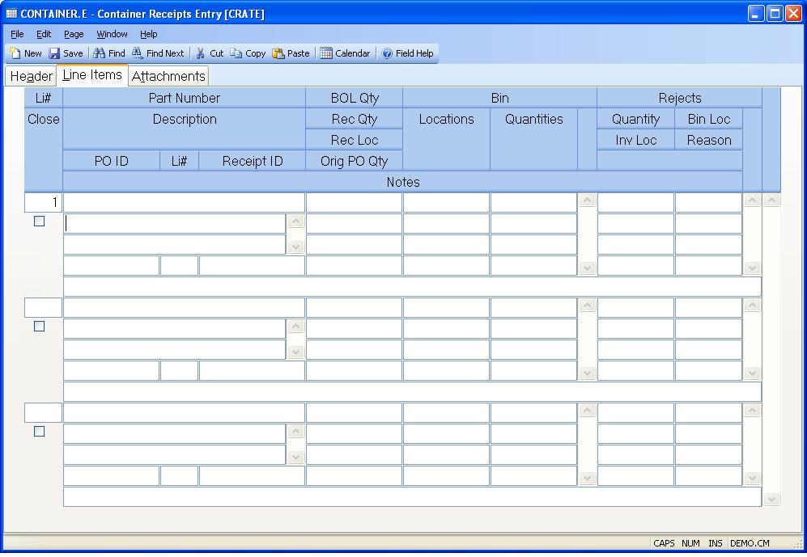

##  Container Receipts Entry (CONTAINER.E)

<PageHeader />

##  Line Items

**Li#** Enter the line item number to be used in identifying the associated
item on the container. The next sequential number will be automatically
assigned if the prior line item is numeric.  
  
**Part Number** Enter the part number associated with this container line
item. For a non-inventory or expense item, leave this field blank.  
  
**Li Desc** Enter the description of the item being purchased. This
description is defaulted from the PARTS file when a part number is entered.  
  
**PO ID** This is the PO number associated with this container. A PO number
and PO line# can be entered, and the part number and quantity will be loaded
for you. If a PO number does not exist for the part number and vendor, then a
PO will be automatically created.  
  
**PO LI** Enter the line number for the PO to have the part number and
quantity associated with that line loaded for you.  
  
**Receipts ID** This is the receipt id for the associated container line item.
It is shown for reference only.  
  
**BOL Qty** This is the quantity on the bill of lading for this PO line item.
It is initially defaulted to the open PO line item quantity but can be changed
if it differs from the BOL document.  
  
**Receipt Qty** Enter the receipt quantity for this container line item. When
the status is set to "C" for this container, then the receipt record will be
created for this PO line item and the inventory transaction will take place
for the quantity entered. If no quantity is entered, then no receipt record
will be created, unless a reject quantity is entered for this line item.  
  
**Rec Loc** The location into which the system will record the receipt of the
materials. The on hand balance in this location for the part will increase by
the amount received. This is defaulted from the PO line item, but can be
changed if necessary.  
  
**Orig Open PO Qty** This is the open PO line item quantity at the time this
line item was originally entered on the container. The "open" quantity is
defined as quantity not received and not on another container.  
  
**Bin** Enter the bin number(s) into which this material is being placed.
Entry will only be allowed if the inventory location is set to bin control.  
  
**Bin Qty** Enter the quantity for the associated bin number(s) into which
this material is being placed. Entry will only be allowed if the inventory
location is set to bin control. The total bin quantities must equal the
receipt quantity entered.  
  
**Reject Qty** Enter the reject quantity for this line item. Do not include
the reject quantity as part of the quantity received. The quantity rejected
will be moved to the associated reject location when the receipt is confirmed.
A DMR record will be created for the reject. Multiple reject quantities and
locations can be entered for the line item if they have different reason codes
or locations.  
  
**Reject Loc** Enter the location into which the system will move the reject
quantity. The on hand balance in this location for the part will increase by
the amount rejected. If it is a bin controlled location, then bin location
must be entered.  
  
**Reject Bin** Enter the bin location for the associated reject quantity.
Entry will only be allowed if the reject inventory location is set to bin
control.  
  
**Reject Rsn** Enter the reason code associated with this reject quantity. It must be a valid exception code on [ DMR.CONTROL ](../../DMR-CONTROL/README.md) . It will be recorded on the DMR record that is stored for this reject. A list of valid exception codes is available using the help.   
  
**Close LI** If the quantity received is less than the quantity ordered and you wish to close the line item short, check this box. The order/scheduled quantity will be adjusted to match the receipt quantity. If, for example, the order quantity is 100 and you receive in 98, the order quantity will be changed to 98. If this receipt is reversed via [ receipts.e3 ](receipts-e3/README.md) , the order quantity will not revert back to 100. A check mark will default into this box for you, if the "do not backorder po" field is checked in the [ po.control ](../../../../../../../../../../rover/AP-OVERVIEW/AP-ENTRY/AP-E/AP-E-1/CURRENCY-CONTROL/PO-E/PO-E-1/po-control) procedure. If this box is not checked the line item will be backordered.   
  
**Notes** Enter any notes pertaining to this container line item.  
  
  
<badge text= "Version 8.10.57" vertical="middle" />

<PageFooter />