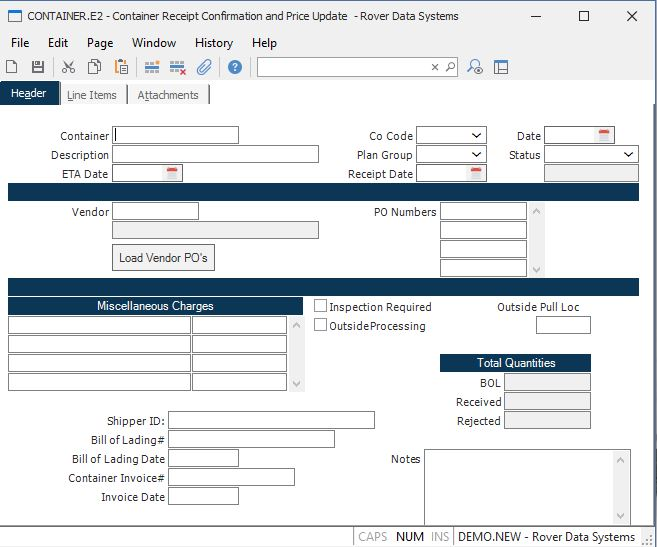

##  Container Receipt Confirmation and Price Update (CONTAINER.E2)

<PageHeader />

##  Header

**CONTAINER.ID** Enter the container number you wish to add or update, or
leave blank to have the system assign the next sequential container ID.  
  
**Description** Enter a description for this container.  
  
**ETA Date** Enter the estimated date of arrival for the container.  
  
**Co Code** Enter the company associated with this container receipt. The
company code must be pre-defined in the CO.CONTROL procedure. If only one
company code exists it will automatically be inserted into this procedure for
you.  
  
**Plan Group** Enter the planning group associated with this container receipt. This field will be verified against the planning group(s) entered in [ PLAN.CONTROL ](../../../../MFG-OVERVIEW/MFG-ENTRY/PLAN-CONTROL/README.md) . If you have only one planning group this field will be defaulted and skipped. This field will be used to default the inventory location in the line items if purchase orders are created.   
  
**Rec Date** The date the container was actually received. This will be
assigned by the system when the status is changed to C (confirmed receipt). It
can be updated manually, if necessary.  
  
**Date** The date the container was initially entered into the system. This
will be defaulted for new container receipts.  
  
**Status** The container receipt status. For new containers, this will default
to "N". When the container is physically received this should be changed to
"R" and the data should be verified for accuracy with the actual container.
When data has been verified, the status should be changed to "C", which will
add PO receipt records and cause inventory transactions to occur. After the
receipts posting process, the AP records are created and the status will be
"P".  
  
**Vendor** Enter the vendor number associated with this container receipt.  
  
**Vendor Name** The vendor name for reference only.  
  
**PO Number** Enter one or more PO numbers that will be included in this
container. If you do not know the PO numbers, you can load all open PO's for
the vendor using the button below, or lookup individual PO's using the lookups
for this prompt.  
  
**Load Vendor PO's** Press this button to load all the open PO's for the
vendor instead of entering the PO numbers manually.  
  
**Misc Desc** Enter the description of the associated miscellaneous amount. These descriptions will be initially loaded from the defaults entered in [ PO.CONTROL ](../../PO-CONTROL/README.md) , but can be changed, added, or deleted.   
  
**Misc Amt** Enter the miscellaneous amount associated with the description. At the time of actual receipt the sum of these costs will be spread across all the line items according to the parameters specified in [ PO.CONTROL ](../../PO-CONTROL/README.md) and will be added to the unit price on a per item basis to calculate the new average inventory cost. Entry of this field is not allowed if using standard cost.   
  
**Shipper Nbr** Enter the Shipper ID/Transit number associated with this
container.  
  
**Bill of Lading** Enter the Bill of Lading number associated with this
container.  
  
**BOL Date** Enter the Bill of Lading date associated with this container.  
  
**Invoice** Enter the container invoice number.  
  
**Inv Date** Enter the container invoice date.  
  
**Insp Reqd** Check this box if the container requires inspection.  
  
**Outside Process** Check here if this container contains outside processing
items. These items, when received, will create inventory and accounting
transactions to pull the raw material and cost from the outside processing
location and move the finished item to the receipt location. The raw material
part number is determined from the BOM associated with each line item part
number.  
  
**Out Pull Loc** For outside processing containers, enter the inventory
location that the raw material being consumed will be pulled from.  
  
**Tot Bill of Lading Qty** The total bill of lading quantities for all line
items on the container. Shown for information only.  
  
**Tot Recvd Qty** The total quantity received for all line items on the
container. Shown for information only.  
  
**Reject Qty** The total quantity rejected for all line items on the
container. Shown for information only.  
  
**Reject Notes** Enter any notes associated with the container.  
  
**Status Lit** The status of the container receipt.  
  
  
<badge text= "Version 8.10.57" vertical="middle" />

<PageFooter />