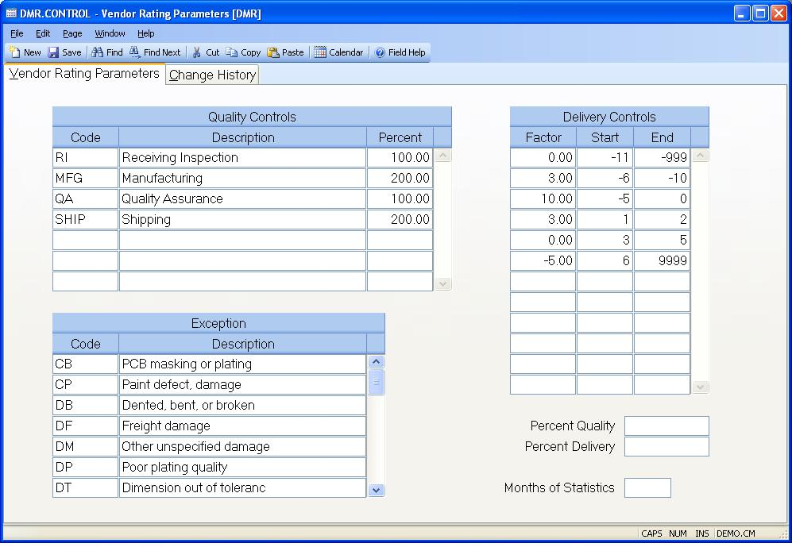

##  Vendor Rating Parameters (DMR.CONTROL)

<PageHeader />

##  Vendor Rating Parameters

**Control ID** "DMR" will be automatically entered as the key to this record
in the CONTROL file. This record contains the vendor rating parameters to be
used with the DMR records and vendor statistics.  
  
**Weighting Code** Enter the codes that identify the weighting factors that may be used in the [ DMR.E ](../../DMR-E/README.md) procedure. These codes represent the point or step in the production process (receiving, assembly, quality) at which the problem is found. The earlier the problem is found, the lower the percent. This is because the problem is more obvious and less resources (time/labor/dollars) have been spent detecting the problem. For example, a problem that is found during the receiving/inspection step might use a percent of 100.00. However, problems not detected until reported by the end users or customers, might use a percent of 400.00.   
  
**Weighting Description** Enter a description of the associated weighting
code.  
  
**Weighting Percent** Enter the percentage to be applied to all failures
reported against the associated weighting code.  
  
**Factor** Enter the factor to be applied to receipts that fall within the
days early or late defined in the associated fields. The largest factor in the
list is used as the optimum in the calculation of on- time delivery
performance, therefore the period that you consider as on-time or optimum
should be the largest number. For example,  
  
Factor From To  
-2 -16   
2 -11 -15  
6 -6 -10  
10 -5 0  
4 1 5  
0 6 10  
-4   
  
**Period Start** Enter the start of the period for the associated factor.
Negative numbers indicate days early, positive indicate days late.  
  
**Period End** Enter the end of the period for the associated factor. Negative
numbers indicate days early, positive indicate days late.  
  
**Exception Code** Enter the failure codes to be used in the [ DMR.E ](../../DMR-E/README.md) procedure. These codes define the type of failure that caused the rejection of the items.   
  
**Exception Description** Enter a description of the failure defined by the
associated code.  
  
**Percent Quality** Enter the percentage to be applied to the quality rating
in determining the total vendor rating. This is used as the default when it
has not been defined in the vendor file. For example, you may decide that
quality issues should be weighted at 70% while delivery is set at 30%.  
  
**Percent Delivery** Enter the percentage to be applied to the delivery rating
in determining the total vendor rating. This is used as the default when it
has not been defined in the vendor file. For example, you may decide that
quality issues should be weighted at 70% while delivery is set at 30%.  
  
**Months of Statistics** Enter the number of months of vendor rating statistics to maintain in the VendorRating file. During the [ VENDOR.P2 ](../../../../AP-OVERVIEW/AP-PROCESS/VENDOR-P2/README.md) process, all months in excess of this number will be dropped. If this field is left blank, 12 months are maintained.   
  
  
<badge text= "Version 8.10.57" vertical="middle" />

<PageFooter />