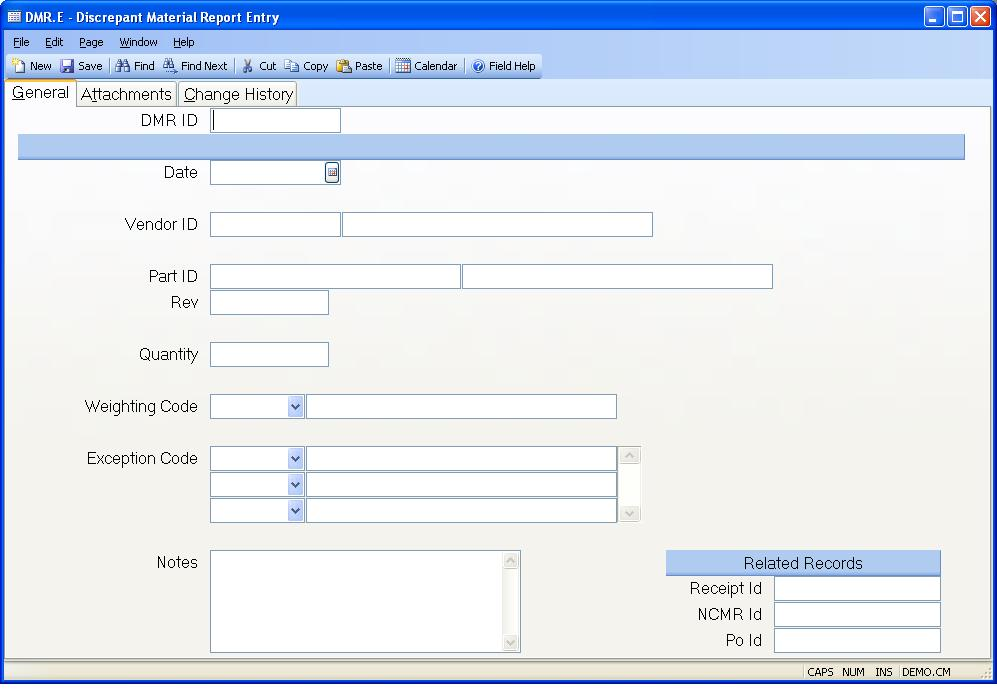

##  Discrepant Material Report Entry (DMR.E)

<PageHeader />

##  General

**DMR.ID** Enter the number of the DMR to be entered or modified. If you leave
the field blank then the ID will be assigned automatically when the record is
filed.  
  
**Date** Enter the date on which the DMR was initiated. The current date is
defaulted.  
  
**Vendor.ID** Enter the vendor responsible for the items rejected on the DMR.  
  
**Vendor Name** Contains the name of the vendor.  
  
**Part.ID** Enter the number of the part that was rejected.  
  
**Part Description** Contains the description of the part number.  
  
**Part Rev** Enter the revision of the part in this field.  
  
**Quantity** Enter the number of items that were rejected.  
  
**Weighting Code** Enter the weighting code to be used in factoring the
rejection in the vendor rating calculation.  
  
**Weighting Name** Contains the name associated with the weighting code
selected.  
  
**Exception Code** Enter the exception codes that apply to the rejected parts.
These codes specify what was wrong with the items.  
  
**Exception Name** Contains the name associated with the exception codes
entered.  
  
**Notes** Enter any notes that may be helpful in explaining the reason for the
rejection.  
  
**Receipt Id** If applicable, enter the purchase order receipt that this DMR record was created for. There is an option in [ RECEIPTS.E2 ](../../RECEIPTS-E2/README.md) to create the DMR records for the material being returned to the vendor.   
  
**Ncmr Id** If applicable, enter the NCMR Id that is associated to this DMR
record.  
  
**Po Id** If applicable, enter the purchase order receipt that this DMR record
was created for.  
  
  
<badge text= "Version 8.10.57" vertical="middle" />

<PageFooter />