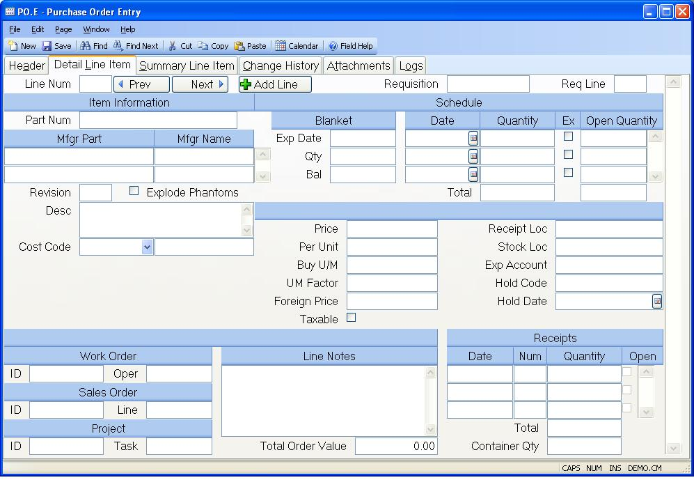

##  Purchase Order Entry (PO.E)

<PageHeader />

##  Detail Line Item

**Line Num** Enter the line item number to be used in identifying the
associated item on the purchase order. To assign the next sequential line item
number, enter "N".  
  
**Requisition** If you want to load an item from a purchase requisition on
this line enter the requisition number in this field.  
  
**Req Line** If you entered a requisition number in the previous prompt, then
enter the line item number on the requisition you want to load.  
  
**Part Num** If you are purchasing a part for stock enter the part number
here. If you are entering a non- inventory or expense item, leave this field
blank.  
  
**Vend Part No** Enter the manufacturer part numbers that may be used to
satisfy the requirement for the item. You may use the help option to bring up
a list of all approved manufacturers for selection from the Parts Master.  
  
**Mfgr Name** Enter the name of the manufacturer for the associated part.  
  
**Revision** Enter the revision level of the item being purchased if
applicable.  
  
**Explode Phantom** Check this box if you want to receive the components of phantom assemblies when receiving a line item that is a phantom part. If unchecked, then the phantom assembly will be received as a normal part number. This setting will default from the [ PO.CONTROL ](PO-CONTROL/README.md) entry but can be changed.   
  
**Desc** Enter the description of the item being purchased. This description
is defaulted from the PARTS file when a part number is entered.  
  
**Blanket Exp Date** If this PO item is part of a blanket agreement, enter the
blanket expiration date here.  
  
**Blanket Quantity** If this PO item has a blanket agreement, enter the total
item quantity that has been authorized on the blanket agreement.  
  
**Blanket Balance** If a blanket qty has been entered, this will show the
balance left on the blanket which is the sum of the schedule quantities
subtracted from the blanket quantity.  
  
**Sched Date** Enter the dates on which the materials are to be received.
Multiple entries are permitted.  
  
**Schedule Quantity** Enter the quantity scheduled for the associated date.  
  
**Expedite** Checkthis box if the associated schedule date and quantity are
being expedited, and early delivery is acceptable. When this box is checked
then the vendor will not be penalized for early delivery in the vendor rating
system.  
  
**Open Quantity** Contains the remaining open balance against the associated
schedule date.  
  
**Tot Sch Qty** Contains the sum of the scheduled quantities.  
  
**Tot Open Sch Qty** Contains the sum of the open schedule quantities.  
  
**Price** Enter the unit price to be paid for the item being purchased.  
  
**Per Unit** Enter the price per quantity associated with the unit price
entered. For example, if the vendor quoted a price of $9.85 per 100 feet of
wire you would enter 9.85 in the unit price field and 100 in the price per
field. When a receipt is made against the item as number of feet received, the
system will divide the unit price by the price per to determine the actual
unit cost. In the case of our example the calculated unit price would be
9.85/100 = .0985 per foot.  
  
**Buy U/M** Enter the two character unit of measure code that defines the way
in which these parts will be shipped from the vendor. If this item is set up
as a lot charged item then enter the letters "LC" in this field. When this is
done the system will assume that the unit price is what will be charged for
each receipt made against this purchase order regardless of what quantity is
received. For example, if you enter a unit price of $100.00, a schedule
quantity of 500 and receive 515 pieces against the order, the amount of the
receipt will be $100.00. Each additional receipt made against the purchase
order will, also, carry an amount of $100.00. For example, if a second receipt
is made for only 2 units, the total receipt amount will be $100.00.  
  
**UM Factor** Enter the factor used to convert the purchased item from the
vendor's unit of measure into the internal unit of measure. For example, if we
were buying eggs from the vendor in dozens, but stocked eggs as individual
units, we would enter 12 into this field.  
  
**Foreign Price** If a currency code and exchange rate are present on the
header, then the foreign price will be displayed here. The foreign price can
also be entered or changed here, and the price will be recalculated based on
the exchange rate.  
  
**Taxable** Check here if the items on this line are subject to sales tax.  
  
**Receipt Loc** Enter the receiving location into which materials on this line
item will be received. This only applies to items with a part number assigned.  
  
**Stock Loc** Enter the inventory location into which this item will be moved
after receiving inspection. This only applies to items with a part number
assigned.  
  
**Exp Account** If the associated item being purchased is not an inventory
item then the general ledger account number that it is to be posted against
must be entered in this field.  
  
**Hold Code** Enter a user defined hold code to place the line item on hold.
The receipts will not be allowed if this code is activated for this line
item..  
  
**Li Hold Date** Enter the date on which this line item was placed on hold.  
  
**Work Order Number** If you entered a work in process location for the
receiving inspection or stocking location then you must enter a work order
number. The presence of a work order number denotes one of two conditions
regarding the purchase order line item depending upon how the receiving
inspection and stocking locations in the previous prompts are defined. If only
the stocking location is defined as a work-in-process location then you are
merely creating a tie between the purchase order and the work order so that
the receipts traveler will show that the materials are to be routed directly
from receiving inspection to the work order. If the receiving inspection
location is set to a work-in-process location then the stocking location must
also be set to the same location. In this case the item is handled as outside
processing and the materials and costs will be applied directly to the work
order. The way in which the dollars are applied to the work order depends upon
the relationship of the purchase order part number to th  
e final assembly number on the work order. If the part number on the purchase
order is the same as the final assembly number on the work order then the
value of the item received is assigned as outside processing cost to the work
order. Otherwise it is treated as material cost.  
  
**Work Order Oper** Enter the work order operation these parts will be received into. If an operation number is present, the quantity purchased and received will be posted to the work order record and can be viewed in [ WO.E ](WO-E/README.md) . If the "track qtys" field is checked in the [ PO.CONTROL ](PO-CONTROL/README.md) procedure, an entry must be made into this field for outside processing operations/work centers.   
  
There is a lookup from this field to display the outside processing
operations/work centers for the work order.  
  
**Sales Order Number** This field contains the sales order that caused this
purchase order. This is used mainly for drop ship activity.  
  
**Sales Order Line** This field identifies which line item of the sales order
is related to this purchase order line item.  
  
**Project Number** If this PO line item is for a project, enter the project
number. This will cause the costs associated with this PO line item to be
added into the project costs.  
  
**Project Task** Enter the task ID associated with the project for this PO
line item. A lookup is provided to show all the tasks for the project.  
  
**Line Notes** Enter any notes applicable to this line item. These notes will
be printed on the purchase order form. If there are predefined notes
available, you may load them by selecting the appropriate option from the help
menu for this prompt.  
  
**Receipts Date** Contains the dates on which receipts for this item have been
posted. The information may not be changed.  
  
**Receipts Num** Contains the receipt number associated with the date and
quantity. The information may not be changed.  
  
**Receipts Quantity** Contains the quantity received on the associated date.
The information may not be changed.  
  
**Receipts Open** This box is checked if the associated receipt has not been
approved.  
  
**Part Image** If a picture of the part has been loaded, it will display here.  
  
**Total Receipts** Contains the total number of items received.  
  
**Container Qty** This is the total container quantity that is in transit for
this PO line item. When the container is physically received, this will no
longer show a quantity.  
  
**Total Order Value** This field displays the value for the entire purchase
order.  
  
**Prev** Click this button to view the previous line item.  
  
**Next** Click this button to view the next line item.  
  
**Add Line** Click this button to add a new line item.  
  
  
<badge text= "Version 8.10.57" vertical="middle" />

<PageFooter />