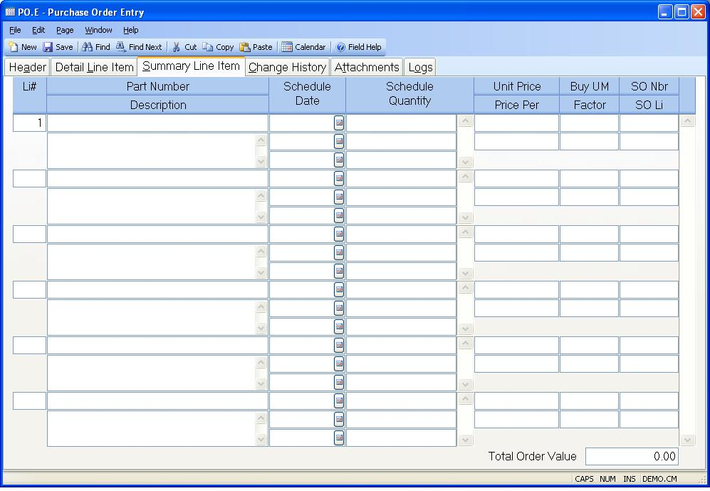

##  Purchase Order Entry (PO.E)

<PageHeader />

##  Summary Line Item

**Li#** Enter the line item number to be used in identifying the associated
item on the purchase order. The next sequential number will be automatically
assigned if the prior line item is numeric.  
  
**Part Number** If you are purchasing a part for stock enter the part number
here. If you are entering a non-inventory or expense item leave this field
blank.  
  
**Description** Enter the description of the item being purchased. This
description is defaulted from the PARTS file when a part number is entered.  
  
**Schedule Date** Enter the dates on which the materials are to be received.
Multiple entries are permitted.  
  
**Sch Qty** Enter the quantity scheduled for the associated date.  
  
**Unit Price** Enter the unit price to be paid for the item being purchased.  
  
**Price Per** Enter the price per quantity associated with the unit price
entered. For example, if the vendor quoted a price of $9.85 per 100 feet of
wire you would enter 9.85 in the unit price field and 100 in the price per
field. When a receipt is made against the item as number of feet received, the
system will divide the unit price by the price per to determine the actual
unit cost. In the case of our example the calculated unit price would be
9.85/100 = .0985 per foot.  
  
**Buy UM** Enter the two character unit of measure code that defines the way
in which these parts will be shipped from the vendor. If this item is set up
as a lot charged item then enter the letters "LC" in this field. When this is
done the system will assume that the entire extended price is what will be
charged regardless of the quantity actually received. For example, if the unit
price is set to $1.00 with a price per factor of 1, and the scheduled quantity
is 100 then the extended price is $100.00. If only 98 items are received then
the unit price will be recalculated on the receipt to be $100 / 98 or $1.0204.
The same logic is applied to excess receipt quantities.  
  
**UM Factor** Enter the factor used to convert the purchased item from the
vendor's unit of measure into the internal unit of measure. For example, if we
were buying eggs from the vendor in dozens, but stocked eggs as individual
units, we would enter 12 into this field.  
  
**SO Nbr** This field contains the sales order that caused this purchase
order. This is used mainly for drop ship activity.  
  
**SO Line** This field identifies which line item of the sales order is
related to this purchase order line item.  
  
**Total Order Value** This field displays the value for the entire purchase
order.  
  
  
<badge text= "Version 8.10.57" vertical="middle" />

<PageFooter />