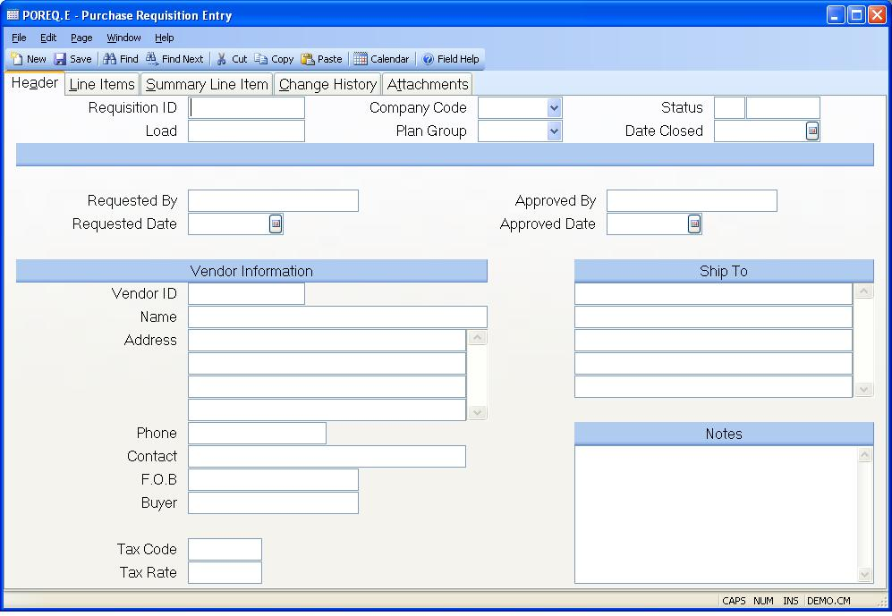

##  Purchase Requisition Entry (POREQ.E)

<PageHeader />

##  Header

**Requisition ID** You may assign the requisition ID manually or leave it
blank and allow the system to assign the next sequential number. To see an
existing requisition, enter the requisition number.  
  
**Load** If you wish to create a new requisition from an existing record,
enter the existing POREQ number here. This function can only be used with new
records.  
  
**Co Code** Enter the company code this purchase order requisition should be
issued to. The company code must be predefined in the CO.CONTROL procedure. If
only one company code exists, it will automatically be inserted into this
prompt.  
  
**Plan Group** Enter the planning group to which the requisition and
subsequent pruchase order are to be associated.  
  
**Status** This field contains the current status of the requisition. The
following options are available: O - Open C - Closed. When a new requisition
is entered the status will be set to "O". When all of the line items have been
applied to a purchase order the system will set the status to "C"
automatically. You may also set the status to "C" manually to close an order
that will not be filled.  
  
**Status Text** Contains the text Open or closed depending on the entry in the
status field.  
  
**Date Closed** Enter the date on which this requisition was closed. This date
will be set by the system when all quantities have been issued to a purchase
order. The only time you should need to set this date is when you manually
close the requisition.  
  
**Requested By** Enter the name of the person requesting the purchase.  
  
**Requested Date** Enter the date on which the requisition was initiated. The
current date will be loaded as the default on new records.  
  
**Approved By** Enter the name of the person granting approval of this requisition. If approval userids and dollar limits exist in [ PO.CONTROL ](../../PO-CONTROL/README.md) , then they will be checked when this entry is made.   
  
**Approved Date** Enter the date on which approval was granted for the
requisition.  
  
**Vendor ID** If you want the items on the requisition to be procured from a
particular vendor you may enter the vendor number in this field. If the
supplier does not currently have a number you can still specify the vendor's
name in the vendor name field.  
  
**Vendor Name** Enter the name of the vendor from which the items are to be
procured.  
  
**Vendor Address** Enter the address of the vendor.  
  
**Vendor Phone** Enter the telephone number of the vendor to be used for
supplying the items.  
  
**Vendor Contact** Enter the name of the person to be contacted at the vendor
regarding the order.  
  
**Fob** Enter the "Free-On-Board" location associated with this purchase
order.  
  
**Buyer** Enter the name of the buyer who will be purchasing for this
requisition. This will be defaulted from the vendor if the vendor has a buyer
associated with it. There is a help lookup to display buyers.  
  
**Ship To** Enter name and address to which the items on this requisition are
to be shipped.  
  
**Header Notes** Enter any notes applicable to the requisition.  
  
**Tax Code** Enter the sales tax code to be used for this order. This code is
originally defaulted from the vendor file. It may be changed manually, as
required.  
  
**Tax Rate** This is the tax rate associated with the sales tax code. It will
be defaulted from the PTAX file based on the tax code entered, but may be
changed manually if needed.  
  
  
<badge text= "Version 8.10.57" vertical="middle" />

<PageFooter />