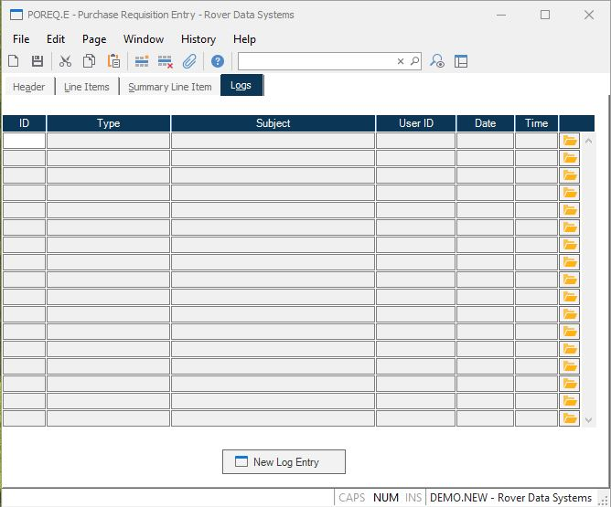

##  Purchase Requisition Entry (POREQ.E)

<PageHeader />

##  Change History

**Change Date** The date the purchase order requisition was changed. This is only stored if one of two conditions are met: 1) The parameters are set in [ CHANGE.CONTROL ](../../../../ACE-OVERVIEW/ACE-ENTRY/CHANGE-CONTROL/README.md) and a change was made that met the criteria for storing change history or 2) Change notes were entered by the user. This field is system controlled.   
  
**Change Time** The time the purchase order requisition was changed. This is
system controlled.  
  
**Changed By** The User ID of the person who changed the purchase order
requisition. This is system controlled.  
  
**Approved User** Enter the name or initials of the person who approved the
purchase order requisition change.  
  
**Change Text** This is change text that is generated by the system based on the settings in [ CHANGE.CONTROL ](../../../../ACE-OVERVIEW/ACE-ENTRY/CHANGE-CONTROL/README.md) defining which fields trigger a change. Changes to those fields will be noted here. This text will also be included in purchase order requisition change notices sent by email.   
  
**Change Notes** Enter any notes associated with changes made on this date and
time. These notes will also be included in purchase order change requisition
notices sent by email.  
  
  
<badge text= "Version 8.10.57" vertical="middle" />

<PageFooter />