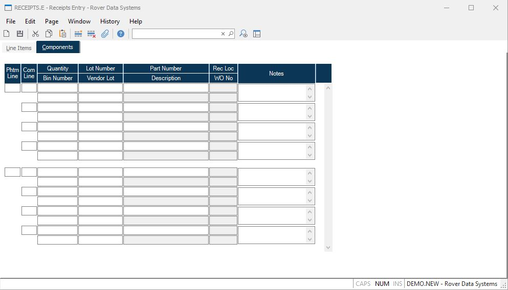

##  Receipts Entry (RECEIPTS.E)

<PageHeader />

##  Components

**Phantom Li** The phantom line item. It must match a line item on the receipt
for a phantom part with quantity received.  
  
**Comp Li** The component line number.  
  
**Comp Qty** The component quantity received. This will automatically be
generated for phantom components using the bill of material, but can be
changed if necessary.  
  
**Comp Bin** Enter the bin number into which this material is being placed.
Entry will only be allowed if the inventory location is set to bin control.  
  
**Comp Lot** If the item being received is lot controlled then you may assign
the lot number in this field. If a lot number is not assigned and the part is
lot controlled then the system will assign a number automatically when the
record is filed.  
  
**Comp Vend Lot** If the vendor has specified a lot number for the items
received you may record the vendor lot number in this field.  
  
**Comp Part** Contains the component part number of the item being received.
This will automatically be generated using the bill of material for the
phantom part, but can be changed if necessary.  
  
**Description**  
  
**Comp Invloc** The location into which the system will record the receipt of
the materials. The on hand balance in this location for the part will increase
by the amount received. This is derived from the parent phantom part and
cannot be changed.  
  
**Rec WO** Contains the work order number the part will be received into if
the receiving location is a work in process location, or the work order into
which the parts are to be moved after being received. This is derived from the
parent phantom part and cannot be changed.  
  
**Comp Notes** Enter any notes pertaining to this component part receipt.  
  
  
<badge text= "Version 8.10.57" vertical="middle" />

<PageFooter />