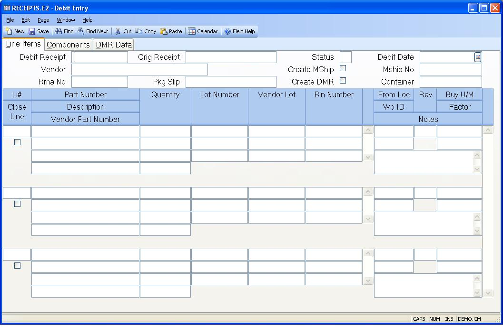

##  Debit Entry (RECEIPTS.E2)

<PageHeader />

##  Line Items

**Receipt ID** Contains the system assigned record ID. The ID consists of the
purchase order number, followed by a dash (-) and the letter "D", which is
followed by a sequential number maintained in the purchase order record. If
you are creating a new debit receipt you should leave this prompt blank. If
you want to make a change to an existing debit receipt you should enter the
full debit receipt ID.  
  
**Orig Receipt** Enter the ID of the original receipt against which you are
creating a debit. This ID will consist of the purchase order number, followed
by a dash (-), followed by a sequential number.  
  
**Status** The status field contains the current status of the debit receipt
record. It will display one of the following codes:  
N - New - no inventory has been moved. MShip has not been created.  
R - Received or Released - An MSHIP will be created if "Create Mship" has been
checked, otherwise debit quantities will be moved from inventory.  
S - Shipped - System controlled status only used with [ MSHIP.E ](../../../../MRK-OVERVIEW/MRK-ENTRY/MSHIP-E/README.md) and indicates that the parts have been shipped (moved from inventory).   
P - The receipt has been posted and the accounts payable record has been
created.  
  
If the status code is not already set to "P" then the user may enter the code "N" for new, or "R" for released. The "N" status sets the receipt as a new receipt and does not create any inventory transactions. If this debit is to be shipped through [ MSHIP.E ](../../../../MRK-OVERVIEW/MRK-ENTRY/MSHIP-E/README.md) , the "R" status will create the MSHIP record but not move inventory, otherwise the "R" status will confirm the receipt by creating inventory transactions and will then be posted the next time [ RECEIPTS.P1 ](../../../PUR-PROCESS/RECEIPTS-P1/README.md) procedure is run. Once the status has been set to "R" and the record has been filed, you may not reset the status to "N" or make any changes to the receipt. However, the debit record can be deleted at status "N" or status "R" (only with MSHIP checked).   
  
**Debit Date** Enter the date on which this debit actually took place.  
  
**Vendor** Contains the name of the vendor associated with the purchase order.  
  
**Ship Debit?** Check here if you want the debit receipt to create a miscellaneous shipment when the debit record is released (status "R"). If so, the inventory movement will be processed when the MSHIP record is shipped (status is changed to "S") through [ MSHIP.E ](../../../../MRK-OVERVIEW/MRK-ENTRY/MSHIP-E/README.md) .   
  
**Mship Id** This is the miscellaneous shipment number created as a result of
releasing this debit receipt. This is shown for information only and is
created only if the "Create Mship" has be checked.  
  
**Vendor Rma No** Enter the vendor's rma number here.  
  
**Pack Slip** Contains the packing slip number associated with the original
receipt.  
  
**Container** This is the container number associated with this receipt if
this receipt record was created from the container receipt process. It is for
information only and cannot be changed.  
  
**Item** Enter the purchase order line item number of the item you are
debiting. This data is loaded from the original receipt.  
  
**Part** Contains the internal part number of the item being received.  
  
**Desc** Contains the description of the part number.  
  
**Vend part** Contains the number used by the vendor to identify the material.  
  
**Receipt Qty** Enter the quantity to be debited. If this item is either lot
or bin controlled, enter the quantity associated with each lot or bin. If it
is neither then enter the entire debit quantity for this line.  
  
**Lot No** Contains the lot number assigned to the receipt line item. It may
not be changed.  
  
**Vendor Lot No** Contains the vendor's lot number for the line item.  
  
**Bin Number** Enter the bin number from which the material is being returned.
The bin number defaults to the bin entered during the original receipt.  
  
**Li Qty** This is the total debit quantity entered for the line item. It is
the sum of the lot quantities, if there are multiple entries. It is for
display only and cannot be changed.  
  
**From Loc** Enter the inventory location from which the debit items were
removed. This should be the location at which the materials currently reside.
This location is used as the FROM location for the inventory transaction. If
the original receipt was for an item that posted outside processing directly
to a work order then you may not change the location. If it was a material
charge then you can.  
  
**WO.ID** If the original receipt for this item posted the value directly to
outside processing cost or you are removing material costs directly from a
work order then the work order number must be entered.  
  
**Rev** Contains the revision level of the material.  
  
**Buy U/M** The unit of measure used by the vendor when the parts were
shipped.  
  
**Buy Factor** The factor by which the quantity is multiplied to obtain the
quantity as expressed in the internal unit of measure. For example, if the
vendor sent eggs by the dozen, but eggs are maintained in inventory
individually then the factor would be 12. You must enter the quantity to be
returned in the vendor's unit of measure.  
  
**Notes** Enter any applicable notes for this line item.  
  
**Close Li** Check this box if you do not wish to re-open the purchase order
line item by the quantity being returned to the vendor against this debit
memo. If this box is checked, the schedule quantity on the purchase order will
be reduced by the quantity being returned and pobook records will be created
to show the change.  
  
**Create Dmr** Check this box if you wish to create DMR (discrepant material) records for the material being returned to the vendor. If required, enter the weighting and exception codes that should be applied to these DMR records on the DMR DATA tab. The DMR records will be created when the debit receipt is posted via [ RECEIPTS.P1 ](../../../PUR-PROCESS/RECEIPTS-P1/README.md) .   
  
  
<badge text= "Version 8.10.57" vertical="middle" />

<PageFooter />