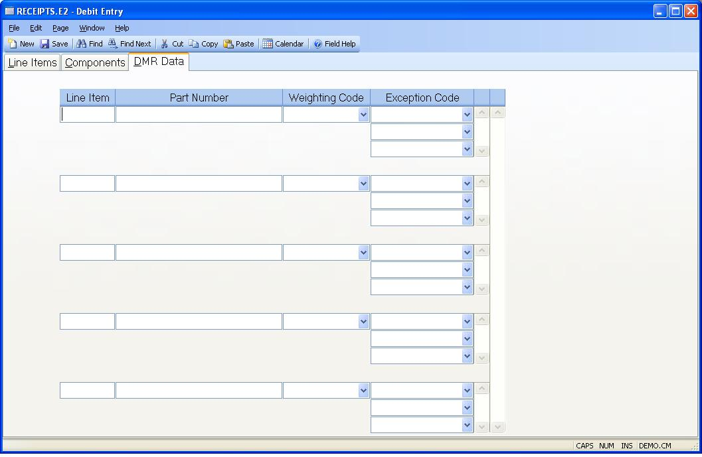

##  Debit Entry (RECEIPTS.E2)

<PageHeader />

##  DMR Data

**Line Item** This field contains the line item number.  
  
**Part Number** The part number for the associated line item.  
  
**Weighting Code** If you are creating DMR records for the material being returned to the vendor, enter the weighting code to be used in factoring the rejection in the vendor rating calculation. Changes to the DMR records can be made via [ DMR.E ](../../../../../../../../rover/AP-OVERVIEW/AP-REPORT/VENDOR-Q/VENDOR-Q-9/DMR-CONTROL/DMR-CONTROL-1/DMR-E) .   
  
**Exception Codes** If you are creating DMR records for the material being returned to the vendor, enter the exception codes that apply to the rejected parts. These codes specify what was wrong with the items. Changes to the DMR records can be made via [ DMR.E ](../../../../../../../../rover/AP-OVERVIEW/AP-REPORT/VENDOR-Q/VENDOR-Q-9/DMR-CONTROL/DMR-CONTROL-1/DMR-E) .   
  
  
<badge text= "Version 8.10.57" vertical="middle" />

<PageFooter />