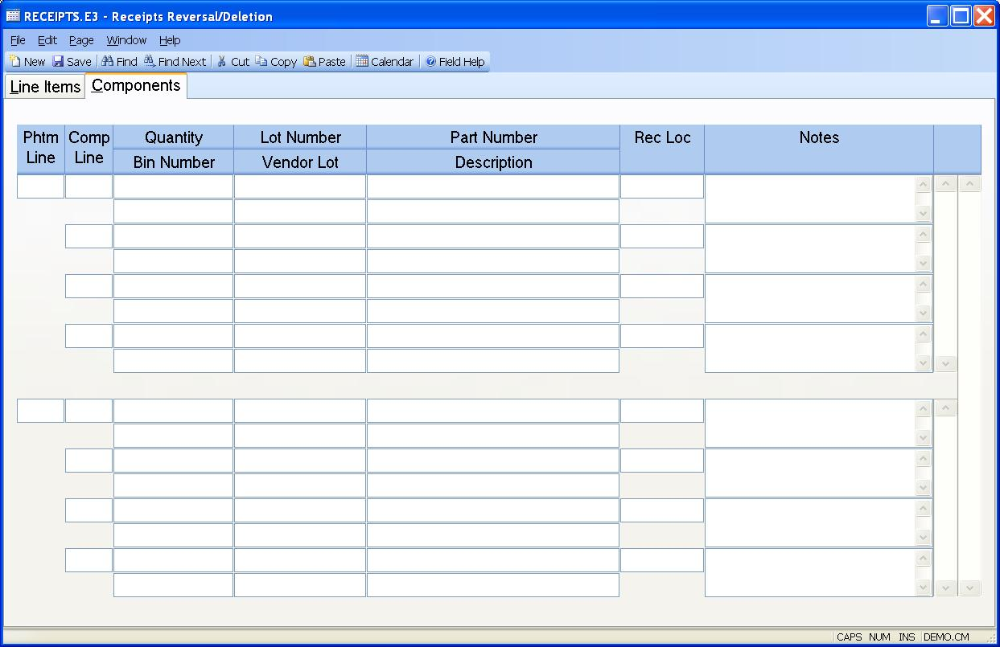

#  Receipts Reversal/Deletion (RECEIPTS.E3)

<PageHeader />

##  Components

**Phantom Li** The phantom line item. It must match a line item on the receipt
for a phantom part with quantity received.  
  
**Comp Li** The component line number.  
  
**Comp Qty** The component quantity received.  
  
**Comp Bin** The bin number into which this material was received.  
  
**Comp Lot** The lot number into which this material was received.  
  
**Comp Vend Lot** The vendor lot number into which this material was received.  
  
**Comp Part** The part number received.  
  
**Desc**  
  
**Comp Invloc** The receipt location of the component part.  
  
**Comp Notes**  
  
  
<badge text= "Version 8.10.57" vertical="middle" />

<PageFooter />