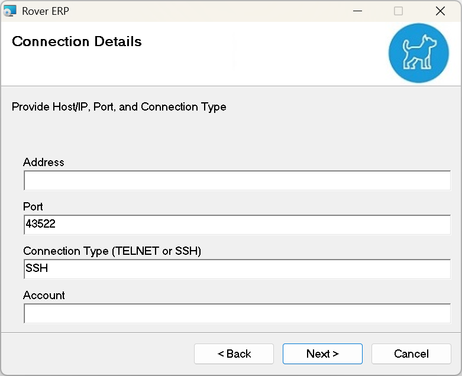
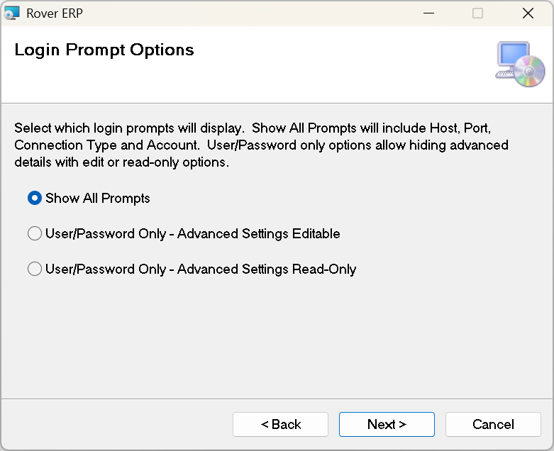
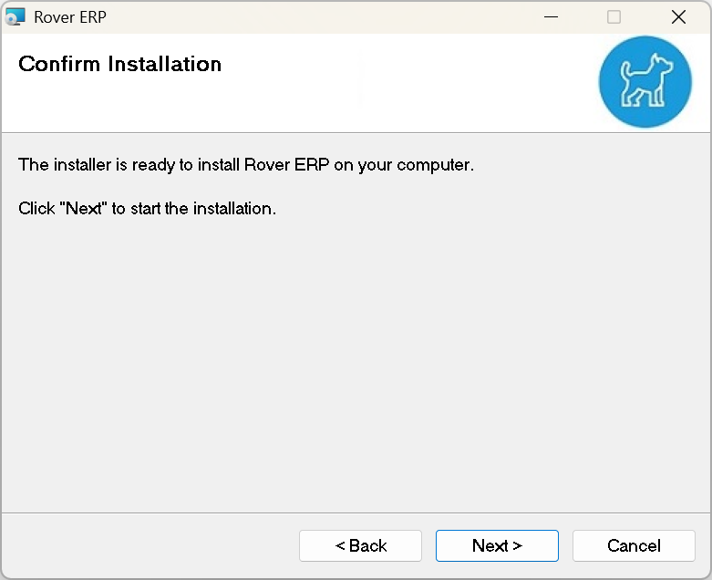
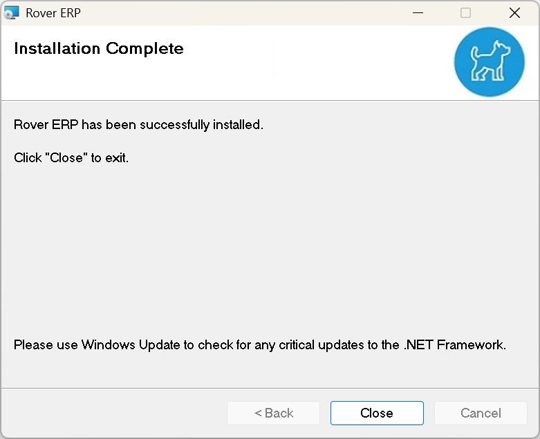

# Client Setup

<PageHeader />

Rover ERP is accessed through a program that must be installed on each client computer. You can find the latest client installer [here](https://roverdesktop.blob.core.windows.net/apps/rover-installer-2.4.0.zip).
<!-- TODO: Update to point to @latest link -->

To install, download the client linked above and extract it. Double click on `setup` to begin the process and follow the instructions below.

> NOTE: It is possible to use services like Microsoft Intune to automate installation of this application on your domain computers. [Command-line Install Options](./cli-setup/README.md)

## Installing the Rover Client

### Select Installation Folder

Use the default installation path and select Everyone

### Connection Details

You will need to use the settings provided to you by our team.

### Login Prompt Options

These options determine which prompts display on the login screen, and whether Advanced Settings are editable.

### Confirm Installation

Press `Next` to begin the installation.

### Installation Complete

Success! The client is now installed on your system. There should be a new icon on your desktop.

### Running the Client

Double click the icon pictured above and you will be met with your configured login screen.

<PageFooter />
