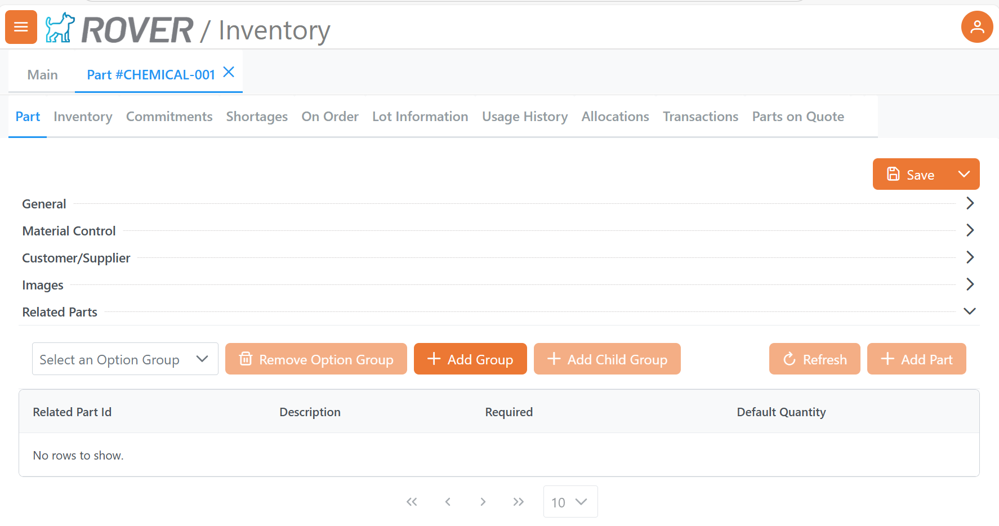

# Rover Inventory

<PageHeader />

## Inventory Display Lookups

INV.CONTROL response JSON format to show additional lookup tables in the Inventory Parts module.

<details>
<summary>INV.CONTROL example response</summary>

```json
{
  "inv_lookup_items": [
    {
      "inv_lookup": "QUOTE*PART",
      "inv_lookup_desc": "Parts on Quote"
    },
    {
      "inv_lookup": "INV*PART",
      "inv_lookup_desc": "Active Parts"
    }
  ]
}
```
</details>

## Related Parts

Related Parts in Rover Business Suite is based on two host side files:
- PARTOPTIONGROUP
- PARTRELATION

Visibility of the "Related Parts" section of Part Detail within the Inventory Module is controlled by a check of the FDICT PARTRELATION response.



<details>
<summary>FDICT PARTRELATON Example</summary>

```json
{
    "total_records_found": "1",
    "BlockSize": "50",
    "fdict_items": [
        {
            "file_name": "PARTRELATION",
            "field_no_items": [
                {
                    "field_no": "0",
                    "conv": "MCU",
                    "dict_name": "ID",
                    "desc_items": [
                        {
                            "desc": "Id"
                        }
                    ],
                    "multi_line": "N",
                    "just": "L",
                    "len": "6",
                    "reference_file": "PARTRELATION",
                    "required": "N"
                },
                {
                    "field_no": "1",
                    "conv": "MCU",
                    "dict_name": "PART.NO",
                    "desc_items": [
                        {
                            "desc": "Part.No"
                        }
                    ],
                    "just": "L",
                    "index": "Y",
                    "len": "20",
                    "reference_file": "PARTS"
                },
                {
                    "field_no": "2",
                    "conv": "MCU",
                    "dict_name": "RELATED.PART.NO",
                    "desc_items": [
                        {
                            "desc": "Related.Part.No"
                        }
                    ],
                    "multi_line": "N",
                    "just": "L",
                    "index": "Y",
                    "len": "20",
                    "reference_file": "PARTS",
                    "required": "N"
                },
                {
                    "field_no": "3",
                    "dict_name": "OPTION.GROUP.ID",
                    "desc_items": [
                        {
                            "desc": "Option.Group.Id"
                        }
                    ],
                    "multi_line": "N",
                    "just": "L",
                    "index": "Y",
                    "len": "5",
                    "required": "N",
                    "valid_value_items": [
                        {
                            "valid_value": "1"
                        },
                        {
                            "valid_value": "2"
                        },
                        {
                            "valid_value": "3"
                        },
                        {
                            "valid_value": "4"
                        },
                        {
                            "valid_value": "5"
                        },
                        {
                            "valid_value": "6"
                        },
                        {
                            "valid_value": "7"
                        },
                        {
                            "valid_value": "8"
                        },
                        {
                            "valid_value": "9"
                        },
                        {
                            "valid_value": "10"
                        },
                        {
                            "valid_value": "123"
                        }
                    ]
                },
                {
                    "field_no": "4",
                    "dict_name": "REQUIRED",
                    "desc_items": [
                        {
                            "desc": "Required"
                        }
                    ],
                    "multi_line": "N",
                    "just": "L",
                    "len": "1"
                },
                {
                    "field_no": "5",
                    "conv": "MD2",
                    "dict_name": "DEFAULT.QTY",
                    "desc_items": [
                        {
                            "desc": "Default.Qty"
                        }
                    ],
                    "multi_line": "N",
                    "just": "R",
                    "len": "12",
                    "required": "N"
                }
            ],
            "correl_field_no_items": [
                {
                    "correl_field_no": "0",
                    "correl_desc": "Attachments",
                    "correl_dict_id": "ATTACHMENTS",
                    "correlative": "SUBR(\"ACE$GETATTACHMENTRECORDID\",\"PARTRELATION\")",
                    "correl_just": "R",
                    "correl_index": "Y",
                    "correl_len": "10",
                    "correl_rw_ok": "Y",
                    "correl_multi_li": "Y",
                    "correl_type": "I"
                },
                {
                    "correl_field_no": "0",
                    "correl_desc": "Part.Optiongrp",
                    "correl_dict_id": "PART.OPTIONGRP",
                    "correlative": "F3:\"*\":F1",
                    "correl_just": "L",
                    "correl_index": "Y",
                    "correl_len": "10",
                    "correl_rw_ok": "Y",
                    "correl_multi_li": "N",
                    "correl_type": "I"
                },
                {
                    "correl_field_no": "2",
                    "correl_desc": "Related.Desc1",
                    "correl_dict_id": "RELATED.DESC1",
                    "correlative": "TPARTS;X;;1",
                    "correl_just": "L",
                    "correl_len": "25",
                    "correl_rw_ok": "Y"
                }
            ]
        }
    ]
}
```
</details>


### Option Groups
Option Groups are exposed via the OPTIONGROUPS.CONTROL response.  There is currently no web based facility for management of option groups.

<details>
<summary>Example OPTIONGROUPS.CONTROL response</summary>
```json
    {
        "control_id": "OPTIONGROUPS",
        "option_group_id_items": [
            {
                "option_group_id": "1",
                "option_group_description": "Related Parts"
            },
            {
                "option_group_id": "2",
                "option_group_description": "Also Purchased"
            }
        ]
    }
```
</details>

### PARTOPTIONGROUPS

GETRECORD/PUTRECORD requests are made against the PARTOPTIONGROUP file to retrieve and update the relationship between PARTS records and defined Option Groups.

<details>
<summary>PARTOPTIONGROUP response example</summary>

```json
{
    "partoptiongroup_items": [
        {
            "id": "110",
            "part_no": "CHEMICAL-001",
            "optiongroup_id": "2",
            "req_selection": "N",
            "track_relation": "N",
            "opt_grp_desc": "Also Purchased"
        },
        {
            "id": "111",
            "part_no": "CHEMICAL-001",
            "optiongroup_id": "5",
            "parent_id": "110",
            "req_selection": "N",
            "track_relation": "N",
            "opt_grp_desc": "Option Group 5"
        },
        {
            "id": "68",
            "part_no": "CHEMICAL-001",
            "optiongroup_id": "1",
            "req_selection": "Y",
            "track_relation": "Y",
            "opt_grp_desc": "Related Parts"
        }
    ],
    "total_records_found": "3",
    "blockSize": "50"
}
```
>Note: Nested relationships are supported by the parent_id property in the response.  

</details>

### PARTRELATION

GETRECORD/PUTRECORD requests are mad against the PARTRELATION file to retrieve and update the parts associated with a parent parts.

<details>
<summary>PARTRELATION response example</summary>

```json
{
    "total_records_found": "1",
    "BlockSize": "50",
    "partrelation_items": [
        {
            "id": "82",
            "default_qty": "10.00",
            "part_no": "CHEMICAL-001",
            "option_group_id": "2",
            "related_part_no": "CAP-10",
            "related_desc1": "Cap for model 10 inch S51 wheel - ",
            "required": "Y"
        }
    ]
}
```
</details>

<PageFooter />

