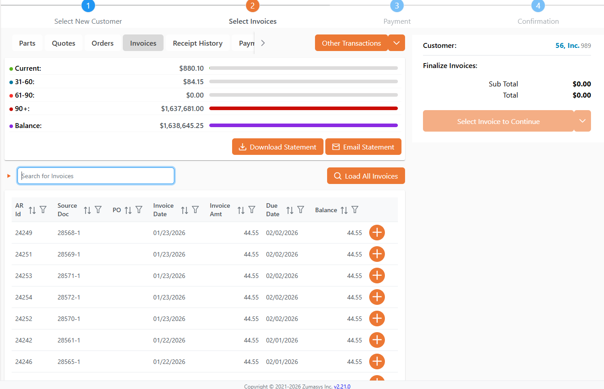
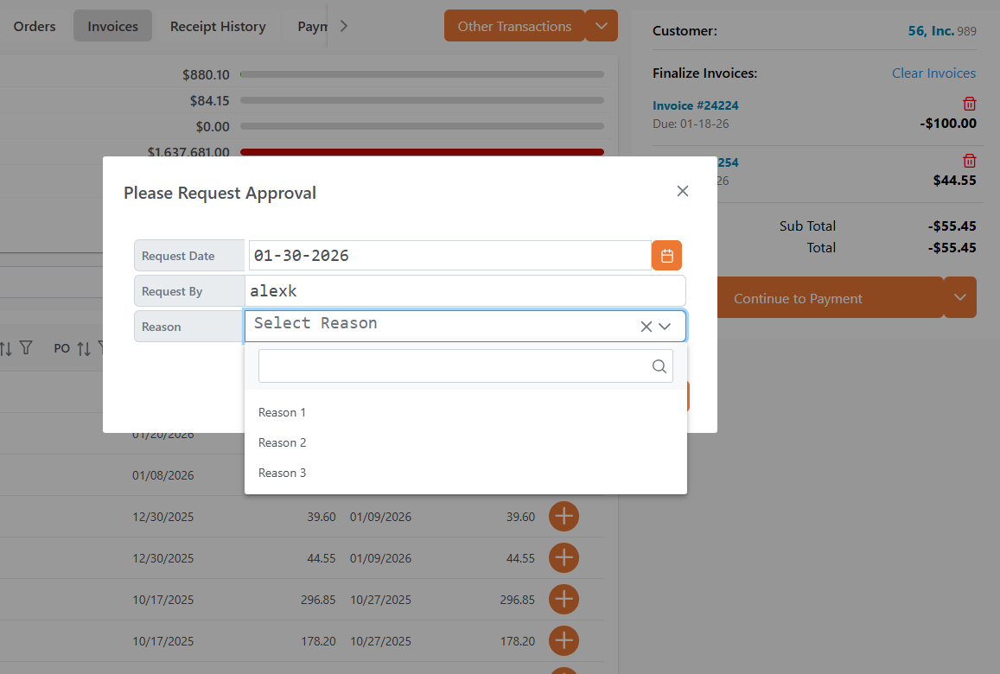
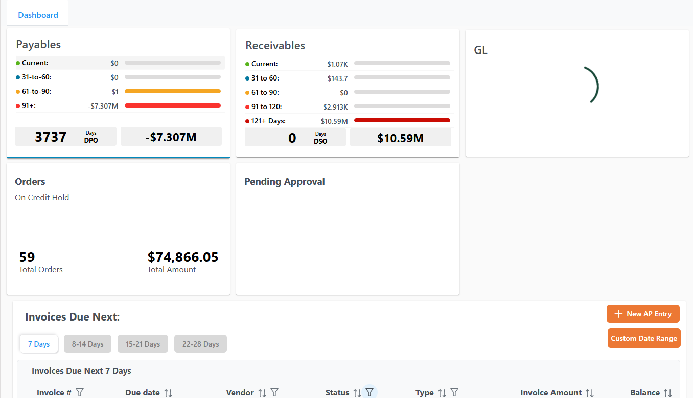
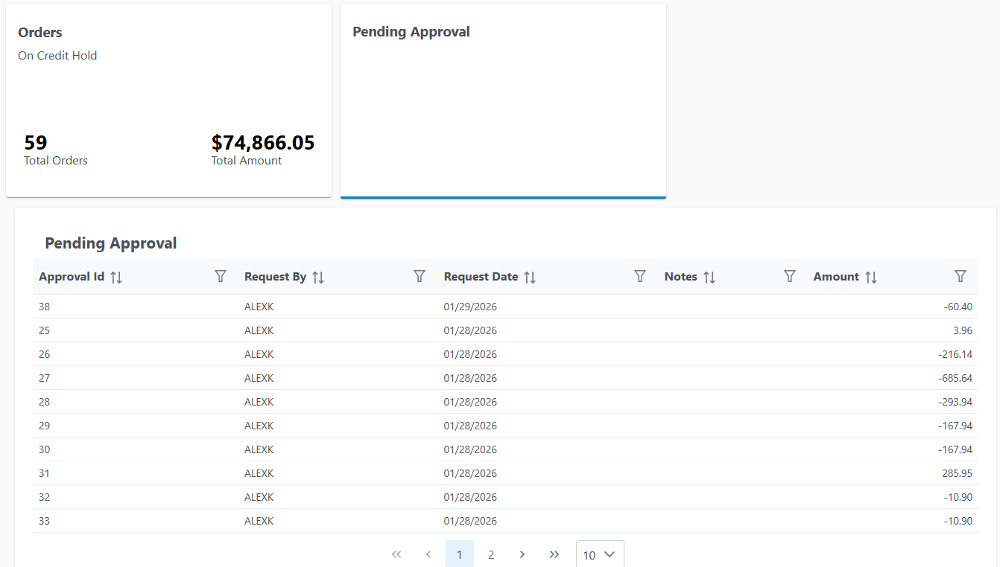
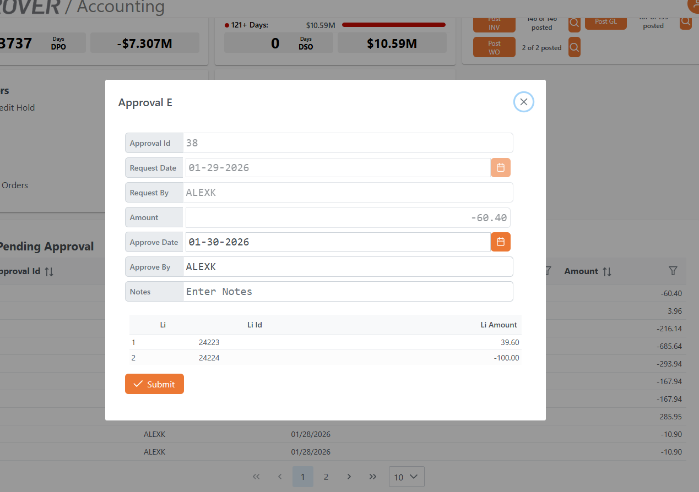

# POS Aged Credit Sample

<PageHeader />

## Table of Contents

- [Enabling Point of Sale Payment Validation](#enabling-point-of-sale-payment-validation)
  - [Sample](#sample)
- [Invoices Lookup](#invoices-lookup)
  - [Sample MRK response](#sample-mrk-response)
  - [Sample LOOKUP](#sample-lookup)
    - [Request](#request)
    - [Response](#response)
- [Displaying a Formsdef form from Validation Response](#displaying-a-formsdef-form-from-validation-response)
  - [Validate Response Sample](#validate-response-sample)
  - [Formsdef GETRECORD response](#formsdef-getrecord-response)
  - [Sample FDICT APPROVAL response](#sample-fdict-approval-response)
  - [Sample save PUTRECORD from FORMSDEF](#sample-save-putrecord-from-formsdef)
- [Display Pending Approval Link in Accounting](#display-pending-approval-link-in-accounting)
  - [Sample ACCT.CONTROL](#sample-acct-control)
  - [Sample Lookup](#sample-lookup-2)
    - [Request](#request-2)
    - [Response](#response-2)
  - [Sample Formsdef](#sample-formsdef)

## Enabling Point of Sale Payment Validation

The CASH file FDICT response needs to include a new section `validate_bp_items`. This section is an array of items, it must contain an item with `validate_ver` of 2.

#### Sample
<details>
<summary>JSON Example</summary>

```json
{
  "total_records_found": "1",
  "BlockSize": "50",
  "fdict_items": [
    {
      "file_name": "CASH",
      "allow_history": "Y",
      "field_no_items": [
        {
          "field_no": "0",
          "conv": "MCU",
          "dict_name": "CASH.ID",
          "desc_items": [
            {
              "desc": "Cash.Id"
            }
          ],
          "just": "R",
          "len": "6",
          "reference_file": "CASH"
        },
        {
          "field_no": "1",
          "conv": "MCU",
          "dict_name": "CUST",
          "desc_items": [
            {
              "desc": "Cust"
            }
          ],
          "just": "L",
          "index": "Y",
          "len": "10",
          "reference_file": "CUST"
        },
        {
          "field_no": "2",
          "conv": "D2-",
          "dict_name": "POST.DATE",
          "desc_items": [
            {
              "desc": "Post"
            },
            {
              "desc": "Date"
            }
          ],
          "just": "R",
          "len": "8"
        },
        {
          "field_no": "3",
          "dict_name": "CHECK",
          "desc_items": [
            {
              "desc": "Check"
            },
            {
              "desc": "Number"
            }
          ],
          "just": "R",
          "index": "Y",
          "len": "15"
        },
        {
          "field_no": "4",
          "conv": "MD2",
          "dict_name": "CHECK.AMOUNT",
          "desc_items": [
            {
              "desc": "Check.Amount"
            }
          ],
          "just": "R",
          "len": "13"
        },
        {
          "field_no": "5",
          "dict_name": "NOTES",
          "desc_items": [
            {
              "desc": "Notes"
            }
          ],
          "just": "T",
          "len": "25"
        },
        {
          "field_no": "6",
          "conv": "D2-",
          "dict_name": "STAMP.DATE",
          "desc_items": [
            {
              "desc": "Stamp"
            },
            {
              "desc": "Date"
            }
          ],
          "just": "R",
          "ignore_change": "Y",
          "len": "8"
        },
        {
          "field_no": "7",
          "dict_name": "STAMP.ID",
          "desc_items": [
            {
              "desc": "Stamp"
            },
            {
              "desc": "Id"
            }
          ],
          "just": "L",
          "ignore_change": "Y",
          "len": "15"
        },
        {
          "field_no": "8",
          "conv": "MCU",
          "dict_name": "CASH.ACCOUNT",
          "desc_items": [
            {
              "desc": "Cash"
            },
            {
              "desc": "Account"
            }
          ],
          "just": "R",
          "ignore_change": "N",
          "len": "12",
          "reference_file": "GLCHART"
        }
      ],
      "correl_field_no_items": [
        {
          "correl_field_no": "1",
          "correl_desc": "Name",
          "correl_dict_id": "CUST.NAME",
          "correlative": "TCUST;X;;1",
          "correl_just": "L",
          "correl_len": "30",
          "correl_rw_ok": "Y"
        },
        {
          "correl_field_no": "0",
          "correl_desc": "Inv.Amount",
          "correl_conv": "MD2",
          "correl_dict_id": "INV.AMT",
          "correlative": "F12üTAR;X;;6",
          "correl_just": "R",
          "correl_len": "12",
          "correl_rw_ok": "Y"
        }
      ],
      "file_title": "Cash Payment File",
      "lookup_name_items": [],
      "file_view_name_items": [],
      "validate_bp_items": [
        {
          "validate_bp": "P$VALIDATECASH",
          "validate_ver": "1",
          "validate_type": "1"
        },
        {
          "validate_bp": "P$VALIDATECASH.V2",
          "validate_ver": "2",
          "validate_type": "2"
        }
      ]
    }
  ]
}
```

</details>

## Invoices Lookup

To enable the use of a lookup data table to display in the Invoices section of POS, provide a new property on MRK control responses `pos_customer_invoices_lookup`



#### Sample MRK response

<details>
<summary>Sample Json</summary>

```json
[
  {
    "control_id": "MRK1",
    "cg_location": "CG",
    "auto_set_ship_date": "N",
    "assign_invoice_(how)": "S",
    "allocate_shipments": "Y",
    "accounting_orders_lookup": "SO*ON.HOLD",
    "accounting_orders_lookup_desc": "Orders on hold",
    "alloc_multiple_locations": "Y",
    "accounting_release_items": [
      {
        "accounting_release": "RON"
      },
      {
        "accounting_release": "VERN"
      },
      {
        "accounting_release": "CATHIEM"
      },
      {
        "accounting_release": "BONNIE"
      },
      {
        "accounting_release": "CHRISTIANO"
      }
    ],
    "allocation_sequence": "1",
    "allow_po_creation": "Y",
    "allow_customer_creation": "Y",
    "allow_mixed_mode": "Y",
    "apply_cm_to_open_order": "Y",
    "assign_invoice_(when)": "S",
    "assign_invoice_(with)": "L",
    "auto_generate_ship": "N",
    "auto_create_wo": "P",
    "auto_create_sub-assembly_wo": "Y",
    "auto_load_ship_qty": "Y",
    "auto_process_rma_terms_document": "CUST",
    "backorder_so": "ENTRY",
    "breakout_tax": "N",
    "cart_field_validation": "Y",
    "commit_range": "999",
    "fg_location": "FG",
    "explode_phantoms": "Y",
    "display_atp": "0",
    "default_taxable_flag": "N",
    "default_cust_terms": "AR",
    "default_apply_overage_to_account": "N",
    "customer_inquiry_lookup": "CUST*POS.CUST2",
    "customer_inquiry_recently_viewed_lookup": "Y",
    "default_image": "https://prodroverstorage.blob.core.windows.net/rover/icon-120x120-1.png",
    "disable_downloading_statements": "N",
    "disable_emailing_statements": "N",
    "disable_updating_part_description": "N",
    "display_inv": "0",
    "display_credit_memos": "N",
    "fet_account:": "000-0736F",
    "fob_dest": "Irvine",
    "filter_inactive_customers": "N",
    "freight_acct#": "000-0930",
    "misc_acct#": "TARIFF",
    "log_serials": "Y",
    "load_customer_notes": "Y",
    "hide_pos_notes": "N",
    "hide_load_customer_button": "N",
    "hide_drafted_orders": "N",
    "gppct_and_cost": "Y",
    "gppct_cost_type": "Avg",
    "hide_parts_tab": "N",
    "hide_order_buttons": "Y",
    "hide_po_no": "N",
    "hide_use_new_address": "N",
    "hold_code_items": [
      {
        "hold_code": "C",
        "hold_code_description": "Credit"
      },
      {
        "hold_code": "E",
        "hold_code_description": "Engineering HOLD LONG DES"
      },
      {
        "hold_code": "W",
        "hold_code_description": "Web Hold"
      }
    ],
    "manually_load_orders": "N",
    "manually_load_invoices": "N",
    "sales_acct#": "000-1000",
    "required_date_offset": "1",
    "pos_price_strategy": "P",
    "order_information_precedes_create_order": "N",
    "order_header_shipto_display": "Top",
    "pos_allow_partial_shipments": "Y",
    "pos_allow_non_stock_parts": "Y",
    "pos_allow_cash_deposit": "Y",
    "part_cart_update_mode": "Y",
    "pos_allow_coupons": "Y",
    "pos_allow_payout": "Y",
    "pos_allow_shipto_override": "N",
    "pos_allow_refund": "Y",
    "pos_maintain_cart_sort": "Y",
    "pos_force_same_part_qty_increment": "N",
    "pos_clear_category_on_search": "Y",
    "pos_cc_pin_pad": "T",
    "pos_auto_validate": "Y",
    "pos_customer_orders_lookup": "SO*POS.CUST.OPEN",
    "pos_cust_soquote_lookup": "SOQUOTE*POS.CUST.LOOKUP",
    "pos_collapse_part_option_groups": "Y",
    "pos_customer_invoices_lookup": "AR*POS.CUSTOMER",
    "pos_disable_check_payout": "Y",
    "pos_extra_info_items": [
      {
        "pos_extra_info": "15"
      },
      {
        "pos_extra_info": "7"
      },
      {
        "pos_extra_info": "10"
      },
      {
        "pos_extra_info": "9"
      }
    ],
    "pos_host_receipt_print": "Y",
    "pos_hide_invoices_ar_kpi": "N",
    "pos_lazy_load_shiptos": "N",
    "pos_inv_lookups_items": [
      {
        "pos_inv_lookups": "SO*PART.ALL",
        "inv_lookup_desc": "SO PART"
      },
      {
        "pos_inv_lookups": "FORECAST*ALL",
        "inv_lookup_desc": "Forecast Listing"
      },
      {
        "pos_inv_lookups": "PO*PARTS.OPEN",
        "inv_lookup_desc": "Lookup Open POs for a Part Number"
      },
      {
        "pos_inv_lookups": "RMA*PARTS.OPEN",
        "inv_lookup_desc": "Open Items for a Part Number Lookup"
      },
      {
        "pos_inv_lookups": "IT*PART.NUMBER",
        "inv_lookup_desc": "Part Number Lookup"
      },
      {
        "pos_inv_lookups": "SHIP*Open Shipments",
        "inv_lookup_desc": "List All Un-Confirmed Shipments"
      },
      {
        "pos_inv_lookups": "AR*HOLD.LOOKUP",
        "inv_lookup_desc": "Lookup Open Items on Hold"
      },
      {
        "pos_inv_lookups": "ARR*CUST.OPEN",
        "inv_lookup_desc": "Open ARR Listing by Customer"
      },
      {
        "pos_inv_lookups": "PRICE*STD.PRICE",
        "inv_lookup_desc": "Standard Price"
      },
      {
        "pos_inv_lookups": "SO*PART.ALL",
        "inv_lookup_desc": "Part Number Lookup for All Orders"
      }
    ],
    "pos_parts_lookup": "PARTS*POS.PARTS",
    "pos_order_code_items": [
      {
        "pos_order_code": "A",
        "default_selection": "Y",
        "pos_order_desc": "Ship",
        "so_type_code": "C",
        "ship_via_code": "03"
      },
      {
        "pos_order_code": "B",
        "default_selection": "N",
        "pos_order_desc": "Will Call",
        "so_type_code": "C",
        "ship_via_code": "UPS BLUE"
      },
      {
        "pos_order_code": "C",
        "default_selection": "N",
        "pos_order_desc": "Delivery",
        "so_type_code": "D",
        "ship_via_code": "02",
        "signature_required": "Y"
      },
      {
        "pos_order_code": "D",
        "pos_order_desc": "Test",
        "so_type_code": "C",
        "ship_via_code": "UPS Worldwide Expedited"
      }
    ],
    "pos_part_status_items": [
      {
        "pos_part_status": "A"
      },
      {
        "pos_part_status": "C"
      },
      {
        "pos_part_status": "P"
      }
    ],
    "pos_partial_ship_field_items": [
      {
        "pos_partial_ship_field": "46"
      },
      {
        "pos_partial_ship_field": "101"
      },
      {
        "pos_partial_ship_field": "104"
      },
      {
        "pos_partial_ship_field": "201"
      }
    ],
    "prompt_on_price_override": "Y",
    "post_invoice_on_ship": "Y",
    "pos_show_pay_terms": "Y",
    "pos_show_book_date": "N",
    "pos_require_price_change_reason": "N",
    "pos_require_entry_user_authentication": "N",
    "pos_register_selection_mode": "U",
    "pos_require_ship_signature": "Y",
    "pos_rma_refund": "N",
    "pos_show_freight_amount": "Y",
    "pos_show_edit_order": "Y",
    "pos_show_category_filter": "Y",
    "pos_show_order_status": "N",
    "pos_show_keyword_search": "Y",
    "pos_show_invoice_print": "Y",
    "pos_show_order_confirmation_page": "N",
    "pos_show_opp_tab": "Y",
    "pos_show_orders_tab": "Y",
    "pos_show_part_cost_column": "Y",
    "pos_show_tax_codes": "Y",
    "pos_show_ship_via": "Y",
    "pos_show_sales_rep": "Y",
    "pos_show_ship_id": "Y",
    "pos_terms_require_payment": "Y",
    "pos_skip_calc_tax": "Y",
    "pos_soquote_lookup": "SOQUOTE*POS.LOOKUP",
    "prohibit_open_po_shipments": "N",
    "require_customer_parts_search": "N",
    "sched_days": "30",
    "schedule_horizon": "999",
    "update_atp": "N",
    "search_using_parts": "N",
    "show_pick_ticket_print": "Y",
    "skip_close_out_report": "Y",
    "show_soquote_tab": "Y",
    "suppress_invoice_parts": "Y",
    "tariff_pct": "10.00",
    "type_items": [
      {
        "type": "VISA",
        "rma_receipt_location": "MRB",
        "rma_cg_location": "CG",
        "account_number": "VISA-ACCR",
        "rma_freight_account": "000-0930",
        "rma_credit": "Y",
        "rma_sales_account": "000-0900",
        "rma_type_description": "Warranty Repair",
        "wo_type": "WR"
      },
      {
        "type": "MC",
        "rma_receipt_location": "MRB",
        "rma_cg_location": "CG",
        "account_number": "MC-ACCR",
        "rma_freight_account": "000-0940",
        "rma_sales_account": "000-0930",
        "rma_type_description": "Billable Repair",
        "wo_type": "BR"
      },
      {
        "type": "DEFAULT",
        "rma_receipt_location": "SCRAP",
        "rma_cg_location": "CG",
        "account_number": "000-0104",
        "rma_freight_account": "000-0940",
        "rma_credit": "Y",
        "rma_sales_account": "000-0930",
        "rma_type_description": "Scrap & Credit"
      },
      {
        "type": "DISC",
        "account_number": "000-0104"
      },
      {
        "type": "AMEX",
        "account_number": "000-0104"
      }
    ],
    "use_lookup_for_recently_viewed": "N",
    "use_gm_pct": "N",
    "valid_so_type_items": [
      {
        "valid_so_type": "R",
        "so_type_code_description": "Return"
      },
      {
        "valid_so_type": "W",
        "so_type_code_description": "Wholesale"
      },
      {
        "valid_so_type": "D",
        "so_type_code_description": "Domestic"
      },
      {
        "valid_so_type": "I",
        "so_type_code_description": "International"
      },
      {
        "valid_so_type": "C",
        "so_type_code_description": "Credit Type Orders"
      },
      {
        "valid_so_type": "T",
        "so_type_code_description": "Rottler Test"
      },
      {
        "valid_so_type": "z",
        "so_type_code_description": "next test"
      }
    ]
  }
]
```

</details>

#### Sample LOOKUP

##### Request

```json
{
  "lookupName": "POS.LOOKUP",
  "file": "SOQUOTE",
  "correls": "",
  "fullRecords": false,
  "filters": {},
  "rangeStart": "1",
  "rangeEnd": "100"
}
```

##### Response

<details>
<summary>Sample Json</summary>

```json
{
  "fDicts": [
    {
      "conv": "MCU",
      "dict_name": "id",
      "display_name": "ID"
    },
    {
      "conv": "",
      "dict_name": "customer_name",
      "display_name": "Customer Name"
    },
    {
      "conv": "",
      "dict_name": "status",
      "display_name": "Status"
    },
    {
      "conv": "D2-",
      "dict_name": "date",
      "display_name": "Date"
    },
    {
      "conv": "",
      "dict_name": "quoted_by",
      "display_name": "Quoted By"
    },
    {
      "conv": "MD2",
      "dict_name": "quote_amount",
      "display_name": "Quote Amount"
    },
    {
      "conv": "",
      "dict_name": "cost_method",
      "valid_value_items": [
        {
          "valid_desc": "Markup Percent",
          "valid_value": "M"
        },
        {
          "valid_desc": "Price File",
          "valid_value": "P"
        }
      ],
      "display_name": "Cost Method"
    }
  ],
  "data": [
    {
      "id": "1610",
      "date": "01/20/2026",
      "cost_method": "P",
      "customer_name": "56, Inc.",
      "quoted_by": "GREGB"
    },
    {
      "id": "1609",
      "date": "11/21/2025",
      "cost_method": "P",
      "customer_name": "56, Inc.",
      "quoted_by": "GREGB"
    },
    {
      "id": "1608",
      "date": "11/21/2025",
      "cost_method": "P",
      "customer_name": "56, Inc.",
      "quoted_by": "GREGB"
    },
    {
      "id": "1607",
      "date": "11/21/2025",
      "cost_method": "P",
      "customer_name": "56, Inc.",
      "quoted_by": "GREGB"
    },
    {
      "id": "1606",
      "date": "11/21/2025",
      "cost_method": "P",
      "customer_name": "56, Inc.",
      "quoted_by": "GREGB"
    },
    {
      "id": "1605",
      "date": "11/21/2025",
      "cost_method": "P",
      "customer_name": "56, Inc.",
      "quoted_by": "GREGB"
    },
    {
      "id": "1604",
      "date": "11/20/2025",
      "cost_method": "P",
      "customer_name": "56, Inc.",
      "quoted_by": "GREGB"
    },
    {
      "id": "1603",
      "date": "11/20/2025",
      "cost_method": "P",
      "customer_name": "56, Inc.",
      "quoted_by": "GREGB"
    },
    {
      "id": "1602",
      "date": "11/20/2025",
      "cost_method": "P",
      "customer_name": "56, Inc.",
      "quoted_by": "GREGB"
    },
    {
      "id": "1601",
      "date": "11/20/2025",
      "cost_method": "P",
      "customer_name": "56, Inc.",
      "quoted_by": "GREGB"
    },
    {
      "id": "1600",
      "date": "11/20/2025",
      "cost_method": "P",
      "customer_name": "56, Inc.",
      "quoted_by": "GREGB"
    },
    {
      "id": "1599",
      "date": "11/20/2025",
      "cost_method": "P",
      "customer_name": "56, Inc.",
      "quoted_by": "GREGB"
    },
    {
      "id": "1598",
      "date": "11/20/2025",
      "cost_method": "P",
      "customer_name": "56, Inc.",
      "quoted_by": "GREGB"
    },
    {
      "id": "1597",
      "date": "11/20/2025",
      "cost_method": "P",
      "customer_name": "56, Inc.",
      "quoted_by": "GREGB"
    },
    {
      "id": "1596",
      "date": "11/20/2025",
      "cost_method": "P",
      "customer_name": "56, Inc.",
      "quoted_by": "GREGB"
    },
    {
      "id": "1595",
      "date": "11/20/2025",
      "cost_method": "P",
      "customer_name": "56, Inc.",
      "quoted_by": "GREGB"
    },
    {
      "id": "1594",
      "date": "11/14/2025",
      "customer_name": "Evans Supplies",
      "status": "N",
      "quoted_by": "BILLB"
    },
    {
      "id": "1593",
      "date": "11/14/2025",
      "customer_name": "Evans Supplies",
      "status": "N",
      "quoted_by": "BILLB"
    },
    {
      "id": "1592",
      "date": "10/28/2025",
      "cost_method": "P",
      "customer_name": "56, Inc.",
      "quoted_by": "GREGB"
    },
    {
      "id": "1591",
      "date": "10/20/2025",
      "cost_method": "P",
      "customer_name": "56, Inc.",
      "quoted_by": "GREGB"
    },
    {
      "id": "1590",
      "date": "10/16/2025",
      "cost_method": "P",
      "customer_name": "Evans Supplies",
      "quoted_by": "WRIGHTM",
      "quote_amount": "3000.00"
    },
    {
      "id": "1589",
      "date": "10/16/2025",
      "cost_method": "P",
      "customer_name": "Evans Supplies",
      "quoted_by": "WRIGHTM"
    },
    {
      "id": "1588",
      "date": "09/23/2025",
      "cost_method": "P",
      "customer_name": "Evans Supplies"
    },
    {
      "id": "1587",
      "date": "08/26/2025",
      "cost_method": "P",
      "customer_name": "CAMBRIDGE PWR PROCESSING "
    },
    {
      "id": "1586",
      "date": "08/25/2025",
      "cost_method": "P",
      "customer_name": "Evans Supplies",
      "quoted_by": "BILLB"
    },
    {
      "id": "1585",
      "date": "08/22/2025",
      "cost_method": "P",
      "customer_name": "Evans Supplies",
      "quoted_by": "WRIGHTM"
    },
    {
      "id": "1584",
      "date": "08/12/2025",
      "cost_method": "P",
      "customer_name": "Evans Supplies",
      "quoted_by": "WRIGHTM",
      "quote_amount": "3000.00"
    },
    {
      "id": "1583",
      "date": "08/12/2025",
      "cost_method": "P",
      "customer_name": "Evans Supplies",
      "quoted_by": "WRIGHTM"
    },
    {
      "id": "1582",
      "date": "08/12/2025",
      "cost_method": "P",
      "customer_name": "56, Inc.",
      "quoted_by": "GREGB"
    },
    {
      "id": "1581",
      "date": "08/12/2025",
      "cost_method": "P",
      "customer_name": "Evans Supplies",
      "quoted_by": "WRIGHTM",
      "quote_amount": "3538.46"
    },
    {
      "id": "1580",
      "date": "08/12/2025",
      "cost_method": "P",
      "customer_name": "Evans Supplies",
      "quoted_by": "WRIGHTM"
    },
    {
      "id": "1579",
      "date": "08/12/2025",
      "cost_method": "P",
      "customer_name": "Evans Supplies",
      "quoted_by": "WRIGHTM",
      "quote_amount": "3000.00"
    },
    {
      "id": "1578",
      "date": "08/04/2025",
      "cost_method": "P",
      "customer_name": "56, Inc.",
      "quoted_by": "ALEXK"
    },
    {
      "id": "1577",
      "date": "08/04/2025",
      "cost_method": "P",
      "customer_name": "Evans Supplies",
      "quote_amount": "50.00"
    },
    {
      "id": "1576",
      "date": "08/04/2025",
      "cost_method": "P",
      "customer_name": "Evans Supplies"
    },
    {
      "id": "1575",
      "date": "07/31/2025",
      "cost_method": "P",
      "customer_name": "Evans Supplies",
      "quoted_by": "BILLB",
      "quote_amount": "970000.00"
    },
    {
      "id": "1574",
      "date": "07/15/2025",
      "cost_method": "P",
      "customer_name": "Evans Supplies",
      "quote_amount": "700.00"
    },
    {
      "id": "1573",
      "date": "07/14/2025",
      "cost_method": "P",
      "customer_name": "Evans Supplies",
      "quoted_by": "MIKEC",
      "quote_amount": "3000.00"
    },
    {
      "id": "1572",
      "date": "06/23/2025",
      "cost_method": "M",
      "customer_name": "Evans Supplies"
    },
    {
      "id": "1571",
      "date": "06/23/2025",
      "cost_method": "P",
      "customer_name": "ajc test",
      "quoted_by": "WRIGHTM",
      "quote_amount": "257.53"
    },
    {
      "id": "1570",
      "date": "06/23/2025",
      "cost_method": "P"
    },
    {
      "id": "1568",
      "date": "06/10/2025",
      "cost_method": "P",
      "customer_name": "Evans Supplies",
      "quoted_by": "BILLB"
    },
    {
      "id": "1567",
      "date": "06/09/2025",
      "cost_method": "P",
      "customer_name": "Christian Main Test",
      "quoted_by": "CHRISTIANO"
    },
    {
      "id": "1566",
      "date": "06/06/2025",
      "cost_method": "P",
      "customer_name": "56, Inc.",
      "quoted_by": "ALEXK"
    },
    {
      "id": "1565",
      "date": "06/06/2025",
      "cost_method": "P",
      "customer_name": "56, Inc.",
      "quoted_by": "ALEXK"
    },
    {
      "id": "1564",
      "date": "06/06/2025",
      "cost_method": "P",
      "customer_name": "56, Inc.",
      "quoted_by": "ALEXK"
    },
    {
      "id": "1563",
      "date": "06/04/2025",
      "cost_method": "P",
      "customer_name": "56, Inc."
    },
    {
      "id": "1562",
      "date": "06/04/2025",
      "cost_method": "P",
      "customer_name": "56, Inc."
    },
    {
      "id": "1561",
      "date": "06/04/2025",
      "cost_method": "P",
      "customer_name": "56, Inc."
    },
    {
      "id": "1560",
      "date": "06/03/2025",
      "cost_method": "P",
      "customer_name": "Evans Supplies",
      "quoted_by": "BILLB"
    },
    {
      "id": "1557",
      "date": "05/22/2025",
      "cost_method": "P",
      "customer_name": "56, Inc."
    },
    {
      "id": "1556",
      "date": "05/22/2025",
      "cost_method": "P",
      "customer_name": "56, Inc.",
      "quoted_by": "ALEXK"
    },
    {
      "id": "1555",
      "date": "05/22/2025",
      "cost_method": "P",
      "customer_name": "56, Inc.",
      "quoted_by": "ALEXK"
    },
    {
      "id": "1554",
      "date": "05/16/2025",
      "cost_method": "P",
      "customer_name": "Christian Main Test",
      "quoted_by": "CHRISTIANO"
    },
    {
      "id": "1553",
      "date": "05/16/2025",
      "cost_method": "P",
      "customer_name": "Christian Main Test",
      "quoted_by": "CHRISTIANO"
    },
    {
      "id": "1552",
      "date": "05/15/2025",
      "cost_method": "P",
      "customer_name": "Christian Main Test",
      "quoted_by": "CHRISTIANO"
    },
    {
      "id": "1551",
      "date": "05/14/2025",
      "cost_method": "P",
      "customer_name": "56, Inc.",
      "status": "o",
      "quoted_by": "ALEXK",
      "quote_amount": "495.00"
    },
    {
      "id": "1550",
      "date": "05/09/2025",
      "cost_method": "P",
      "customer_name": "56, Inc.",
      "quoted_by": "GREGB",
      "quote_amount": "495.00"
    },
    {
      "id": "1549",
      "date": "05/08/2025",
      "cost_method": "P",
      "customer_name": "56, Inc.",
      "quoted_by": "GREGB"
    },
    {
      "id": "1548",
      "date": "05/08/2025",
      "cost_method": "P",
      "customer_name": "56, Inc.",
      "quoted_by": "GREGB",
      "quote_amount": "495.00"
    },
    {
      "id": "1547",
      "date": "05/08/2025",
      "cost_method": "P",
      "customer_name": "56, Inc.",
      "quoted_by": "ALEXK",
      "quote_amount": "495.00"
    },
    {
      "id": "1546",
      "date": "05/08/2025",
      "cost_method": "P",
      "customer_name": "56, Inc.",
      "quoted_by": "ALEXK",
      "quote_amount": "495.00"
    },
    {
      "id": "1545",
      "date": "05/08/2025",
      "cost_method": "P",
      "customer_name": "56, Inc.",
      "quoted_by": "ALEXK",
      "quote_amount": "495.00"
    },
    {
      "id": "1544",
      "date": "04/29/2025",
      "cost_method": "P",
      "customer_name": "Atlantic Aero, Inc.",
      "quote_amount": "2000.00"
    },
    {
      "id": "1543",
      "date": "04/29/2025",
      "cost_method": "P",
      "customer_name": "Evans Supplies",
      "quoted_by": "andrew",
      "quote_amount": "1650.00"
    },
    {
      "id": "1542",
      "date": "04/28/2025",
      "cost_method": "P",
      "customer_name": "Atlantic Aero, Inc.",
      "quote_amount": "2000.00"
    },
    {
      "id": "1541",
      "date": "04/27/2025",
      "cost_method": "P",
      "customer_name": "Atlantic Aero, Inc.",
      "quote_amount": "2892.92"
    },
    {
      "id": "1540",
      "date": "04/27/2025",
      "cost_method": "P",
      "customer_name": "Atlantic Aero, Inc.",
      "quote_amount": "2000.00"
    },
    {
      "id": "1539",
      "date": "04/24/2025",
      "cost_method": "P",
      "customer_name": "56, Inc.",
      "quoted_by": "GREGB"
    },
    {
      "id": "1538",
      "date": "04/24/2025",
      "cost_method": "M",
      "customer_name": "Christian Main Test",
      "quoted_by": "CHRISTIANO"
    },
    {
      "id": "1537",
      "date": "04/24/2025",
      "cost_method": "P",
      "customer_name": "56, Inc.",
      "quoted_by": "GREGB",
      "quote_amount": "495.00"
    },
    {
      "id": "1536",
      "date": "04/23/2025",
      "cost_method": "P",
      "customer_name": "56, Inc.",
      "quoted_by": "GREGB"
    },
    {
      "id": "1535",
      "date": "04/21/2025",
      "cost_method": "P",
      "customer_name": "Evans Supplies",
      "quoted_by": "WRIGHTM"
    },
    {
      "id": "1533",
      "date": "04/18/2025",
      "customer_name": "56, Inc.",
      "quote_amount": "0.10"
    },
    {
      "id": "1532",
      "date": "04/17/2025",
      "cost_method": "P",
      "customer_name": "56, Inc.",
      "quoted_by": "GREGB"
    },
    {
      "id": "1531",
      "date": "04/17/2025",
      "cost_method": "P",
      "customer_name": "56, Inc.",
      "quoted_by": "GREGB"
    },
    {
      "id": "1530",
      "date": "04/17/2025",
      "cost_method": "P",
      "customer_name": "56, Inc.",
      "quoted_by": "GREGB"
    },
    {
      "id": "1529",
      "date": "04/16/2025",
      "cost_method": "M",
      "customer_name": "56, Inc.",
      "quoted_by": "CHRISTIANO"
    },
    {
      "id": "1528",
      "date": "04/16/2025",
      "cost_method": "P",
      "customer_name": "56, Inc.",
      "quoted_by": "CHRISTIANO"
    },
    {
      "id": "1534",
      "date": "04/14/2025",
      "customer_name": "56, Inc.",
      "status": "N",
      "quoted_by": "CHRISTIANO",
      "quote_amount": "495.00"
    },
    {
      "id": "1512",
      "date": "04/14/2025",
      "customer_name": "56, Inc.",
      "status": "N",
      "quoted_by": "CHRISTIANO",
      "quote_amount": "495.00"
    },
    {
      "id": "1511",
      "date": "04/14/2025",
      "customer_name": "56, Inc.",
      "status": "N",
      "quoted_by": "CHRISTIANO",
      "quote_amount": "495.00"
    },
    {
      "id": "1510",
      "date": "04/14/2025",
      "cost_method": "P",
      "customer_name": "56, Inc.",
      "quoted_by": "GREGB"
    },
    {
      "id": "1507",
      "date": "04/10/2025",
      "customer_name": "56, Inc.",
      "status": "N",
      "quoted_by": "CHRISTIANO"
    },
    {
      "id": "1506",
      "date": "04/10/2025",
      "customer_name": "56, Inc.",
      "status": "N",
      "quoted_by": "CHRISTIANO"
    },
    {
      "id": "1505",
      "date": "04/10/2025",
      "cost_method": "P",
      "customer_name": "Evans Supplies",
      "quoted_by": "WRIGHTM",
      "quote_amount": "3538.46"
    },
    {
      "id": "1504",
      "date": "04/10/2025",
      "customer_name": "Christian Main Test",
      "status": "N",
      "quoted_by": "CHRISTIANO"
    },
    {
      "id": "1503",
      "date": "04/10/2025",
      "cost_method": "P",
      "customer_name": "56, Inc.",
      "quoted_by": "GREGB"
    },
    {
      "id": "1502",
      "date": "04/08/2025",
      "cost_method": "P",
      "customer_name": "56, Inc.",
      "quoted_by": "GREGB"
    },
    {
      "id": "1501",
      "date": "04/07/2025",
      "cost_method": "P",
      "customer_name": "56, Inc.",
      "quoted_by": "GREGB",
      "quote_amount": "495.00"
    },
    {
      "id": "1500",
      "date": "04/02/2025",
      "customer_name": "56, Inc.",
      "quoted_by": "GREGB"
    },
    {
      "id": "1499",
      "date": "04/02/2025",
      "cost_method": "P",
      "customer_name": "56, Inc.",
      "quoted_by": "GREGB"
    },
    {
      "id": "1498",
      "date": "04/02/2025",
      "cost_method": "P",
      "customer_name": "56, Inc.",
      "quoted_by": "GREGB"
    },
    {
      "id": "1497",
      "date": "04/02/2025",
      "cost_method": "P",
      "customer_name": "56, Inc.",
      "quoted_by": "GREGB",
      "quote_amount": "495.00"
    },
    {
      "id": "1496",
      "date": "04/02/2025",
      "cost_method": "P",
      "customer_name": "56, Inc.",
      "quoted_by": "GREGB",
      "quote_amount": "495.00"
    },
    {
      "id": "1495",
      "date": "04/02/2025",
      "cost_method": "P",
      "customer_name": "56, Inc.",
      "quoted_by": "GREGB",
      "quote_amount": "495.00"
    },
    {
      "id": "1494",
      "date": "04/02/2025",
      "cost_method": "P",
      "customer_name": "56, Inc.",
      "quoted_by": "GREGB",
      "quote_amount": "495.00"
    },
    {
      "id": "1493",
      "date": "04/02/2025",
      "cost_method": "P",
      "customer_name": "56, Inc.",
      "quoted_by": "GREGB"
    },
    {
      "id": "1492",
      "date": "04/02/2025",
      "cost_method": "P",
      "customer_name": "56, Inc.",
      "quoted_by": "GREGB"
    },
    {
      "id": "1491",
      "date": "04/02/2025",
      "cost_method": "P",
      "customer_name": "56, Inc.",
      "quoted_by": "GREGB"
    }
  ],
  "total_records_found": "622"
}
```

</details>

## Displaying a Formsdef form from Validation Response

When PUTRECORD for the CASH file is called with `validate_only` = "Y" in the request metadata, or on PUTRECORD CASH for final submission, add a `workflow_action` to the metadata object in the response. This must contain the `formId`, `formName`. It can optionally include:

- `recordId` to force the form to use a provided record id when saving
- `record` to provide initial values for the `oldRecord` to be used, if the record already exists on file. Values in `record` will be used as default values on the form when displayed.

The formsdef form provided must then be provided as a form when requested via a GETRECORD request against the FORMSDEF file.



#### Validate Response Sample

<details>
<summary>Sample Json</summary>

```json
{
  "response": {
    "status": "success",
    "recordId": "",
    "metaData": {
      "workflow_action": {
        "formId": "APPROVAL.REQ",
        "recordId": "",
        "fileName": "APPROVAL",
        "title": "Please Request Approval",
        "record": {
          "type": "AR",
          "request_date": "01-29-26",
          "request_by": "alexk",
          "li_items": [
            {
              "li": 1,
              "li_id": "24223",
              "li_amount": "39.60"
            },
            {
              "li": 2,
              "li_id": "24224",
              "li_amount": "-100.00"
            }
          ]
        },
        "type": "formsdef"
      }
    }
  }
}
```

</details>

#### Formsdef GETRECORD response

Request GETRECORD for FORMSDEF with `id`="APPROVAL.REQ"

`field_items` is a list of fields to display. These must be defined in FDICT for the file of the name specified in `file_name`. We will request this when displaying the form.

<details>
<summary>Sample Json</summary>

```json
{
  "total_records_found": "1",
  "BlockSize": "50",
  "formsdef_items": [
    {
      "form_id": "APPROVAL.REQ",
      "enabled": "Y",
      "file_name": "APPROVAL",
      "field_items": [
        {
          "field": "REQUEST.DATE"
        },
        {
          "field": "REQUEST.BY"
        },
        {
          "field": "REASON"
        }
      ],
      "form_name": "Approval Request",
      "module": "ACCOUNTING",
      "process_type": "SAVE"
    }
  ]
}
```

</details>

#### Sample FDICT APPROVAL response

<details>
<summary>Sample Json</summary>

```json
{
  "total_records_found": "1",
  "BlockSize": "50",
  "fdict_items": [
    {
      "file_name": "APPROVAL",
      "field_no_items": [
        {
          "field_no": "0",
          "conv": "MCU",
          "boolean": "N",
          "dict_name": "APPROVAL.ID",
          "desc_items": [
            {
              "desc": "Approval.Id"
            }
          ],
          "multi_line": "N",
          "just": "R",
          "ignore_change": "N",
          "len": "13",
          "reference_file": "APPROVAL",
          "required": "N",
          "web_validate": "N"
        },
        {
          "field_no": "1",
          "conv": "D2-",
          "dict_name": "REQUEST.DATE",
          "desc_items": [
            {
              "desc": "Request.Date"
            }
          ],
          "multi_line": "N",
          "just": "R",
          "len": "8"
        },
        {
          "field_no": "2",
          "conv": "MCU",
          "dict_name": "REQUEST.BY",
          "desc_items": [
            {
              "desc": "Request.By"
            }
          ],
          "multi_line": "N",
          "just": "L",
          "len": "25"
        },
        {
          "field_no": "3",
          "conv": "MCU",
          "dict_name": "TYPE",
          "desc_items": [
            {
              "desc": "Type"
            }
          ],
          "multi_line": "N",
          "just": "L",
          "len": "8"
        },
        {
          "field_no": "4",
          "conv": "MT",
          "dict_name": "NOTES",
          "desc_items": [
            {
              "desc": "Notes"
            }
          ],
          "multi_line": "N",
          "just": "L",
          "len": "25"
        },
        {
          "field_no": "5",
          "conv": "D2-",
          "dict_name": "APPROVE.DATE",
          "desc_items": [
            {
              "desc": "Approve.Date"
            }
          ],
          "just": "R",
          "len": "8"
        },
        {
          "field_no": "6",
          "conv": "MCU",
          "dict_name": "APPROVE.BY",
          "desc_items": [
            {
              "desc": "Approve.By"
            }
          ],
          "just": "L",
          "len": "25"
        },
        {
          "field_no": "7",
          "dict_name": "LI",
          "desc_items": [
            {
              "desc": "Li"
            }
          ],
          "structure": "7ü8ü9",
          "just": "R",
          "len": "3"
        },
        {
          "field_no": "8",
          "control_field": "7",
          "conv": "MCU",
          "dict_name": "LI.ID",
          "desc_items": [
            {
              "desc": "Li.Id"
            }
          ],
          "multi_line": "N",
          "just": "R",
          "len": "13",
          "reference_file": "AR"
        },
        {
          "field_no": "9",
          "control_field": "7",
          "conv": "MD2",
          "dict_name": "LI.AMOUNT",
          "desc_items": [
            {
              "desc": "Li.Amount"
            }
          ],
          "multi_line": "N",
          "just": "R",
          "len": "13"
        },
        {
          "field_no": "10",
          "dict_name": "REASON",
          "desc_items": [
            {
              "desc": "Reason"
            }
          ],
          "just": "L",
          "len": "25",
          "required": "N",
          "valid_value_items": [
            {
              "valid_value": "Reason 1"
            },
            {
              "valid_value": "Reason 2"
            },
            {
              "valid_value": "Reason 3"
            }
          ]
        }
      ],
      "correl_field_no_items": [
        {
          "correl_field_no": "0",
          "correl_desc": "Attachments",
          "correl_dict_id": "ATTACHMENTS",
          "correlative": "SUBR(\"ACE$GETATTACHMENTRECORDID\",\"APPROVAL\")",
          "correl_just": "R",
          "correl_len": "10",
          "correl_type": "I"
        },
        {
          "correl_field_no": "0",
          "correl_desc": "Att.File.Name",
          "corr_ctrl_fld": "ATTACHMENTS",
          "correl_dict_id": "ATT.FILE.NAME",
          "correlative": "SUBR(\"ACE$GETATTACHMENTFILENAME\",\"APPROVAL\")",
          "correl_just": "L",
          "correl_len": "30",
          "correl_type": "I"
        },
        {
          "correl_field_no": "0",
          "correl_desc": "Att.Created.By",
          "corr_ctrl_fld": "ATTACHMENTS",
          "correl_conv": "MCU",
          "correl_dict_id": "ATT.CREATED.BY",
          "correlative": "SUBR(\"ACE$GETATTACHMENTCREATEDBY\",\"APPROVAL\")",
          "correl_just": "L",
          "correl_len": "15",
          "correl_type": "I"
        },
        {
          "correl_field_no": "0",
          "correl_desc": "Att.Date",
          "corr_ctrl_fld": "ATTACHMENTS",
          "correl_conv": "D2-",
          "correl_dict_id": "ATT.DATE",
          "correlative": "SUBR(\"ACE$GETATTACHMENTDATECREATED\",\"APPROVAL\")",
          "correl_just": "L",
          "correl_len": "8",
          "correl_type": "I"
        },
        {
          "correl_field_no": "0",
          "correl_desc": "Att.Time",
          "corr_ctrl_fld": "ATTACHMENTS",
          "correl_conv": "MT",
          "correl_dict_id": "ATT.TIME",
          "correlative": "SUBR(\"ACE$GETATTACHMENTTIMECREATED\",\"APPROVAL\")",
          "correl_just": "L",
          "correl_len": "5",
          "correl_type": "I"
        },
        {
          "correl_field_no": "0",
          "correl_desc": "Att.Mime.Type",
          "corr_ctrl_fld": "ATTACHMENTS",
          "correl_dict_id": "ATT.MIME.TYPE",
          "correlative": "SUBR(\"ACE$GETATTACHMENTMIMETYPE\",\"APPROVAL\")",
          "correl_just": "L",
          "correl_len": "30",
          "correl_type": "I"
        },
        {
          "correl_field_no": "0",
          "correl_desc": "Amount",
          "correl_conv": "MD2",
          "correl_dict_id": "AMOUNT",
          "correlative": "SUM(LI.AMOUNT)",
          "correl_just": "R",
          "correl_len": "13",
          "correl_type": "I",
          "correl_multi_li": "N"
        }
      ],
      "file_title": "Approvals file",
      "lookup_name_items": [
        {
          "lookup_name": "PENDING.APPROVAL",
          "lu_menu_caption": "List approvals pending approval",
          "lu_enabled": "Y",
          "lu_display_fld_items": [
            {
              "lu_display_fld": "APPROVAL.ID"
            },
            {
              "lu_display_fld": "REQUEST.BY"
            },
            {
              "lu_display_fld": "REQUEST.DATE"
            },
            {
              "lu_display_fld": "NOTES"
            },
            {
              "lu_display_fld": "AMOUNT"
            }
          ],
          "lu_compare_fld_items": [
            {
              "lu_compare_fld": "APPROVE.BY",
              "lu_compare_oper": "Equal to",
              "lu_compare_not": "N"
            },
            {
              "lu_compare_fld": "APPROVE.DATE",
              "lu_compare_oper": "Equal to"
            }
          ],
          "lu_list_caption": "List approvals pending approval",
          "lu_std_product": "Y",
          "lu_sort_field_items": [
            {
              "lu_sort_field": "REQUEST.DATE",
              "lu_sort_seq": "Descending"
            },
            {
              "lu_sort_field": "APPROVAL.ID",
              "lu_sort_seq": "Ascending"
            }
          ]
        }
      ],
      "validate_bp_items": [
        {
          "validate_bp": "P$VALIDATEAPPROVAL",
          "validate_ver": "2",
          "validate_type": "2"
        }
      ],
      "process_type_items": [
        {
          "process_type": "SAVE"
        }
      ]
    }
  ]
}
```

</details>

#### Sample save PUTRECORD from FORMSDEF

<details>
<summary>Sample Json</summary>

```json
{
  "record": {
    "type": "AR",
    "request_date": "01-29-26",
    "request_by": "alexk",
    "li_items": [
      { "li": 1, "li_id": "24223", "li_amount": "39.60" },
      { "li": 2, "li_id": "24224", "li_amount": "-100.00" }
    ],
    "reason": "Reason 1"
  },
  "oldRecord": {
    "type": "AR",
    "request_date": "01-29-26",
    "request_by": "alexk",
    "li_items": [
      { "li": 1, "li_id": "24223", "li_amount": "39.60" },
      { "li": 2, "li_id": "24224", "li_amount": "-100.00" }
    ]
  },
  "filename": "APPROVAL"
}
```

</details>

## Display Pending Approval Link in Accounting

Custom cards are governed by a new property `acct_card_lookups_items` in the ACCT.CONTROL response. These have three properties

- `acct_card_lookups` - Lookup to fetch to drive card title and data (currently data not shown)
- `card_lookup` - The lookup name for the lookup used to display the data table shown when the card is selected
- `card_action` - The name of a formsdef form to be displayed, using the data from the lookup data table, when a row is clicked. This formsdef form must have a module of "ACCOUNTING"







#### Sample ACCT.CONTROL

<details>
<summary>Sample Json</summary>

```json
[
  {
    "control_id": "ACCT",
    "a": {
      "r_col_1_days": "30",
      "p_col_1_days": "30",
      "p_activity_days": "999",
      "p_col_1_heading": "....Current",
      "p_col_2_days": "60",
      "p_col_2_heading": "...31-to-60",
      "p_col_3_days": "90",
      "p_col_3_heading": "...61-to-90",
      "p_col_4_days": "9999",
      "p_col_4_heading": "91+",
      "r_col_1_heading": "....Current",
      "r_col_2_days": "60",
      "r_col_2_heading": "31 to 60",
      "r_col_3_days": "90",
      "r_col_3_heading": "61 to 90",
      "r_col_4_days": "120",
      "r_col_4_heading": "91 to 120",
      "r_col_5_days": "121",
      "r_col_5heading": "121+ Days"
    },
    "1099flg": "Y",
    "ar_aging_method": "Invoice Date",
    "ap_aging_method": "Invoice Date",
    "activity_days": "9999",
    "acct_card_lookups_items": [
      {
        "acct_card_lookups": "APPROVAL*PENDING.APPROVAL",
        "card_lookup": "APPROVAL*PENDING.APPROVAL",
        "card_action": "APPROVAL.E"
      }
    ],
    "app_vendor": "Y",
    "commission_calculation": "P",
    "comm_pay_account": "000-0724",
    "comm_expense_account": "400-1141",
    "collection_status_items": [
      {
        "collection_status": "1",
        "status_desc": "Collections"
      },
      {
        "collection_status": "2",
        "status_desc": "Priority"
      }
    ],
    "update_sales": "Y",
    "update_commissions": "Y",
    "create_commission_accrual_records": "N",
    "days_ar_history": "365",
    "g": {
      "l_account_number_items": [
        {
          "g": {
            "l_account_number": "11-1101-1100"
          },
          "bank_account": "139957393333333",
          "bank_name": "Wells Fargo"
        },
        {
          "g": {
            "l_account_number": "000-0105"
          },
          "bank_account": "135135",
          "bank_name": "Southern Calif Bank"
        }
      ]
    },
    "vendor_types_items": [
      {
        "vendor_types": "CATHIEM"
      },
      {
        "vendor_types": "JENM"
      },
      {
        "vendor_types": "NICOLEG"
      }
    ]
  }
]
```

</details>

#### Sample Lookup

##### Request

<details>
<summary>Sample Json</summary>

```json
{
  "lookupName": "PENDING.APPROVAL",
  "file": "APPROVAL",
  "parameters": {},
  "fullRecords": true,
  "filters": {},
  "rangeStart": "1",
  "rangeEnd": "100"
}
```

</details>

##### Response

<details>
<summary>Sample Json</summary>

```json
{
  "fDicts": [
    {
      "conv": "MCU",
      "dict_name": "approval_id",
      "display_name": "Approval Id"
    },
    {
      "conv": "MCU",
      "dict_name": "request_by",
      "display_name": "Request By"
    },
    {
      "conv": "D2-",
      "dict_name": "request_date",
      "display_name": "Request Date"
    },
    {
      "conv": "MT",
      "dict_name": "notes",
      "display_name": "Notes"
    },
    {
      "conv": "MD2",
      "dict_name": "amount",
      "display_name": "Amount"
    }
  ],
  "data": [
    {
      "approval_id": "38",
      "amount": "-60.40",
      "request_date": "01/29/2026",
      "request_by": "ALEXK",
      "reason": "Reason 1",
      "li_items": [
        {
          "li": "1",
          "li_id": "24223",
          "li_amount": "39.60"
        },
        {
          "li": "2",
          "li_id": "24224",
          "li_amount": "-100.00"
        }
      ],
      "type": "AR"
    },
    {
      "approval_id": "25",
      "amount": "3.96",
      "request_date": "01/28/2026",
      "request_by": "ALEXK",
      "reason": "Reason 2",
      "li_items": [
        {
          "li": "1",
          "li_id": "23948",
          "li_amount": "53.46"
        },
        {
          "li": "2",
          "li_id": "23919",
          "li_amount": "-49.50"
        }
      ],
      "type": "AR"
    },
    {
      "approval_id": "26",
      "amount": "-216.14",
      "request_date": "01/28/2026",
      "request_by": "ALEXK",
      "reason": "Reason 1",
      "li_items": [
        {
          "li": "1",
          "li_id": "23932",
          "li_amount": "-310.50"
        },
        {
          "li": "2",
          "li_id": "23949",
          "li_amount": "94.36"
        }
      ],
      "type": "AR"
    },
    {
      "approval_id": "27",
      "amount": "-685.64",
      "request_date": "01/28/2026",
      "request_by": "ALEXK",
      "reason": "Reason 3",
      "li_items": [
        {
          "li": "1",
          "li_id": "23963",
          "li_amount": "-839.83"
        },
        {
          "li": "2",
          "li_id": "23955",
          "li_amount": "20.00"
        },
        {
          "li": "3",
          "li_id": "23954",
          "li_amount": "134.19"
        }
      ],
      "type": "AR"
    },
    {
      "approval_id": "28",
      "amount": "-293.94",
      "request_date": "01/28/2026",
      "request_by": "ALEXK",
      "reason": "Reason 1",
      "li_items": [
        {
          "li": "1",
          "li_id": "24161",
          "li_amount": "-383.04"
        },
        {
          "li": "2",
          "li_id": "24251",
          "li_amount": "44.55"
        },
        {
          "li": "3",
          "li_id": "24249",
          "li_amount": "44.55"
        }
      ],
      "type": "AR"
    },
    {
      "approval_id": "29",
      "amount": "-167.94",
      "request_date": "01/28/2026",
      "request_by": "ALEXK",
      "reason": "Reason 1",
      "li_items": [
        {
          "li": "1",
          "li_id": "24163",
          "li_amount": "-257.04"
        },
        {
          "li": "2",
          "li_id": "24251",
          "li_amount": "44.55"
        },
        {
          "li": "3",
          "li_id": "24249",
          "li_amount": "44.55"
        }
      ],
      "type": "AR"
    },
    {
      "approval_id": "30",
      "amount": "-167.94",
      "request_date": "01/28/2026",
      "request_by": "ALEXK",
      "reason": "Reason 2",
      "li_items": [
        {
          "li": "1",
          "li_id": "24163",
          "li_amount": "-257.04"
        },
        {
          "li": "2",
          "li_id": "24251",
          "li_amount": "44.55"
        },
        {
          "li": "3",
          "li_id": "24249",
          "li_amount": "44.55"
        }
      ],
      "type": "AR"
    },
    {
      "approval_id": "31",
      "amount": "285.95",
      "request_date": "01/28/2026",
      "request_by": "ALEXK",
      "reason": "Reason 2",
      "li_items": [
        {
          "li": "1",
          "li_id": "24224",
          "li_amount": "-100.00"
        },
        {
          "li": "2",
          "li_id": "24205",
          "li_amount": "296.85"
        },
        {
          "li": "3",
          "li_id": "24254",
          "li_amount": "44.55"
        },
        {
          "li": "4",
          "li_id": "24249",
          "li_amount": "44.55"
        }
      ],
      "type": "AR"
    },
    {
      "approval_id": "32",
      "amount": "-10.90",
      "request_date": "01/28/2026",
      "request_by": "ALEXK",
      "reason": "Reason 3",
      "li_items": [
        {
          "li": "1",
          "li_id": "24224",
          "li_amount": "-100.00"
        },
        {
          "li": "2",
          "li_id": "24244",
          "li_amount": "44.55"
        },
        {
          "li": "3",
          "li_id": "24252",
          "li_amount": "44.55"
        }
      ],
      "type": "AR"
    },
    {
      "approval_id": "33",
      "amount": "-10.90",
      "request_date": "01/28/2026",
      "request_by": "ALEXK",
      "reason": "Reason 1",
      "li_items": [
        {
          "li": "1",
          "li_id": "24224",
          "li_amount": "-100.00"
        },
        {
          "li": "2",
          "li_id": "24244",
          "li_amount": "44.55"
        },
        {
          "li": "3",
          "li_id": "24252",
          "li_amount": "44.55"
        }
      ],
      "type": "AR"
    },
    {
      "approval_id": "34",
      "amount": "-10.90",
      "request_date": "01/28/2026",
      "request_by": "ALEXK",
      "reason": "Reason 1",
      "li_items": [
        {
          "li": "1",
          "li_id": "24222",
          "li_amount": "44.55"
        },
        {
          "li": "2",
          "li_id": "24224",
          "li_amount": "-100.00"
        },
        {
          "li": "3",
          "li_id": "24244",
          "li_amount": "44.55"
        }
      ],
      "type": "AR"
    }
  ],
  "total_records_found": "11"
}
```

</details>

#### Sample Formsdef

<details>
<summary>Sample Json</summary>

```json
{
  "total_records_found": "1",
  "BlockSize": "50",
  "formsdef_items": [
    {
      "form_id": "APPROVAL.E",
      "enabled": "Y",
      "file_name": "APPROVAL",
      "field_items": [
        {
          "field": "APPROVAL.ID",
          "read_only": "Y"
        },
        {
          "field": "REQUEST.DATE",
          "read_only": "Y"
        },
        {
          "field": "REQUEST.BY",
          "read_only": "Y"
        },
        {
          "field": "AMOUNT",
          "read_only": "1"
        },
        {
          "field": "APPROVE.DATE",
          "default_val": "@SD"
        },
        {
          "field": "APPROVE.BY",
          "default_val": "@USER"
        },
        {
          "field": "NOTES"
        },
        {
          "field": "LI",
          "read_only": "Y",
          "hidden": "N",
          "validate": "N"
        },
        {
          "field": "LI.ID",
          "read_only": "Y",
          "hidden": "N",
          "validate": "N"
        },
        {
          "field": "LI.AMOUNT",
          "read_only": "Y"
        }
      ],
      "form_name": "Approval submission",
      "module": "ACCOUNTING",
      "process_type": "SAVE"
    }
  ]
}
```

</details>