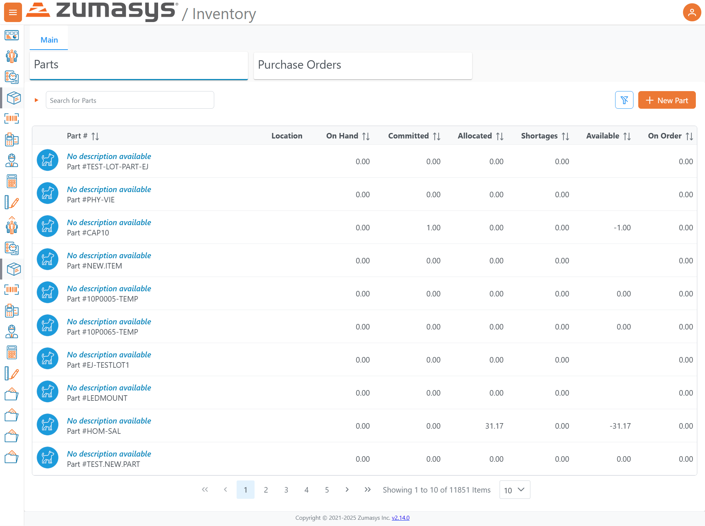
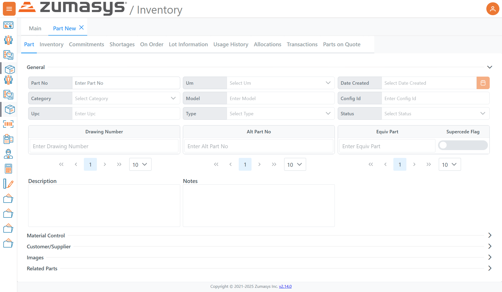
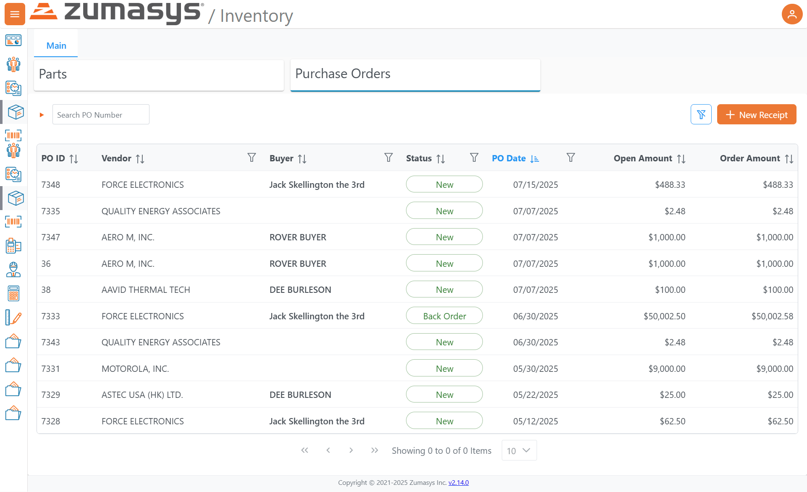
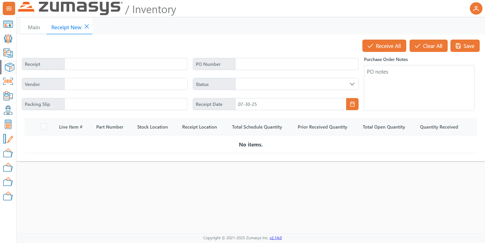

<PageHeader />

# Inventory 

## Parts

> Screen path: `Inventory → Parts`    
> App version (footer): **v2.14.0**

## Overview

The **Parts** screen lists all inventory items and their current quantities. From here you can search, filter, sort, create new parts, and navigate through the list with pagination controls.

---

## Page Layout

### Header

- **Zumasys / Inventory** product header.

### Section Tabs

- **Parts** (active)
- **Purchase Orders** (adjacent tab)

### Toolbar (right of the search box)

- **Filters**: funnel icon – opens filtering options for the grid (e.g., by quantity or attribute).
- **New Part**: orange **+ New Part** button – creates a new part record.

### Left Navigation

- Vertical icon bar linking to other modules/areas (icons only).

---

## Search & Filters

- **Search for Parts**: free-text field that narrows the grid by part number/description as you type.
- **Filters** (funnel icon): add structured filters (e.g., show only parts with shortages or with available < 0).

---

## Grid / Columns

Each row represents a part. The first cell shows the **description** (or "No description available") and the **Part #** (e.g., `#CAP10`, `#LEDMOUNT`, `#10P0005-TEMP`).

| Column | What it shows / how it's used |
|--------|-------------------------------|
| Part # | Identifier for the part. Click a row to open details (when available). Sortable. |
| Location | Storage location/bin (blank if not set). |
| On Hand | Quantity physically in stock across the selected scope. Sortable. |
| Committed | Quantity promised/allocated to demand (e.g., orders). Sortable. |
| Allocated | Quantity assigned/reserved to specific jobs/tasks. Sortable. |
| Shortages | Quantity short versus demand (often positive values indicating needed qty). Sortable. |
| Available | Net free quantity. Negative values indicate over-commitment (e.g., -31.17 in the screenshot). Sortable. |
| On Order | Quantity expected from open purchase orders. Sortable. |

> **Tip:** Each column header shows a small up/down indicator. Click to toggle ascending/descending sort.

---

## Pagination & List Size

- Pagination controls at the bottom: `« ‹ 1 2 3 4 5 › »`.
- Status text example: **"Showing 1 to 10 of 11851 Items."**
- **Page size** selector (bottom-right) defaults to **10** items per page; choose a larger value to see more rows per page.

---

## Common Tasks

### 1) Find a part quickly

1. Click in **Search for Parts**.
2. Type any part number or keyword (e.g., `LEDMOUNT`).
3. Press **Enter** or wait for the grid to update.

### 2) Show only parts with problems (e.g., negative available)

1. Click the **Filters** (funnel) icon.
2. Add a rule such as **Available < 0** (or choose "Shortages > 0").
3. Apply filters to update the grid.

### 3) Create a new part

1. Click **+ New Part**.
2. Fill in required fields (part number, description, units, etc.).
3. Save to add it to the list.

### 4) Sort by a quantity

1. Click a column header (e.g., **Shortages**).
2. Click again to flip ascending/descending.

### 5) Change how many rows you see

1. At the bottom-right, open the page-size dropdown (defaults to **10**).
2. Choose a larger number (e.g., **25** or **50**).

### 6) Switch to Purchase Orders

- Click the **Purchase Orders** tab near the top of the page.

---

## Interpreting Values

- **Decimals:** Quantities may include decimals (e.g., `31.17`).
- **Negative Available:** Indicates demand exceeding free stock (e.g., `Allocated 31.17` and **Available `-31.17`**).
- **Blank Location:** Part exists but no location is set (or location column not used).

---

## Examples Visible in the Screenshot

- Sample part numbers include: `#CAP10`, `#LEDMOUNT`, `#NEW.ITEM`, `#10P0005-TEMP`, `#10P0065-TEMP`, `#EJ-TESTLOT1`, `#PHY-VIE`.
- The list shows **10** items per page and a total of **11,851** items.

---

## Footer

- Version link: **v2.14.0** (useful when reporting issues).

---

### Notes & Best Practices

- Use **filters** to narrow large lists before exporting or mass updates.
- Sort by **Shortages** or **Available** to triage inventory issues first.
- If your counts look off, check **Committed**, **Allocated**, and **On Order** to understand why **Available** may be negative.

---

## Part (New)

> Screen path: `Inventory → Parts → New`

## Purpose

The **Part (New)** screen is used to create and maintain a **part master**. It captures identifiers (Part No, UPC), classifications (Category, Type, Model), control flags, alternates/equivalents, and descriptive data that downstream processes (receiving, allocations, orders) rely on.

---

## Page Layout

### Tabs (within the Part record)

* **Part** (active)
* **Inventory**
* **Commitments**
* **Shortages**
* **On Order**
* **Lot Information**
* **Usage History**
* **Allocations**
* **Transactions**
* **Parts on Quote**

> These tabs surface operational views related to the selected part (stock, demand, history, etc.). When creating a new part, you typically start on **Part** to define master data, then use the other tabs after saving.

### Collapsible Sections (bottom of the Part tab)

* **Material Control**
* **Customer/Supplier**
* **Images**
* **Related Parts**

---

## General (Part tab)

| Field            | Description / Use                                                                      |
| ---------------- | -------------------------------------------------------------------------------------- |
| **Part No**      | Required unique identifier for the item.                                               |
| **Um (UoM)**     | Primary unit of measure used for transactions (e.g., EA, BOX).                         |
| **Date Created** | Part creation date; calendar picker provided.                                          |
| **Category**     | Classification for reporting/segmentation (e.g., Capacitors, Fasteners).               |
| **Model**        | Optional model or family reference.                                                    |
| **Config Id**    | Optional configuration reference.                                                      |
| **Upc**          | Universal Product Code or other barcode value.                                         |
| **Type**         | Item type (e.g., Finished Good, Raw Material, Non-Stock)—used for rules and reporting. |
| **Status**       | Lifecycle state (e.g., Active/Inactive) controlling availability in transactions.      |

### Alternates, Drawings & Equivalents

These fields support one-to-many entries (note the mini **pagination controls** beneath each).

| Area               | Fields                 | Notes                                                                                 |
| ------------------ | ---------------------- | ------------------------------------------------------------------------------------- |
| **Drawing Number** | *Enter Drawing Number* | Track one or more engineering drawings tied to the part.                              |
| **Alt Part No**    | *Enter Alt Part No*    | Alternate internal numbers or legacy IDs.                                             |
| **Equiv Part**     | *Enter Equiv Part*     | Functionally equivalent parts (often cross-vendor).                                   |
| **Supercede Flag** | Toggle                 | Marks that this part is superseded/replaced (behavior depends on your configuration). |

### Descriptive Fields

* **Description** – Human-readable summary for search and documents.
* **Notes** – Free-form notes (specs, handling instructions, etc.).

---

## Collapsible Sections (Details)

> Expand each row to edit additional attributes as enabled in your environment.

* **Material Control** – Stocking policies (e.g., lot/serial control, reorder parameters).
* **Customer/Supplier** – Customer-specific part numbers, preferred vendors, cost info.
* **Images** – Upload/reference product images or drawings.
* **Related Parts** – Accessories, subcomponents, replacements beyond “Equiv/Alt” lists.

---

## Common Tasks

### 1) Create a new part

1. Navigate to **Inventory → Parts → + New Part**.
2. On the **Part** tab, fill **Part No**, **Um**, **Category**, **Type**, and **Status** at minimum.
3. Add **Description** and any **UPC/Model/Config Id** as applicable.
4. (Optional) Add **Drawing Number**, **Alt Part No**, and **Equiv Part** entries (use the small paginator if you add multiple).
5. (Optional) Expand **Material Control / Customer-Supplier / Images / Related Parts** to capture further attributes.
6. **Save** the record. Subsequent tabs (Inventory, Allocations, etc.) populate as you transact against the part.

### 2) Add alternates or equivalents later

1. Open the part and go to the **Part** tab.
2. Enter an **Alt Part No** or **Equiv Part**, then move with the mini paginator to add more items.
3. **Save**.

### 3) Mark a part as superseded

1. Open the part on the **Part** tab.
2. Toggle **Supercede Flag** on and reference the replacement under **Equiv Part** (recommended).
3. **Save**. (Your environment may prevent new use of superseded parts in orders.)

### 4) Attach drawings or images

1. In the **Part** tab, add **Drawing Number(s)**;
   and/or expand **Images** and upload/link the file.
2. **Save**.

---

## Tips & Best Practices

* **Naming:** Keep **Part No** consistent and machine-friendly; use **Description** for human detail.
* **Classifications:** Set **Category/Type/Status** correctly up front—many reports and rules depend on them.
* **Alternates vs. Equivalents:**

  * **Alt Part No** = another internal/legacy identifier.
  * **Equiv Part** = a different part that can substitute functionally (often vendor cross).
* **Supercede Flag:** Use when the part should no longer be used and has a successor; link the successor via **Equiv Part** to guide buyers/planners.
* **Documentation:** Store **Drawing Numbers** and **Images** so downstream users can verify specs during receiving and quality checks.

---

## Purchase Orders

> Screen path: `Inventory → Purchase Orders`
> App version (footer): **v2.14.0**

## Overview

The **Purchase Orders** screen lists open and historical POs, with tools to search, filter, sort, and create **receipts** against POs. It surfaces key fields—vendor, buyer, status, dates, and monetary amounts—to help you manage inbound supply and match receipts to orders.

---

## Page Layout

### Header & Tabs

* **Parts** | **Purchase Orders** (active)

### Search & Actions (top-right of grid)

* **Search PO Number**: narrows the list by PO ID as you type.
* **Filters**: funnel icon – opens column-level or global filters.
* **+ New Receipt** (orange button): starts a new PO receipt (receiving workflow).

### Left Navigation

* Vertical icon bar for navigating to other modules/areas.

---

## Grid / Columns

Each row represents a purchase order. Column headers are **sortable** and support **filters** (funnel icons).

| Column           | Description                                                                                                     |
| ---------------- | --------------------------------------------------------------------------------------------------------------- |
| **PO ID**        | Unique identifier for the purchase order. Click a row to view PO details (when available).                      |
| **Vendor**       | Supplier associated with the PO.                                                                                |
| **Buyer**        | Person or role responsible for the PO.                                                                          |
| **Status**       | Current state of the PO. Examples in the screenshot include **New** and **Back Order** (rendered as pill tags). |
| **PO Date**      | The order date; shown in `MM/DD/YYYY` format.                                                                   |
| **Open Amount**  | The remaining (unreceived/uninvoiced) value still open on the PO.                                               |
| **Order Amount** | The original total value of the PO.                                                                             |

> **Tip:** Sort by **Open Amount** descending to prioritize the largest outstanding POs, or by **PO Date** to focus on the newest/oldest orders first.

---

## Pagination & Page Size

* Pagination controls appear at the bottom: `« ‹ 1 2 3 … › »`.
* **Page size** selector defaults to **10** rows; increase to view more at once.
* Status text shows the current range (e.g., “Showing 1 to 10 of N Items”).

---

## Common Tasks

### 1) Find a specific PO

1. Click **Search PO Number**.
2. Enter the ID (full or partial).
3. Press **Enter** or wait for the list to update.

### 2) Filter by vendor, buyer, status, or date

1. Click the **Filters** (funnel) icon near the header (or the funnel under a column).
2. Add conditions such as **Vendor =** …, **Buyer =** …, **Status = New**, or **PO Date is between**….
3. Apply the filter to refine the list.

### 3) Receive items against a PO

1. Click **+ New Receipt**.
2. Select the **PO** to receive against (if prompted) and add the lines/quantities received.
3. Save/post the receipt.

   * The **Open Amount** on that PO will decrease accordingly.

### 4) Review back orders

1. Filter **Status = Back Order**.
2. Sort by **PO Date** or **Open Amount** to prioritize.
3. Drill into the PO to view outstanding lines and next steps with the vendor.

### 5) Reconcile values

* **Order Amount** shows the total value originally placed.
* **Open Amount** shows what remains.

  * If **Open Amount = Order Amount**, nothing has been received yet.
  * If **Open Amount = 0.00**, the PO is fully received/closed (or fully invoiced, depending on workflow).

---

## Interpreting Values & Status

* **Monetary formatting:** values are shown with currency and thousands separators (e.g., `$50,002.50`).
* **Statuses:** at minimum, you’ll see **New** and **Back Order**. Your environment may include additional statuses (e.g., Closed or Cancelled), which will appear as pill tags in the **Status** column.
* **Sorting/Filtering cues:** up/down arrows indicate sort order on a column; the funnel icon indicates an active filter.

---

## Best Practices

* Use **PO Date** + **Status** filters to create work queues (e.g., recent POs still **New**).
* Sort by **Open Amount** to focus supplier follow-ups where the largest value is outstanding.
* When investigating discrepancies, compare **Open Amount** with recent **Receipts** and line-level quantities on the PO details page.

Below is a **continuation** of the Markdown documentation, covering the **Receipt New** page shown in your third screenshot.

---

## Receipt (New)

> Screen path: `Inventory → Receipts → New`

## Purpose

The **Receipt (New)** screen is used to record inbound goods against an existing **Purchase Order (PO)**. Once a PO is selected, its open lines appear in the grid so you can confirm locations and enter the **Quantity Received** for each line.

---

## Page Layout

### Tabs

* **Main**
* **Receipt New** (active)

### Left Navigation

* Vertical icon bar to other modules/areas.

### Header Actions (top-right)

* **Receive All** – Prefills **Quantity Received** with each line’s **Total Open Quantity**.
* **Clear All** – Sets all **Quantity Received** values to zero/blank.
* **Save** – Saves the receipt with the entered values (and advances per your environment’s workflow).

---

## Header Fields

| Field                    | Description                                                                                            |
| ------------------------ | ------------------------------------------------------------------------------------------------------ |
| **Receipt**              | System-generated or user-entered identifier for this receipt.                                          |
| **PO Number**            | Choose the **Purchase Order** you are receiving against. Selecting a PO loads its lines into the grid. |
| **Vendor**               | Populated from the selected PO.                                                                        |
| **Status**               | Dropdown indicating the receipt’s state (e.g., new/draft/posted as defined by your setup).             |
| **Packing Slip**         | Reference number from the supplier’s packing slip.                                                     |
| **Receipt Date**         | The effective date of receipt; calendar picker available.                                              |
| **Purchase Order Notes** | Free-text area for receiving notes (shown at right).                                                   |

> **Note:** The grid below initially shows **“No items.”** until a **PO Number** is selected.

---

## Line Items Grid

Once a PO is chosen, its open lines appear with the following columns. Use the row checkbox to select individual lines if needed.

| Column                      | Meaning / How to use                                                                          |
| --------------------------- | --------------------------------------------------------------------------------------------- |
| **Line Item #**             | PO line identifier.                                                                           |
| **Part Number**             | Item being received.                                                                          |
| **Stock Location**          | Current/expected stock location (from the PO or defaults).                                    |
| **Receipt Location**        | Where you will store the received goods; adjust as needed.                                    |
| **Total Schedule Quantity** | Total quantity scheduled on the PO line.                                                      |
| **Prior Received Quantity** | Cumulative quantity already received prior to this receipt.                                   |
| **Total Open Quantity**     | Remaining quantity still open on the PO line.                                                 |
| **Quantity Received**       | Enter how much is being received now (or use **Receive All** to fill with the open quantity). |

---

## Typical Receiving Workflow

1. **Open** `Inventory → Purchase Orders` and identify the PO (optional pre-step).
2. Navigate to **Receipt (New)** and **select the PO Number**.

   * Vendor and PO notes populate; the grid loads with open lines.
3. (Optional) Enter **Packing Slip** and confirm **Receipt Date**.
4. For each line:
   a. Confirm **Receipt Location** (change if needed).
   b. Enter **Quantity Received** (or click **Receive All** to fill for every line).
5. Review entries; use **Clear All** if you need to reset quantities.
6. Click **Save** to record the receipt.

   * After saving, the PO’s **Open Quantity/Amount** should decrease accordingly.

---

## Tips & Best Practices

* **Partial receipts:** Enter only the quantity physically received; remaining units stay open on the PO for future receipts.
* **Negative or over-receipts:** If your process disallows receiving more than **Total Open Quantity**, use **Clear All** and re-enter valid amounts.
* **Locations:** Ensure **Receipt Location** reflects where items will actually be stored to avoid future put-away confusion.
* **Dates:** Use the **Receipt Date** to match supplier documents for accurate valuation and aging.

---

## Troubleshooting

* **No items after selecting a PO:** Verify the PO still has open lines and that you selected the correct PO.
* **Cannot save:** Check required fields (e.g., **PO Number**, **Receipt Date**) and confirm at least one line has a **Quantity Received**.
* **Totals don’t match expectations:** Compare **Prior Received Quantity** + **Quantity Received** against **Total Schedule Quantity** for each line.

---
## Related Documentation

[Related Parts](related-parts/README.md)

[PO Receipts](receiving/README.md)
