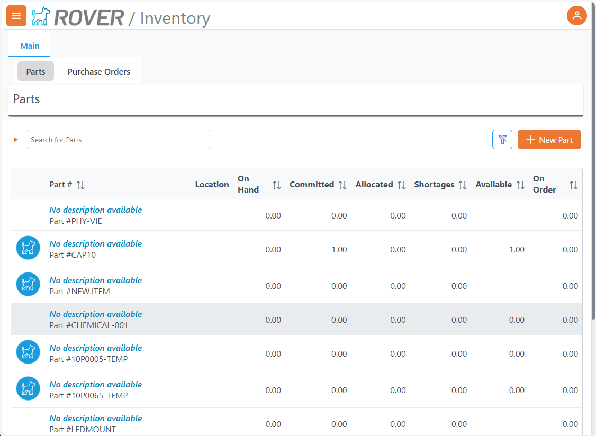
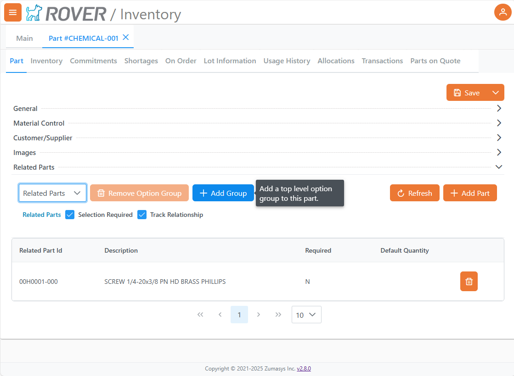
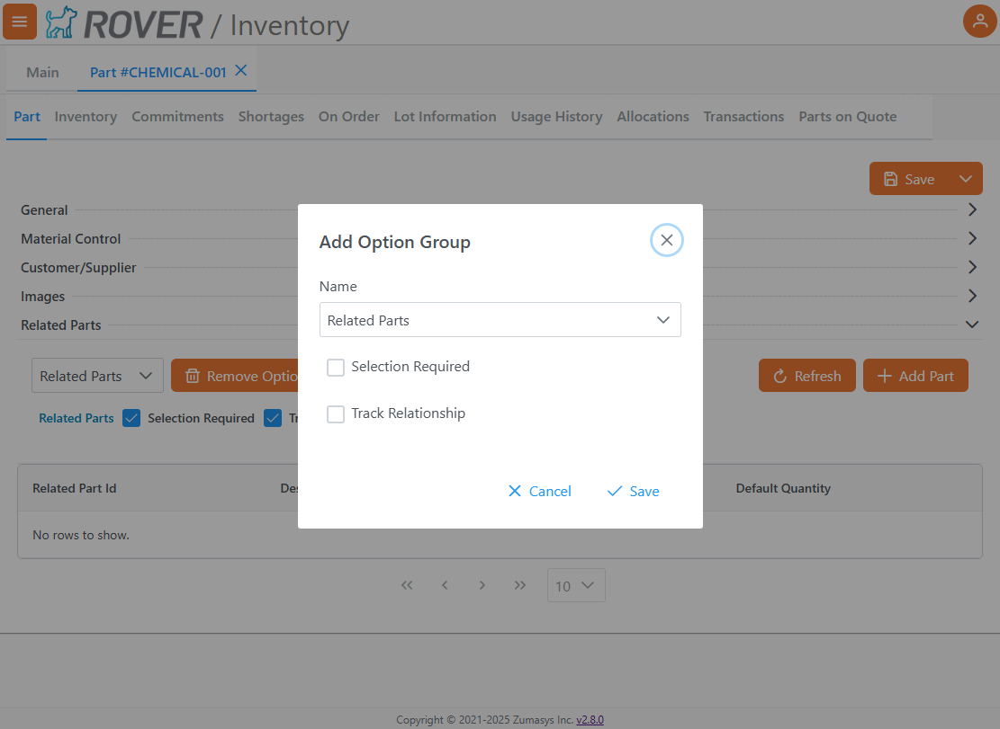
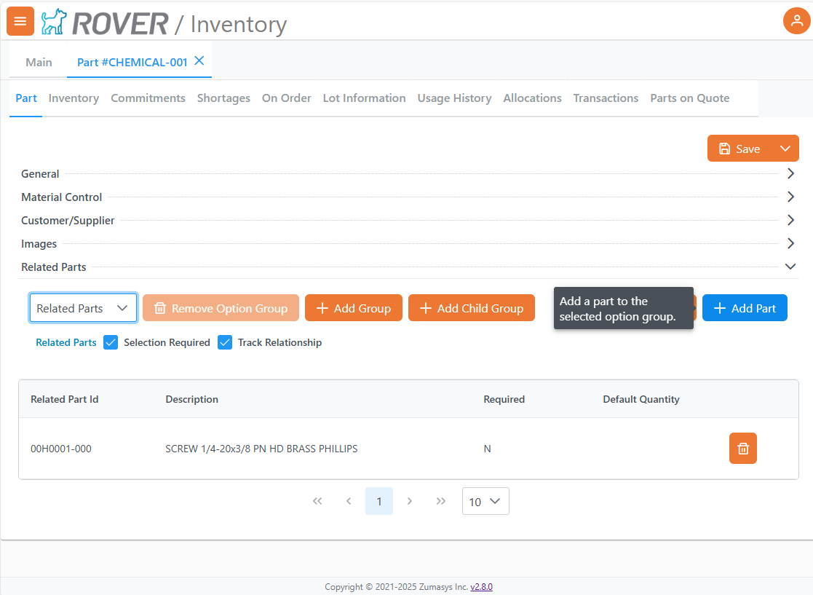
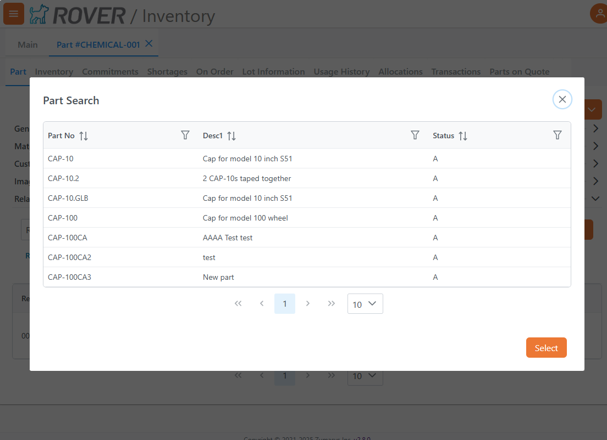
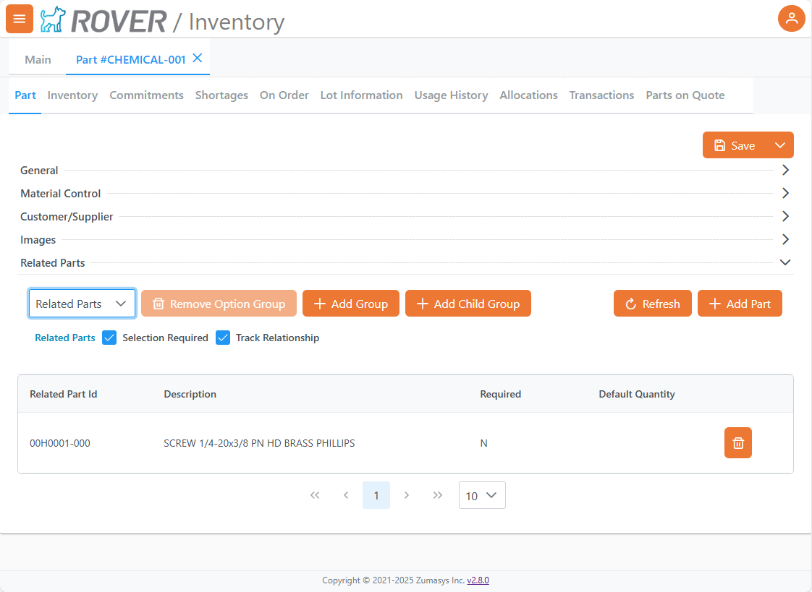
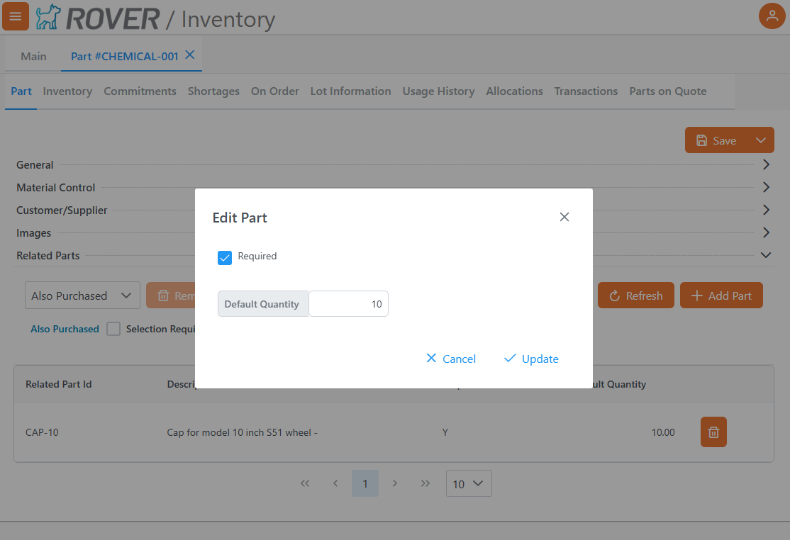
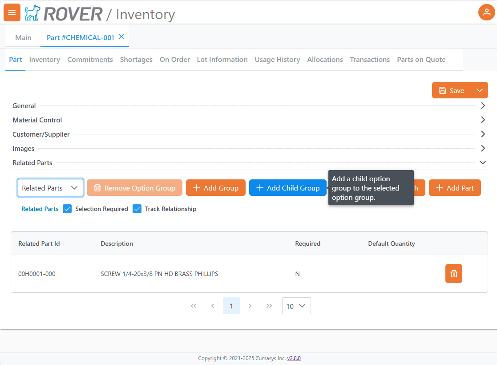
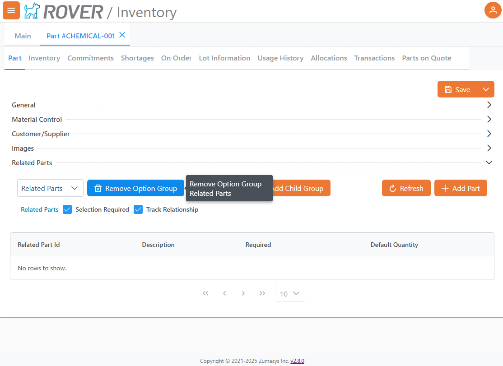

# Related Parts Setup

<PageHeader />

This guide outlines how to use the Related Parts feature within the Rover ERP Inventory module. This functionality enables the configuration of Option Groups and associated parts, which can be used for defining required or related components.  Related Parts is a recent addition to Rover Business Suite, for more information, To see more, [contact sales](mailto:sales@zumasys.com?subject=Rover%20Web%20Related%20Parts) today!

## Accessing the Related Parts Section

To begin managing Related Parts:

1. Navigate to the **Inventory** module.
2. Select a part from the **Parts** tab.
3. Open the **Related Parts** sub-tab.

## Creating an Option Group

To define a new group of related parts:

1. In the **Related Parts** section, click the **Add Group** button.

2. In the popup, provide the following:
   - **Name**: Select a predefined group type.  These group names are maintained in Rover Desktop via `OPTIONGROUPS.CONTROL`
   - **Selection Required**: Check if at least one child part must be selected. 
   >Note: Enabling 'Selection Required' will automatically enable 'Track Relationship'
   - **Track Relationship**: Enable this to checkbox to track related parts on Sales Quotes and Sales Orders.

3. Click **Save** to add the group.

## Adding Parts to an Option Group

1. Select the desired option group from the dropdown.
2. Click **Add Part**.

3. In the dialog:
   - Enter part number or description.
   - Set **Required** if the part must be included when adding the parent part to a Sales Quote or Sales Order.
   - Define the **Default Quantity**.

4. Click the **Search** field to bring up matching parts.

5. Select a part and confirm by clicking **Select**, then **Save**.

## Viewing Group Contents

Once a group is created and selected, the list of associated parts will appear below.

Each entry includes:
- **Part ID**
- **Description**
- **Required flag**
- **Default Quantity**
- **Trash icon to remove the part**

Editing Part Details:

To edit the Default Quantity or Required option for a part, click the row.  Make your changes and click 'Update' to save those changes.

## Managing Groups

- **Selection Required** and **Track Relationship** options can be adjusted after selecting a group from the dropdown.

- To add a **Child Group**, select an existing group and click **Add Child Group**.

- To remove a group, select it and click **Remove Option Group**.
>Note: Groups cannot be removed if they contain parts.
    

<PageFooter />
