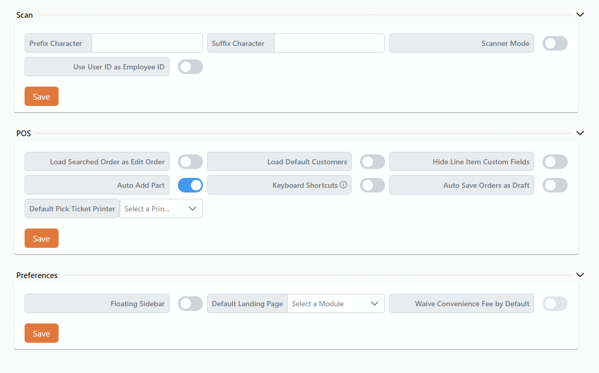

# Rover Business Suite: Settings Overview

<PageHeader />

Rover Business Suite has many user settings which allow users to enable and disable application functionality local to their device.

## Scan

Scan settings allow users to set up their own preferences for [Rover Scan](../scan/README.md).

### Prefix Character
- Allows the user to specify a character that will be automatically added at the beginning of scanned data.

### Suffix Character
- Allows the user to specify a character that will be automatically added at the end of scanned data.

### Use User ID as Employee ID
- A toggle switch that, when enabled, automatically uses the User ID as the Employee ID throughout the system.
- This functionality applies to key actions such as starting a job, ending a job, and completing work orders.

### Scanner Mode
- A toggle switch that allows users to enable or disable scanner mode.
- When enabled, scanner mode will apply to all applicable input fields, facilitating seamless data entry using a scanner.

## POS

### Load Searched Order as Edit Order
- A toggle switch that, when enabled, ensures that after a customer is selected and an order is searched for, the order opens in edit mode instead of finalize order mode.

### Load Default Customers
- A toggle switch to automatically load all customers table by default when entering the POS module.

### Hide Line Item Custom Fields
- A toggle switch to hide custom fields in cart view.

### Auto Add Part
- When a part number is entered in the POS search and a matching item is found, it will automatically be added to the cart upon completing the search.

### Keyboard Shortcuts
- Toggle to turn keyboard shortcuts on and off.
  
  

### Auto Save Orders As Draft
- A toggle switch that enables automatic, continuous saving of an order without requiring manual intervention.
- When activated, any changes made to an order are automatically saved in real-time, ensuring no data is lost due to user oversight or unexpected interruptions.

### Default Pick Ticket Printer
- A dropdown menu to select the default printer for pick tickets.

## Preferences

### Floating Sidebar
- A toggle switch to enable or disable a floating sidebar.

### Default Landing Page
- A dropdown menu to select the default module or page upon login.

### Waive Convenience Fee by Default
- A toggle switch to automatically waive convenience fees when paying an invoice.

## Actions

### Save Button
- A button to save all current settings and preferences.

<PageFooter />
