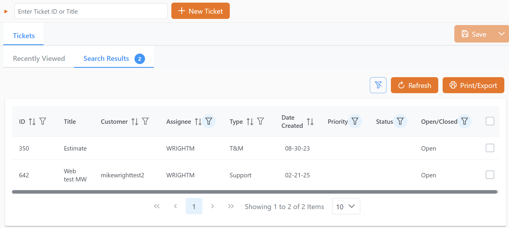
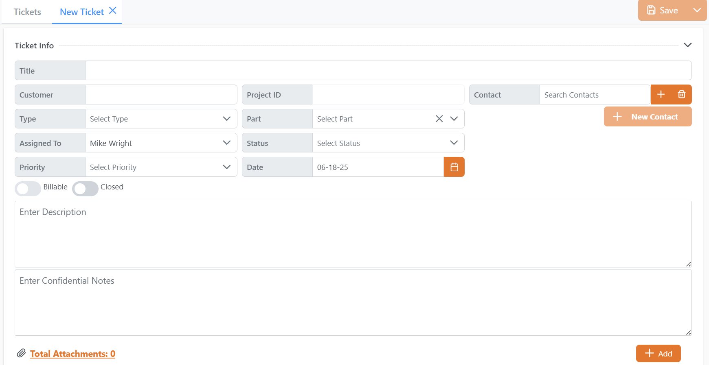
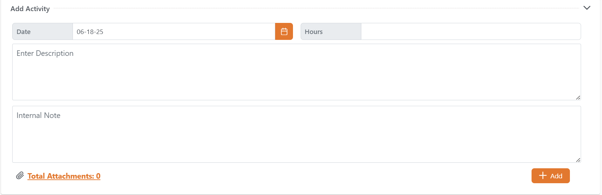

# Rover Tickets & Time

<PageHeader />

Rover Tickets & Time is a comprehensive support management solution that allows teams to efficiently manage customer tickets and track time through an intuitive web interface. The application provides robust tools for ticket creation, assignment, status tracking, and time logging to help support organizations deliver exceptional customer service.

**Tags:**
<badge text='support management' vertical='middle' />
<badge text='time tracking' vertical='middle' />
<badge text='customer service' vertical='middle' />

## Overview

The Tickets & Time module integrates seamlessly with your existing ERP system to provide a modern, web-based interface for managing support requests. Teams can create detailed tickets, assign priorities, track status changes, and log time spent on each case. The system supports multiple contacts per ticket and provides enhanced filtering capabilities to help teams focus on what matters most.

## Key Features

### Enhanced Ticket Detail Fields

- **Priority Tracking** – Assign and track ticket priorities to ensure critical issues receive immediate attention
- **Status Management** – Monitor ticket status throughout the resolution process with clear status indicators
- **Multiple Contact Support** – Link multiple contacts to a single ticket for better customer relationship management
- **Rich Text Notes** – Add detailed notes with formatting support for comprehensive documentation

### Improved Ticket Entry and Updates

- **Duplicate Prevention** – Built-in safeguards prevent accidental duplicate submissions when saving tickets
- **Auto-Save Functionality** – Automatic saving prevents data loss during ticket creation and updates
- **Validation Checks** – Real-time validation ensures all required fields are completed before submission
- **Change Tracking** – Complete audit trail of all ticket modifications with timestamps and user information

### Enhanced Filtering and List Management

- **Advanced Filters** – Filter tickets by priority, status, contact, date range, and custom criteria
- **One-Click Clearing** – Quickly clear all filters with a single click to view all tickets
- **Saved Views** – Save frequently used filter combinations for quick access
- **Real-Time Refresh** – Refresh filtered lists without losing your current view or filter settings
- **Bulk Operations** – Perform actions on multiple tickets simultaneously

### Time Tracking and Reporting

- **Detailed Time Logging** – Record time spent on each ticket with detailed activity descriptions
- **Project Association** – Link time entries to specific projects or billing codes
- **Reporting Tools** – Generate comprehensive reports on time spent, ticket resolution times, and team productivity
- **Billing Integration** – Export time entries for invoicing and billing purposes

## Getting Started

### Creating a New Ticket

1. Click the **New Ticket** button from the main dashboard
2. Enter the customer information or select from existing contacts
3. Set the ticket priority based on urgency and impact
4. Add a detailed description of the issue or request
5. Assign the ticket to appropriate team members
6. Attach any relevant files or documentation
7. Save the ticket to begin tracking

### Managing Ticket Status

1. Open the ticket from the tickets list
2. Update the status field as work progresses:
   - **Open** – New ticket requiring initial review
   - **In Progress** – Actively being worked on
   - **Pending** – Waiting for customer response or external dependencies
   - **Resolved** – Issue has been fixed and awaiting confirmation
   - **Closed** – Ticket is complete and no further action required
3. Add notes documenting the work performed
4. Log time spent on the ticket
5. Update contact information if needed

### Using Filters and Search

1. Use the filter panel to narrow down ticket lists:
   - Filter by priority (High, Medium, Low)
   - Filter by status (Open, In Progress, Pending, etc.)
   - Filter by assigned user or team
   - Filter by date range or customer
2. Apply multiple filters for precise results
3. Save frequently used filter combinations
4. Use the search function to find specific tickets by ID, customer name, or keywords
5. Refresh the list to see the latest updates without losing your filters

### Time Entry and Tracking

1. Open the ticket you worked on
2. Click the **Add Time Entry** button
3. Enter the following information:
   - Start and end times or total duration
   - Description of work performed
   - Project or billing code (if applicable)
   - Rate category or billing type
4. Save the time entry
5. Review time entries on the ticket timeline
6. Generate time reports for billing or analysis

## Best Practices

### Ticket Management

- **Use Clear Descriptions** – Write detailed, clear descriptions that help team members understand the issue quickly
- **Set Appropriate Priorities** – Use priority levels consistently across your organization
- **Keep Notes Updated** – Document all actions taken and communication with customers
- **Close Tickets Promptly** – Close resolved tickets in a timely manner to maintain accurate metrics

### Time Tracking

- **Track Time Accurately** – Log time as work is performed to ensure accuracy
- **Use Descriptive Entries** – Include enough detail to understand what work was performed
- **Review Regularly** – Review time entries before submitting for billing or reporting
- **Follow Company Policies** – Adhere to your organization's time tracking and billing policies

## Configuration Options

The Tickets & Time module can be configured to match your organization's specific workflows and requirements. Contact your system administrator or Zumasys support for assistance with:

- Custom ticket fields and workflows
- Integration with external systems
- Automated notifications and escalations
- Custom reporting and analytics
- User permissions and security settings

## Support and Training

For additional support, training, or questions about Rover Tickets & Time, contact:

- **Client Success Manager** – for strategic guidance and best practices
- [**Sales**](mailto:sales@zumasys.com?subject=Rover%20Tickets%20%26%20Time) – for feature questions and upgrades
- [**Support**](mailto:help@zumasys.com?subject=Rover%20Tickets%20%26%20Time) – for technical assistance and troubleshooting

<PageFooter />
