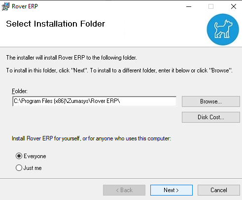
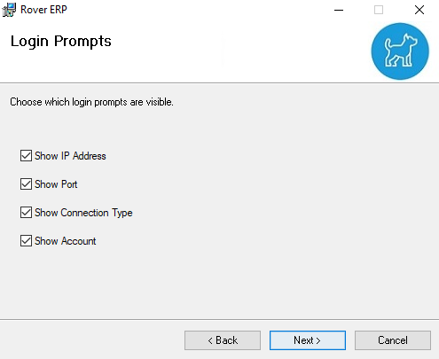

# Client Setup

<PageHeader />

Rover ERP is accessed through a program that must be installed on each client computer.

[You can find the latest client installer here](https://roverdesktop.blob.core.windows.net/apps/rover-installer-1.7.0.zip)

Download the client linked above and extract it. Double click on `setup`.

## Installing the Rover Client

### Select Installation Folder
Use the default installation path and select Everyone

   

### Login Prompts - Defaults
You will need to use the settings provided to you by our team.

   

### Login Prompts - Visiblilty
These settings determine whether or not you want to give your users the option to change the defaults set above.

It is generally recommended to have all of these options **UNCHECKED**.

   
   
### Confirm Installation
Press `Next` to begin the installation.

   

### Installation Complete
Success! The client is now installed on your system. There should be a new icon on your desktop. 

   

   

### Running the Client

Double click the icon pictured above and you will be met with your configured login screen.

   

<PageFooter />
