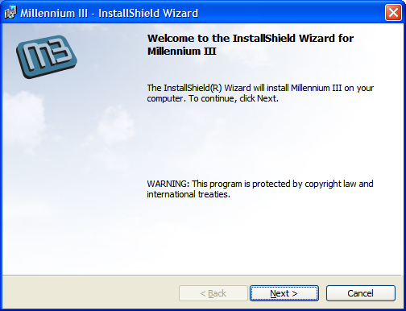
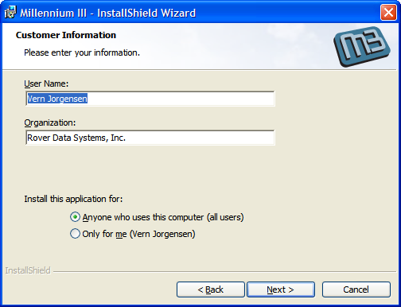
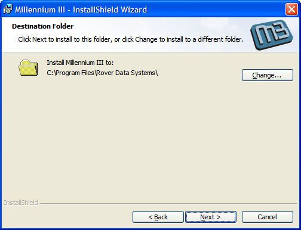
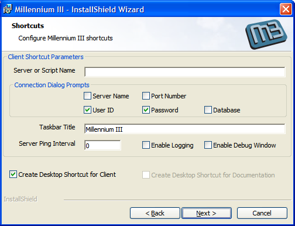
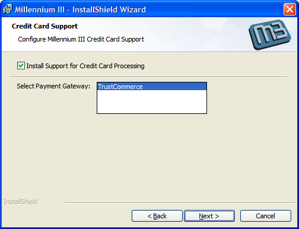
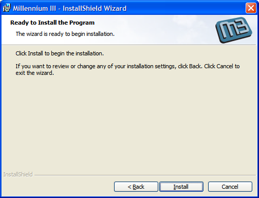
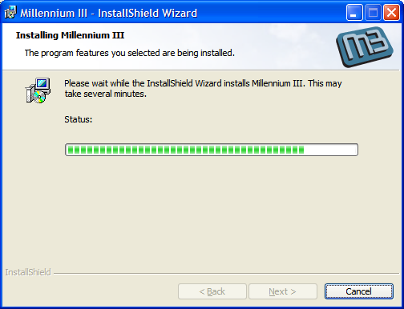

# Client Setup

<PageHeader />

## Running Setup

Rover (formerly known as "Millennium III") is accessed through a program that must be installed on each client computer. The options presented during installation will vary depending on various parameter settings that may be defined in the setup initialization file. For more information about these settings please refer to the Setup Administration section in this document.

### Starting setup

Installation may be run by double clicking the Setup.exe from a CD or from a folder on your computer or another computer on the network. When setup is run the window shown below will appear on your screen. Click the Next button.



### Customer Information

The next window that appears will prompt you for information about you and your company. In some cases Windows will automatically load this information for you. If the computer you are installing on has more than one user defined and you want to restrict access to only your user id.



### Destination Folder

Setup will display the default destination for installing the M3 Client program. You may change this location as required by clicking the Change button and selecting a new location.



### Shortcut Settings

This window allows you to choose the settings to use in the shortcuts that are created for running the M3 Client program. Your system administrator may have pre-defined default entries for some of these settings and may also restrict your ability to change some settings. In some cases the settings may be pre-defined and this window will not appear at all. The meaning of each setting is described below.



### Server or Script Name

Identifies the name or IP address of the server hosting M3, or the name of an automated login script file that already contains this information.

### Connection Dialog Prompts

Depending on how your user profile on the M3 Server has been defined you will need to provide the system with information about how to log in. The check boxes in this section identify what information will be asked of you when you start the program. In most case the only items that should be checked are User ID and Password. For more information about each of these settings refer to the Setup Administration section of this document.

### Taskbar Title

This identifies the name that will appear on the button in the Windows Taskbar.

### Server Ping Interval

If you are accessing a system remotely you will most likely be making the connection through some type of firewall. Most firewalls have settings that will timeout (drop) a connection after a defined period of inactivity. You can prevent this from happening by setting a ping interval that will cause the client to send a small amount data through the connection to make it appear to the firewall that there is activity. This information is ignored by the M3 server and will not affect any applications you are currently running. Set the interval to the number of seconds between each ping, for example 60. Set it to 0 to turn off pinging.

### Enable Logging

The client can generate a log file of all the activity that occurs during a session. The logs are stored in the same folder in which the client program was installed. These logs can be useful when problems occur but are normally turned off.

### Enable Debug Window

The debug window is another tool for diagnosing problems that occur. It captures and displays all of the data traffic between the host and client. It is normally turned off.

### Create Desktop Shortcut for Client

If you would like a shortcut to the M3 Client automatically added to your desktop check this box.

### Create Desktop Shortcut for Documentation

If your system administrator has defined the location at which the web based M3 documentation is located you can have the system create a desktop shortcut to it by checking the box.

### Credit Card Support

By default the setup program will install the components required to perform credit card processing through the client and you will not see this window during setup. You will only see this window if your administrator has setup the installation to do so. Checking the box will cause the credit card components to be installed for the payment gateway that is highlighted.



### Completing Installation

Clicking the Install button on this page will begin the actual installation of the software.






## Configuration Information

The M3 Client Setup process provides a Setup.ini file that allows you to control the setup process. You can define the default settings for many of the options asked of the user through the setup process and also restrict which entries they may change.

### Configuration File Example

The setup folder is delivered with an `M3Setup.ini`-template file that contains all of the available parameters. To use this file, make a copy and change the name to `M3Setup.ini`. Any standard text editor such as Notepad may be used to edit the file. The file looks like this:

``` ini
* Installation property name = value pairs:

* This file is delivered as M3Setup.ini-template. It must be changed to
* M3Setup.ini to be recognized by the setup program. It is delivered with
* the settings that the setup program would use if an M3Setup.ini file was
* not present or an individual option was not present in this file.

* Note: The values "Checked" and "Unchecked" are case-sensitive for all properties.

* Server name, IP address or logon script name. For example, 192.168.1.100.
M3_SERVER =

* Default check box settings that determine the information
* requested of the user when logging in.
M3_PROMPT_SERVER = Unchecked
M3_PROMPT_PORT = Unchecked
M3_PROMPT_USER = Checked
M3_PROMPT_PASSWORD = Checked
M3_PROMPT_DATABASE = Unchecked

* Text that appears in the button on the Windows task bar.
* If not set "Millennium III" will appear.
M3_TASKBAR_TITLE = Millennium III

* Ping interval seconds setting to prevent connections from dropping
* due to firewall timeouts. Set to zero (0) to disable.
M3_PING_INTERVAL = 0

* Set to Checked if activity log files are to be generated, usually for debugging.
M3_LOG_ENABLED = Unchecked

* Set to Checked if the communications debug window should be shown, for debugging.
M3_DEBUG_ENABLED = Unchecked

* Set to Checked if a desktop shortcut to M3 should be created.
M3_CLIENT_DESK_CREATE = Checked

* Settings for shortcuts to M3 documentation.
* Set to Checked if a desktop shortcut should be created.
M3_DOCN_DESK_CREATE = Unchecked

* Set to the path where the M3 documentation resides. For example, \\server\M3Doc\index.htm
M3_DOCN_DIR =

* Prevent changing any values by hiding Shortcuts dialog:
M3_SHORTCUTS_VISIBLE = 0

* Prevent changing shortcut values by disabling specific controls.
* Set to zero (0) to disable or 1 (default) to allow changes.
M3_SERVER_ENABLE = 1
M3_PROMPT_SERVER_ENABLE = 1
M3_PROMPT_PORT_ENABLE = 1
M3_PROMPT_USER_ENABLE = 1
M3_PROMPT_PASSWORD_ENABLE = 1
M3_PROMPT_DATABASE_ENABLE = 1
M3_TASKBAR_TITLE_ENABLE = 1
M3_PING_INTERVAL_ENABLE = 1
M3_LOG_ENABLED_ENABLE = 1
M3_DEBUG_ENABLED_ENABLE = 1
M3_CLIENT_DESK_CREATE_ENABLE = 1
M3_DOCN_DESK_CREATE_ENABLE = 1

* Credit Card Support settings.
* Set to Checked to install credit card processing software
M3_CC_INSTALL = Unchecked

* Set to the name of the credit card processing service to be used.
* Options are TrustCommerce, CyberSource
M3_CC_GATEWAY = TrustCommerce

* Set to 1 to allow changes in the credit card support dialog or zero (0) to disallow.
M3_CC_VISIBLE = 1
```

> An asterisk at the beginning of a line denotes a comment and is ignored by the setup program. Each of the possible settings is commented by default and may be activated by removing the asterisk from the beginning of the line. The following is a description of each of the settings.

### Configuration File API

#### M3_SERVER

Server or Script Name default. For example, `M3_SERVER=192.168.1.1`

#### M3_PROMPT_SERVER

Server Name check box default. Set to `M3_PROMPT_SERVER=Checked` to default a check in the box or `M3_PROMPT_SERVER=Unchecked` to leave it unchecked. If the option is not activated (commented with an asterisk) Unchecked is assumed.

#### M3_PROMPT_PORT

Port Number check box default. Set to `M3_PROMPT_PORT=Checked` to default a check in the box or `M3_PROMPT_PORT=Unchecked` to leave it unchecked. If the option is not activated (commented with an asterisk) Unchecked is assumed.

#### M3_PROMPT_USER

User ID check box default. Set to `M3_PROMPT_USER=Checked` to default a check in the box or `M3_PROMPT_USER=Unchecked` to leave it unchecked. If the option is not activated (commented with an asterisk) Unchecked is assumed.

#### M3_PROMPT_PASSWORD

Password check box default. Set to `M3_PROMPT_PASSWORD=Checked` to default a check in the box or `M3_PROMPT_PASSWORD=Unchecked` to leave it unchecked. If the option is not activated (commented with an asterisk) Unchecked is assumed.

#### M3_PROMPT_DATABASE

Database check box default. Set to `M3_PROMPT_DATABASE=Checked` to default a check in the box or `M3_PROMPT_DATABASE=Unchecked` to leave it unchecked. If the option is not activated (commented with an asterisk) Unchecked is assumed.

#### M3_TASKBAR_TITLE

Taskbar Title default. For example, `M3_TASKBAR_TITLE=ERP System`. If the default is not activated (commented with an asterisk) *Millennium III* is used.

#### M3_PING_INTERVAL

Server Ping Interval default. For example, `M3_PING_INTERVAL=60`. If the default is not activated (commented with an asterisk) 0 is used.

#### M3_LOG_ENABLED

Enable Logging check box default. Set to `M3_LOG_ENABLED=Checked` to default a check in the box or `M3_LOG_ENABLED=Unchecked` to leave it unchecked. If the option is not activated (commented with an asterisk) Unchecked is assumed.

#### M3_DEBUG_ENABLED

Enable Debug Window check box default. Set to `M3_DEBUG_ENABLED=Checked` to default a check in the box or `M3_DEBUG_ENABLED=Unchecked` to leave it unchecked. If the option is not activated (commented with an asterisk) Unchecked is assumed.

#### M3_CLIENT_DESK_CREATE

Create Desktop Shortcut for Client check box default. Set to `M3_CLIENT_DESK_CREATE=Checked` to default a check in the box or `M3_CLIENT_DESK_CREATE=Unchecked` to leave it unchecked. If the option is not activated (commented with an asterisk) Unchecked is assumed.

#### M3_DOCN_DESK_CREATE

Create Desktop Shortcut for Documentation check box default. Set to `M3_DOCN_DESK_CREATE=Checked` to default a check in the box or `M3_DOCN_DESK_CREATE=Unchecked` to leave it unchecked. If the option is not activated (commented with an asterisk) Unchecked is assumed.

#### M3_CLIENT_DOCN_DIR

If you want the user to have access to the browser based documentation you must indicate the path at which the documentation resides with this setting. If this setting is not present the Create Desktop Shortcut for Documentation option will not be available during setup. For example, `M3_CLIENT_DOCN_DIR=\\Server1\M3Doc\index.htm`.

#### M3_SHORTCUTS_VISIBLE

Determines if the Shortcuts page appears to the user during the setup process. You would use this option if you had predefined all of the settings and did not want the user to be able to change any of them during setup. For example, `M3_SHORTCUTS_VISIBLE=0` would prevent the Shortcuts page from appearing to the user. `M3_SHORTCUTS_VISIBLE=1` would allow the page to be displayed. If the option is not active (commented) the page will be displayed.

#### M3_SERVER_ENABLED

Determines if the Server or Script Name setting may be changed by the user. For example, `M3_SERVER_ENABLED=0` would prevent the user from making changes. `M3_SERVER_ENABLED=1` would allow the setting to be changed. If not activated (commented) the setting is assumed to be 1.

#### M3_PROMPT_SERVER_ENABLED

Determines if the Server Name check box may be changed by the user. For example, `M3_PROMPT_SERVER_ENABLED=0` would prevent the user from making changes. `M3_PROMPT_SERVER_ENABLED=1` would allow the setting to be changed. If not activated (commented) the setting is assumed to be 1.

#### M3_PROMPT_PORT_ENABLED

Determines if the Port Number check box may be changed by the user. For example, `M3_PROMPT_PORT_ENABLED=0` would prevent the user from making changes. `M3_PROMPT_PORT_ENABLED=1` would allow the setting to be changed. If not activated (commented) the setting is assumed to be 1.

#### M3_PROMPT_USER_ENABLED

Determines if the User ID check box may be changed by the user. For example, `M3_PROMPT_USER_ENABLED=0` would prevent the user from making changes. `M3_PROMPT_USER_ENABLED=1` would allow the setting to be changed. If not activated (commented) the setting is assumed to be 1.

#### M3_PROMPT_PASSWORD_ENABLED

Determines if the Password check box may be changed by the user. For example, `M3_PROMPT_PASSWORD_ENABLED=0` would prevent the user from making changes. `M3_PROMPT_PASSWORD_ENABLED=1` would allow the setting to be changed. If not activated (commented) the setting is assumed to be 1.

#### M3_PROMPT_DATABASE_ENABLED

Determines if the Database check box may be changed by the user. For example, `M3_PROMPT_DATABASE_ENABLED=0` would prevent the user from making changes. `M3_PROMPT_DATABASE_ENABLED=1` would allow the setting to be changed. If not activated (commented) the setting is assumed to be 1.

#### M3_TASKBAR_TITLE_ENABLED

Determines if the Taskbar Title setting may be changed by the user. For example, `M3_TASKBAR_TITLE_ENABLED=0` would prevent the user from making changes. `M3_TASKBAR_TITLE_ENABLED=1` would allow the setting to be changed. If not activated (commented) the setting is assumed to be 1.

#### M3_PING_INTERVAL_ENABLED

Determines if the Server Ping Interval setting may be changed by the user. For example, `M3_PING_INTERVAL_ENABLED=0` would prevent the user from making changes. `M3_PING_INTERVAL_ENABLED=1` would allow the setting to be changed. If not activated (commented) the setting is assumed to be 1.

#### M3_LOG_ENABLED_ENABLED

Determines if the Enable Logging check box may be changed by the user. For example, `M3_LOG_ENABLED_ENABLED=0` would prevent the user from making changes. `M3_LOG_ENABLED_ENABLED=1` would allow the setting to be changed. If not activated (commented) the setting is assumed to be 1.

#### M3_CLIENT_DESK_CREATE_ENABLED

Determines if the Create Desktop Shortcut for Client check box may be changed by the user. For example, `M3_CLIENT_DESK_CREATE_ENABLED=0` would prevent the user from making changes. `M3_CLIENT_DESK_CREATE_ENABLED=1` would allow the setting to be changed. If not activated (commented) the setting is assumed to be 1.

#### M3_DOCN_DESK_CREATE_ENABLED

Determines if the Create Desktop Shortcut for Documentation check box may be changed by the user. For example, `M3_DOCN_DESK_CREATE_ENABLED=0` would prevent the user from making changes. `M3_DOCN_DESK_CREATE_ENABLED=1` would allow the setting to be changed. If not activated (commented) the setting is assumed to be 1.

#### M3_CC_INSTALL

This option determines the default setting for Install Support for Credit Card Processing option on the Credit Card Support page is checked. For example, `M3_CC_INSTALL=Checked` defaults a check in the box. `M3_CC_INSTALL=Unchecked` would show the box empty. If not activated (commented) the setting is assumed to be Checked.

#### M3_CC_GATEWAY

This option determines if the default credit card processing gateway be installed. For example, `M3_CC_GAETWAY=TrustCommerce`.

#### M3_CC_VISIBLE

This option determines if the credit card processing page is to appear during setup allowing the user to change the settings. For example, `M3_CC_VISIBLE=1` will show the page. `M3_CC_VISIBLE=0` will not show the page. If this option is not activated (commented) then a setting of 0 is used.

#### CLIENT SPECIAL NOTES

To increase the M3 initial logon window. Add the following switch to the client shortcut.

`/A XX`

`XX` = Number of time to increase size.  For example, 10 will be times time normal size.

If multiple displays are being used and the screen control is lost. Add the following switch to the client shortcut.

`/X 1`

<PageFooter />
