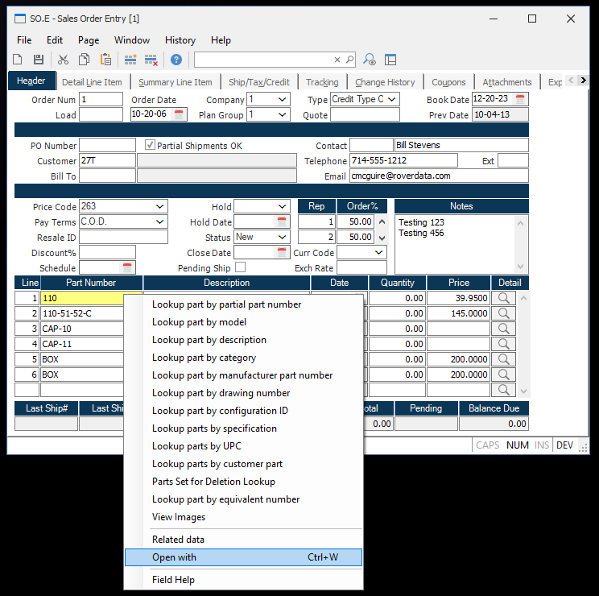

# Rover Desktop v1.7.2 Release Notes

<badge text= "Version 1.7.2" vertical="middle" />

<PageHeader />

These are the release notes for version 1.7.2 of the Rover Desktop application.  Contact your _Client Success Manager_, [Sales](mailto:sales@zumasys.com?subject=Rover%20Desktp%20v1.7.2) or [Support](mailto:help@zumasys.com?subjectRover%20Desktp%20v1.7.2) with any questions!

You can download this version [here!](https://roverdesktop.blob.core.windows.net/apps/rover-installer-1.7.2.zip)

## Updates

- **Selection Grid**
  - When a selection grid is active, as data is typed, a search is performed on the defined search column for the grid and the first matching row is selected.
  

- **Hotkeys**
  - When the active field on a form has a context menu that includes an "Open With" option, pressing Ctrl-W will open the list of available programs.
  - When a data form or print preview form is active, pressing Ctrl-B will activate the Workspace window and the Command textbox will be given focus.
  

## Bug Fixes

- **General**
  - Addresses an issue with chart generation when Y-Axis values are not passed as integer.
  - Addresses an issue where child datagrid indexes were not reset when a parent datagrid was scrolled.

<PageFooter />
