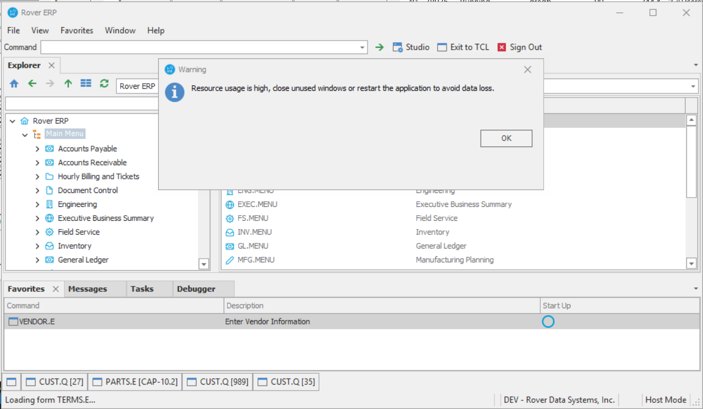

# Rover Desktop v2.4.0 Release Notes

<badge text= "Version 2.4.0" vertical="middle" />

<PageHeader />

These are the release notes for version 2.4.0 of the Rover Desktop application.  Contact your _Client Success Manager_, [Sales](mailto:sales@zumasys.com?subject=Rover%20Desktop%20v2.4.0) or [Support](mailto:help@zumasys.com?subjectRover%20Desktop%20v2.4.0) with any questions!

You can download this version [here!](https://roverdesktop.blob.core.windows.net/apps/rover-installer-2.4.0.zip)

## Updates
- Disable "Right to Left" display in ME Editor
- GDI Object cleanup improvements during form close events.
- Adds GDI Object details to exception logs.
- Adds warning dialog when forms are opened while the current GDI object count exceeds 7500.

## Bug Fixes
- Addresses an issue with buttonClick events being skipped in nested datagrid scenarios.
- Addresses an exception in messageBoxEnhanced related to monospace font display.
- Addresses a specific crash related to screen centerpoint calculation.
- Addresses an issue with Ctrl-E causing a crash when closing forms that contained a chart control.
- Addresses an issue with combobox option values on nested grids.
- Addresses an issue with HTML content not being properly detected in emails body strings.

<PageFooter />

