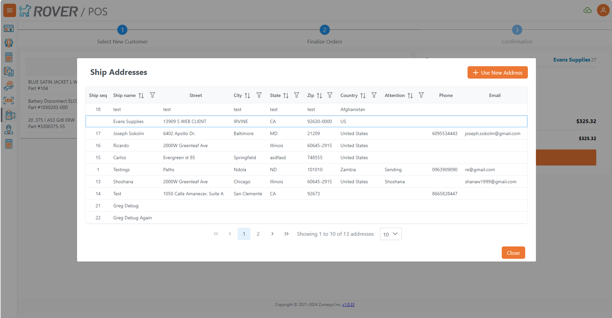
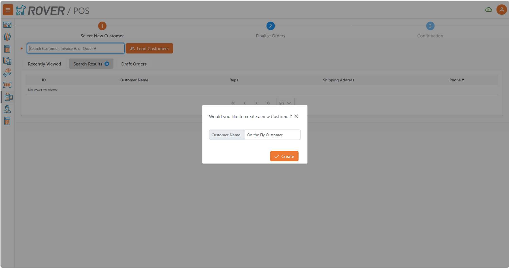
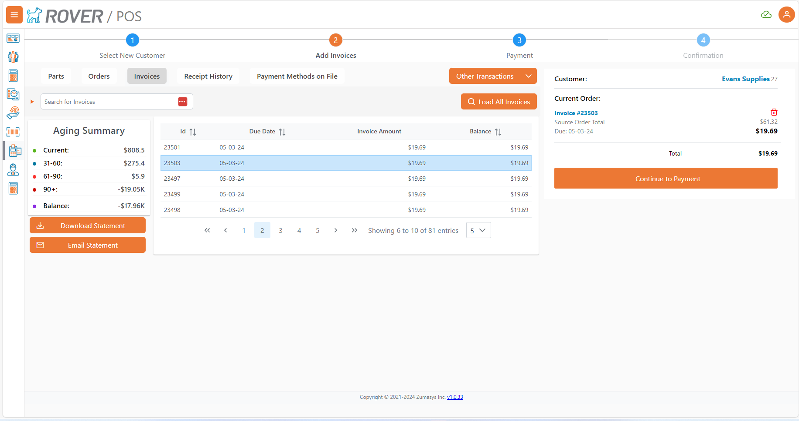
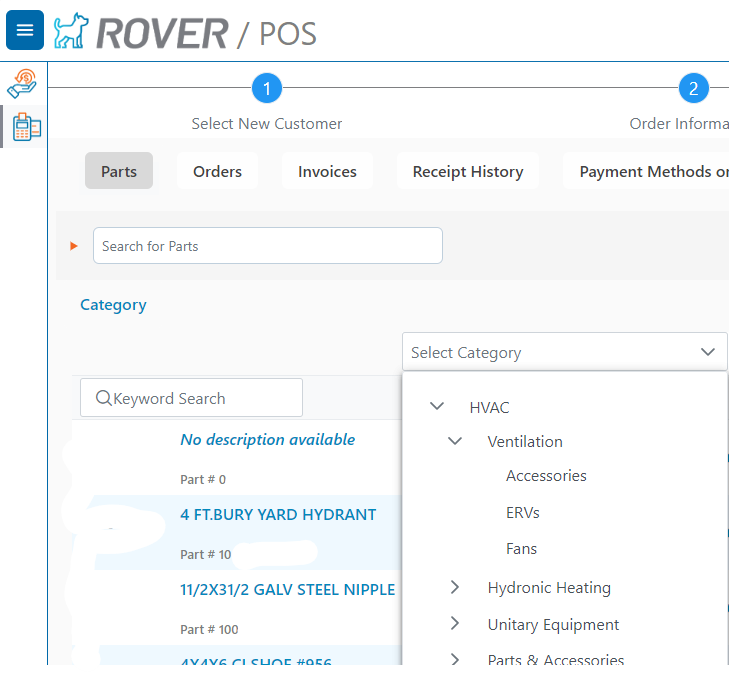
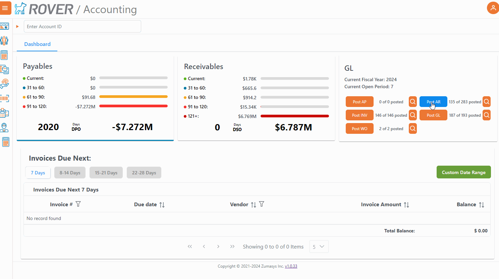
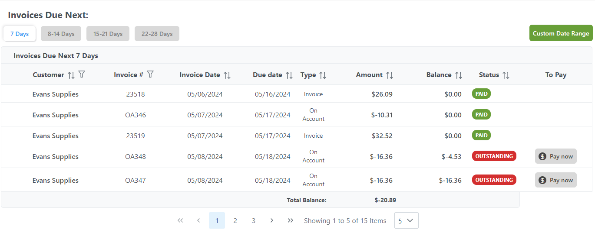

# Rover Web v1.0.34 Draft Release Notes

<badge text= "Version 1.0.34" vertical="middle" />

<PageHeader />

These are the release notes for version 1.0.34 (5TBD) of the Rover Web application and can be made available to customers running _Rover ERP_, _IMACS_ and other non-Zumasys owned systems. Contact your _Client Success Manager_, [Sales](mailto:sales@zumasys.com?subject=Rover%20Web%20v1.0.34) or [Support](mailto:help@zumasys.com?subject=Rover%20Web%20v1.0.34) today!

## New Features

- **Rover Web**
  - **Point of Sale**
    - Partial Shipment Option, enabled using `MRK.CONTROL`, which includes:
    
    - New Ship Options Screen with PO Origination capabilities.
    
    - Shipment Address updates, allows for selection of a shipping address for each partial shipment.
    
    - "On the Fly" Customer Creation from the POS Customer Search. Enable using `MRK.CONTROL`
      > Enabling this feature also enables the addition of the selected sales rep on an order to the Customer Record if none exist
      
    - Customer Search via Phone Number
    - Open Order Total Display on each invoice line
    
    - Optional Credit Memo Application to Order. Enable using `MRK.CONTROL`
    - Mixed User/Register Mode. Enable using `MRK.CONTROL`
      > Note: Currently only supported by select ERPs.
    - Payment Overage checkbox can be hidden
      > Note: Currently only supported by select ERPs, requires Register Mode.
    - Payment Overage can now have a default value
      > Note: Currently only supported by select ERPs, requires Register Mode.
    - New category filter using tree-based selection. Enable using `MRK.CONTROL`
    
    - Ability to show keyword search in parts table. Enable using `MRK.CONTROL`
    - Cost column has been added to the cart view. Enable using `MRK.CONTROL`
    - Select Sales Rep during Order Creation. Enable using `MRK.CONTROL`
  - **Accounting**
    - A new GL Card which allows viewing, interfacing, and posting Registers and GL Transactions
    
    - An Invoice Date column has been added to the Accounts Receivable Data Table, and the Customer Name column has been moved to the first column of the table
    
  - **Invoices**
    - The Invoices page will be deprecated in 1.0.35 now that the Accounting page is available.

## Bug Fixes

- **Rover Web**
  - **Point of Sale**
    - Voided Transaction Receipt now accurately reflects the Void transaction, instead of the original transaction.
    - Updating an Invoice Amount will now clear all Tenders and reset the overage default
    - Cash Drawer Pop Error Resolved
    - Fixed issue with ACH payment options missing.
  - **Inventory**
    - Updated inventory to include Plan Group, Shortages, and Allocated amounts.
  - **Accounting**
    - Fixed an issue with select drill downs from the AR KPI

<PageFooter />
