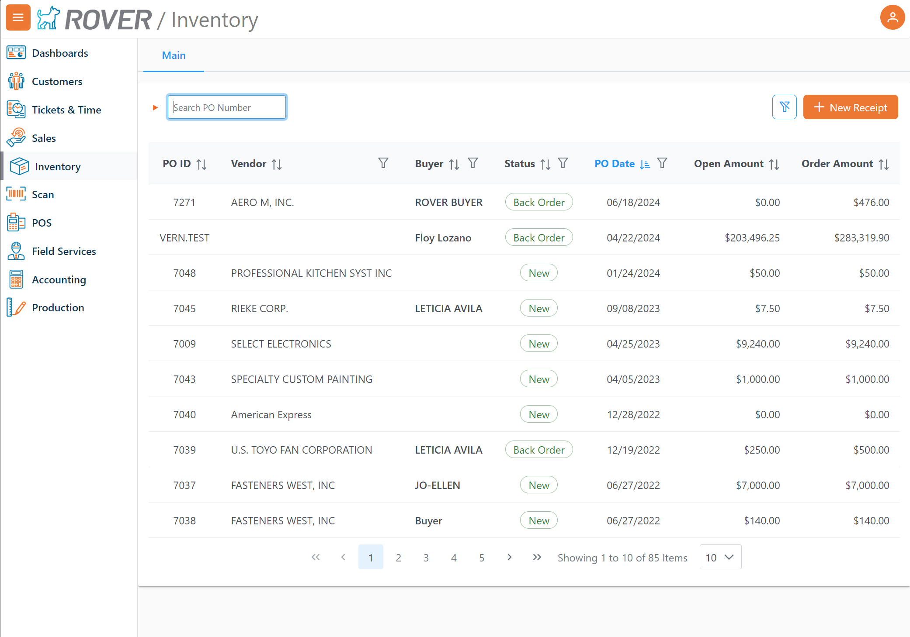
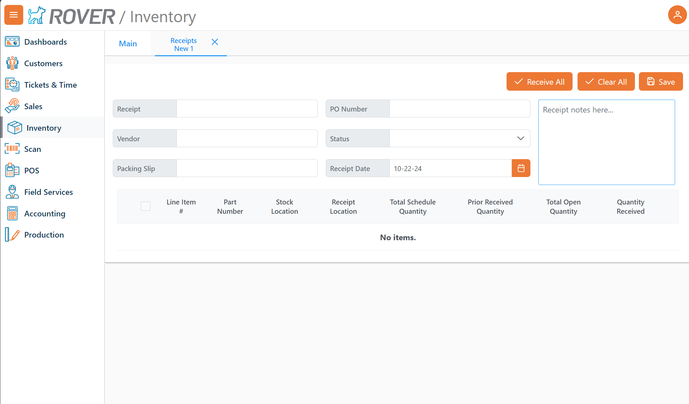
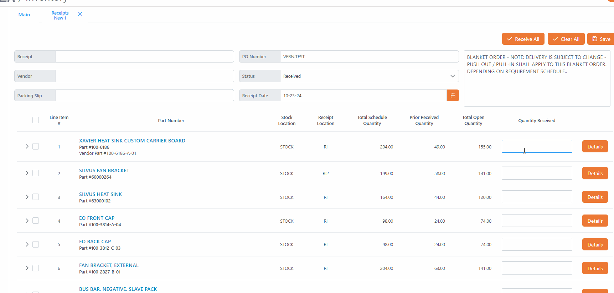

# Rover Web v1.10.0 Release Notes

<badge text= "Version 1.10.0" vertical="middle" />

<PageHeader />

These are the release notes for version 1.10.0 (10/24/2024) of the Rover Web application and can be made available to customers running _Rover ERP_, _IMACS_ and other non-Zumasys owned systems. Contact your _Client Success Manager_, [Sales](mailto:sales@zumasys.com?subject=Rover%20Web%20v1.10.0) or [Support](mailto:help@zumasys.com?subject=Rover%20Web%20v1.10.0) today!

## New Features

- **Rover Web**
  - **Inventory**
    - The inventory module has officially been added with significant updates. This new release provides a data table that pulls in all existing purchase orders. You can now view, sort, filter, and search through existing purchase orders.
      
    - The ability to create a receipt is available.
      
    - When selecting a purchase order from the table, you will be taken to a screen where you can either receive all items or clear all quantities received for the purchase order. You can also check the top box to select all and fill the available quantity received, or select items individually. Entering a partial quantity will result in an orange tint on the row, while entering a greater quantity will result in a red tint. The correct quantity will be displayed in blue.
      
  - **Production Scheduling**
    - Added default filtering for initial loading of purchase orders, excluding finalized or closed statuses.
    - Made quantity non-editable on scheduled orders.
    - Added viewable notes for scheduled orders.
    - Added ability to edit work order notes within the unscheduled order table.
  - **Point of Sale**
    - Added support for read only custom fields.
      > Note: Currently only supported by select ERPs.
    - Additional help text has been added to the Payment section.
    - Confirmation dialog when navigating away from POS now allows you to save progress as a draft.
    - Added keyboard shortcuts support for parts table. To enable, toggle the new "Keyboard Shortcuts" located in the POS settings menu.
      - Loading parts now focus on the first part quantity field.
      - Pressing the 'Enter' will add the part to that cart.
      - Shift + 'Arrow Up' and 'Arrow Down' will move the focus up or down the parts table.
      - Shift + 'F' will focus on part search.
  - **General**
    - UI enhancements for settings page.

## Bug Fixes

- **Rover Web**
  - **General**
    - Email dialog now automatically adds email address when navigating to the next field.
    - Calendar popup no longer appears unintentionally when using browser autocomplete.
      > Note: Issue only appeared in Microsoft Edge.
  - **POS**
    - Fixed issue with cart line items sub-totaling appearing offscreen.
  - **Production Scheduling**
    - Fixed issue with scheduled work orders appearing in unscheduled work order table.
    - Fixed issue with 'Add Operation' displaying incorrect time.
    - Fixed issue with Confirmation dialog always navigating to the customers section. Will now navigate to the section that was selected.
  - **Customers**
    - Fixed issue with KPI cards not focusing on the correct tab when clicking.
