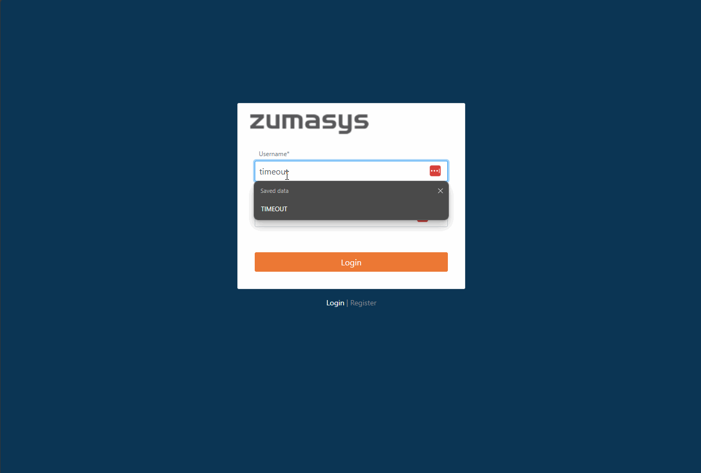

# Rover Web v1.11.0 Release Notes

<badge text= "Version 1.11.0" vertical="middle" />

<PageHeader />

These are the release notes for version 1.11.0 (11/12/2024) of the Rover Web application and can be made available to customers running _Rover ERP_, _IMACS_ and other non-Zumasys owned systems. Contact your _Client Success Manager_, [Sales](mailto:sales@zumasys.com?subject=Rover%20Web%20v1.10.0) or [Support](mailto:help@zumasys.com?subject=Rover%20Web%20v1.10.0) today!

## New Features

- **Rover Web**
  - **Login**
    - Select implementations now support the option for the host backend to force a user logging in to update their password.
    
  - **Customers**
    - Invoice Payment capabilites will only be available for users with the `CASH.E` command
  - **Accounting**
    - Invoice Payment capabilites will only be available for users with the `CASH.E` command
  - **POS**
    - MRK toggle added to the Opportunities tab.
    - There has been a redesign of the Invoices Tab in POS, allowing for more compatibility with smaller screens and more convenient features including downloading and emailing of an invoice and the ability to clear all invoices from the cart.
    

## Bug Fixes

- **Rover Web**
  - **Field Services**
    - Error observed when sending emails with a blank "To" email address has been resolved. Form will no longer submit without a filled "To" email address.
  - **POS**
    - Updating the amount on an invoice that has been added to the cart is now always bound by the original amount, instead of a previously updated amount.
    - When adding or updating part quantities to the cart, quantities will be correctly restricted to multiples of a part's sell quantity. `Applies to Select implementations`
  - **Production Scheduling**
    - Additional Operations now display the added Title as the Label in the Gantt Chart, instead of the base Operation.
  - **Customers**
    - Fixed scenarios where Quotes and Orders badge counts were inaccurate.
    - Quotes and Orders date sort now works properly.
    - Quotes date filter now works properly.
    - Fixed scenarios where Quotes and Orders paging were not functional.
  - **Inventory**
    - Fixed sorting issue when selecting a rows-per-page option greater than 10, paginating, and then applying a sort.
