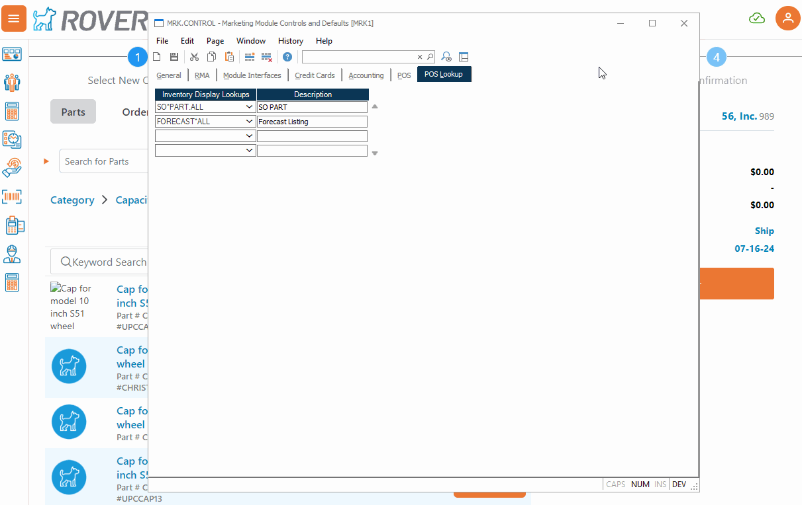
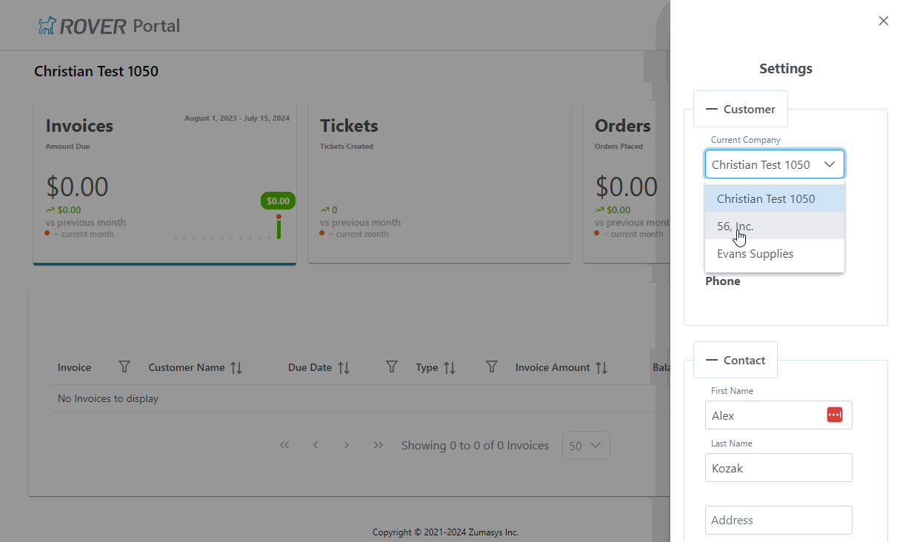

# Rover Web v1.3.0 Release Notes

<badge text= "Version 1.3.0" vertical="middle" />

<PageHeader />

These are the DRAFT release notes for version 1.3.0 (7/16/2024) of the Rover Web application and can be made available to customers running _Rover ERP_, _IMACS_ and other non-Zumasys owned systems. Contact your _Client Success Manager_, [Sales](mailto:sales@zumasys.com?subject=Rover%20Web%20v1.3.0) or [Support](mailto:help@zumasys.com?subject=Rover%20Web%20v1.3.0) today!

## New Features
- **Rover Web**
    - **Point of Sale**
      - Support for overriding the address for a selected ship to address has been added. This is enabled by the "Allow Ship To Address Override" setting in MRK.CONTROL.
      
      - Customizable lookups are supported in the inventory dialog in the part lookup. These can be configured in MRK.CONTROL to select which items to show. Currently only lookups with certain signatures are supported with more support coming in the future.
      
      - Added invoice date under "invoices" tab
      - Invoice Date column has been added to the Invoices table.
    - **Field Services**
      - Improved performance of initial load of the Field Services form.
## Bug Fixes

- **Rover Web**
  - **Point of Sale**
    - An issue with inconsistent sales tax calculation calls during certain POS actions has been resolved.
    - When validation mode is enabled in POS, a validation call is now made during Add To Cart actions.
      > Note: Currently only supported by select ERPs.

- **Rover Customer Portal**
  - The invoices table now refreshes when switching Customers. 
     

<PageFooter />
