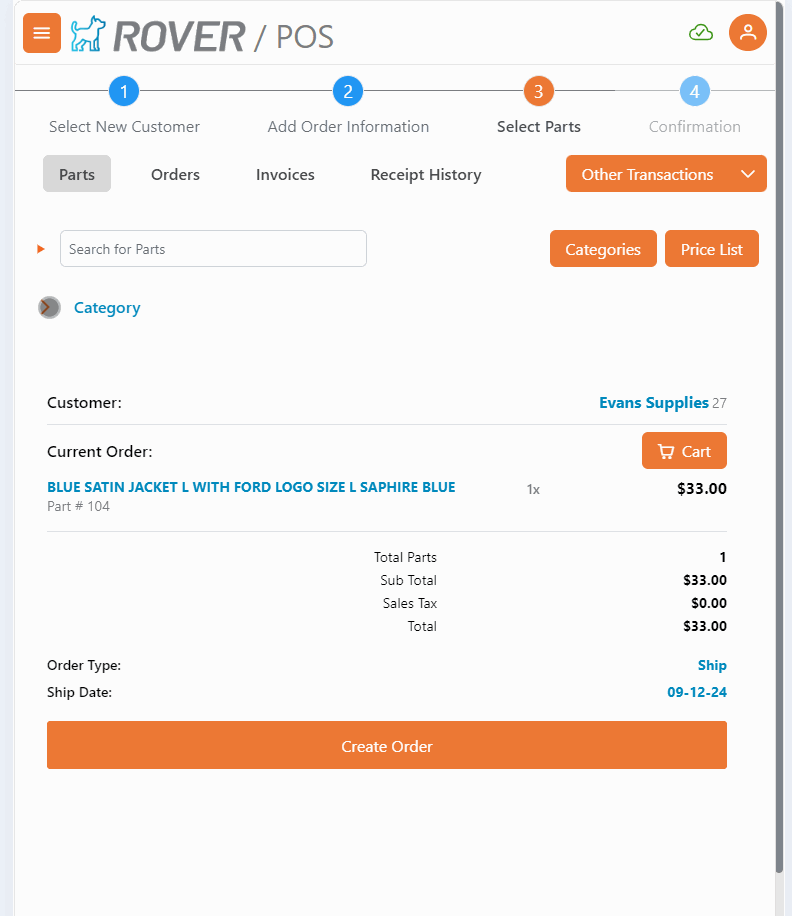

# Rover Web v1.7.0 Release Notes

<badge text= "Version 1.7.0" vertical="middle" />

<PageHeader />

These are the release notes for version 1.7.0 (9/13/2024) of the Rover Web application and can be made available to customers running _Rover ERP_, _IMACS_ and other non-Zumasys owned systems. Contact your _Client Success Manager_, [Sales](mailto:sales@zumasys.com?subject=Rover%20Web%20v1.7.0) or [Support](mailto:help@zumasys.com?subject=Rover%20Web%20v1.7.0) today!

## New Features

- **Rover Web**
  - **Point of Sale**
    - Ability to clear selected category on search. This is enabled by the "POS Clear Category on Search" setting in MRK.CONTROL.
    - On small screen format devices (iPad Mini in portrait mode), a collapsible section was added to more easily view the cart summary section.
     
    - Adds a default filter to the Orders table to return "New" status orders.
    - Added ability to selectively display custom fields in the Cart Summary section. This is enabled by the "POS Extra Info" setting in MRK.CONTROL
    - Shipping Orders now requires `SHIP.E` to be included in the user security record. 
  - **Customer Inquiry**
    - Adds print/export option to Contact Log.

## Bug Fixes

- **Field Services**
  - Resolves an issue with pagination and customer search on the main Field Services table.
- **Point of Sale**
  - Button and section labels in point of sale have been updated for consistency.
  - Invoice table search now includes selected customer ID in request.
  - Resolves an issue with a product filter not resetting when a category is changed.
  - Resolves an issue with items in the Orders table not being sorted properly.
  - Resolved issue with MRK.CONTROL and CO.CONTROL API request repeating multiple times.
  - Part unit of measure is now properly displayed on the shopping cart view.
  - Resolves an issue with note and amount display fields not being cleared between transactions.
- **Tickets & Time**
  - Resolves an issue where total hours failed to populate in some situations.
- **Sales**
  - Resolves an issue with incorrect customer name appearing when opening Order, Opportunities, or Quotes dialog
  - Resolves an issue with customer filter not resetting when switching between sales module and customer module.
- **Scan**
  - Resolves an issue with duplicate submit being made on certain mobile computers in a custom scan application.
    > Note: Currently only supported by select ERPs.
<PageFooter />
