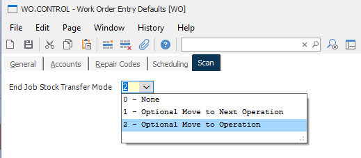
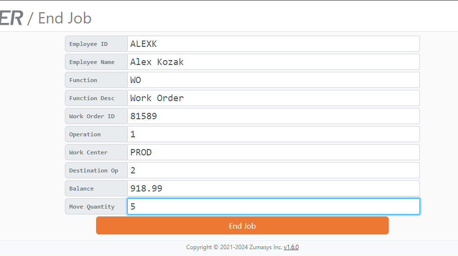
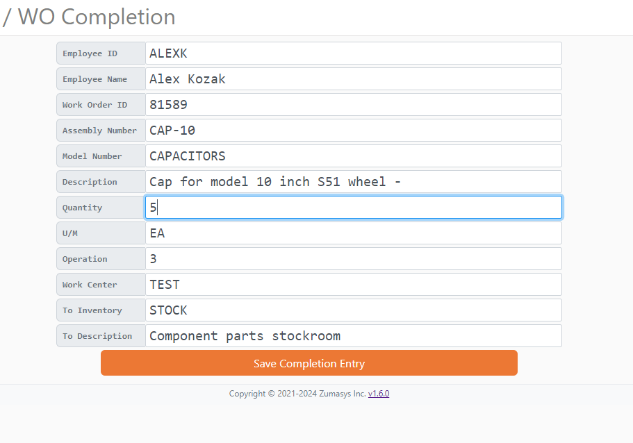
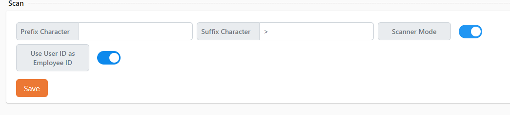
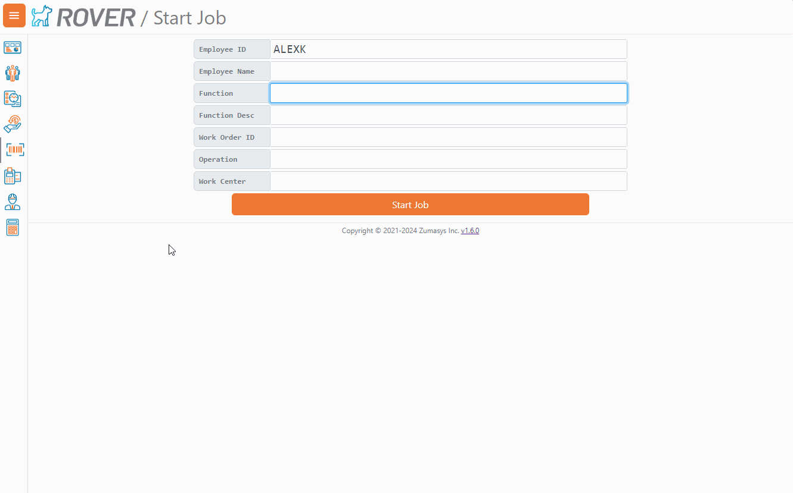

# Rover Web v1.8.0 Release Notes

<badge text= "Version 1.8.0" vertical="middle" />

<PageHeader />

These are the release notes for version 1.8.0 (9/30/2024) of the Rover Web application and can be made available to customers running _Rover ERP_, _IMACS_ and other non-Zumasys owned systems. Contact your _Client Success Manager_, [Sales](mailto:sales@zumasys.com?subject=Rover%20Web%20v1.8.0) or [Support](mailto:help@zumasys.com?subject=Rover%20Web%20v1.8.0) today!

## New Features

- **Rover Web**
  - **Point of Sale**
    - Support fractional part quantities based on the "fractions" property in `PARTS.E`
    - Adds a new user setting to determine flow for searched open orders. When "Load Searched Orders into Parts View" is on, searching for an order will navigate the user to the Parts Tab for editing. When turned off, the user will be routed to the Orders Tab. The default for this toggle is off.
        > Only supported by select ERPs
    - If validation is turned on, a validation request will be sent upon clicking "Select Parts." The user will not be able to proceed until the Order Information is successfully validated.
    - The Parts Search is now re-focused after an item is added to the cart via mouse-click.
    - Added ability to prompt to reprint a PICK ticket if the order has already been printed.
    - > Only supported by select ERPs
  - **Scan**
    - The End Job page now supports new optional stock transfer behaviors when ending a job. These are controlled by WO.CONTROL.
    
    
    - A new WO Completion page has been added to enable completing quantity in work orders, sending completed parts to a stock location or another work order
    
    - A new User setting, **Use User ID as Employee ID** has been added to the Scan section to allow users to opt to automatically fill in the Employee ID field in Scan's Start Job, End Job, and WO Completion.
     
     

## Bug Fixes

- **Point of Sale**
  - Submission of payment for a `ROA` or an `OI` transaction no longer clears the invoices cart.
  - Invoices summary is retained on the confirmation screen.
  - Vendor selection on the Ship View has been fixed.
  - Duplicate success and error messages have been removed.
- **Scan**
  - Start Job page correctly supports logging into a new job.
- **Invoice**
  - The Invoices module has been removed. Invoices can still be viewed within `Point of Sale`, `Customers`, or `Accounting` modules.

<PageFooter />
