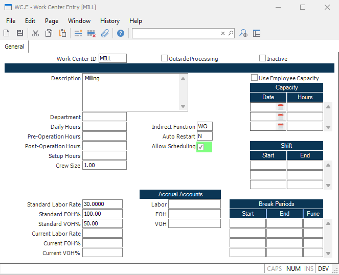
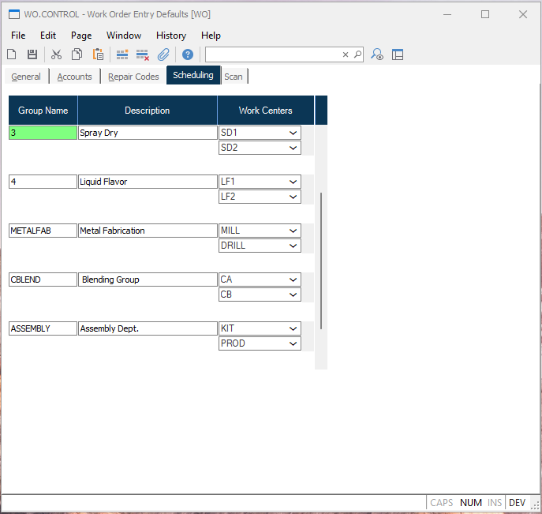
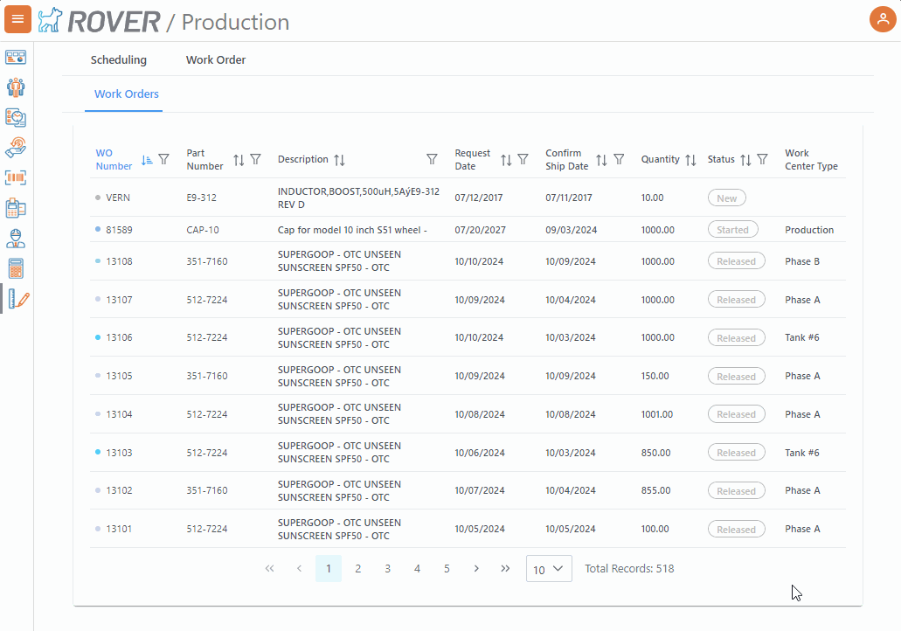
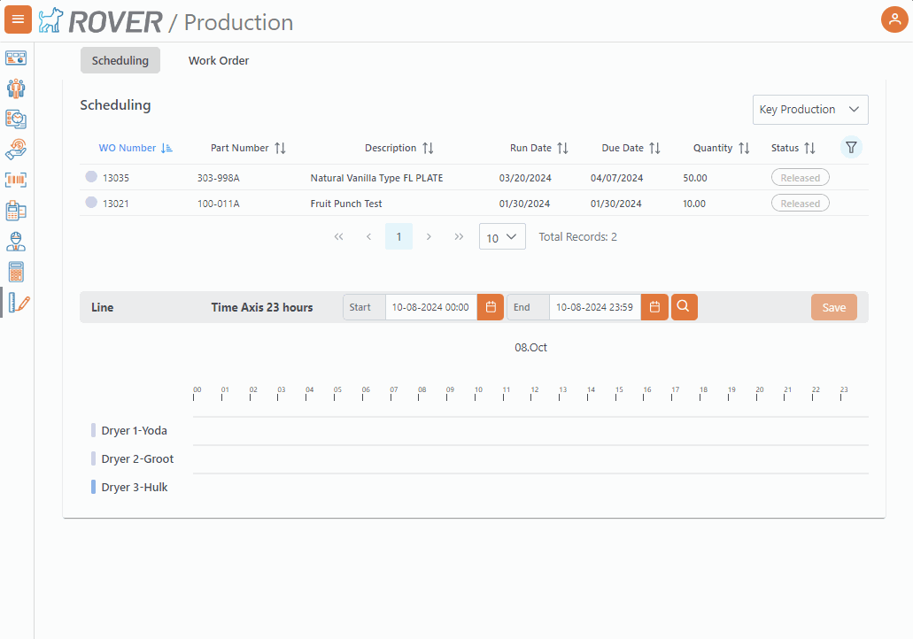
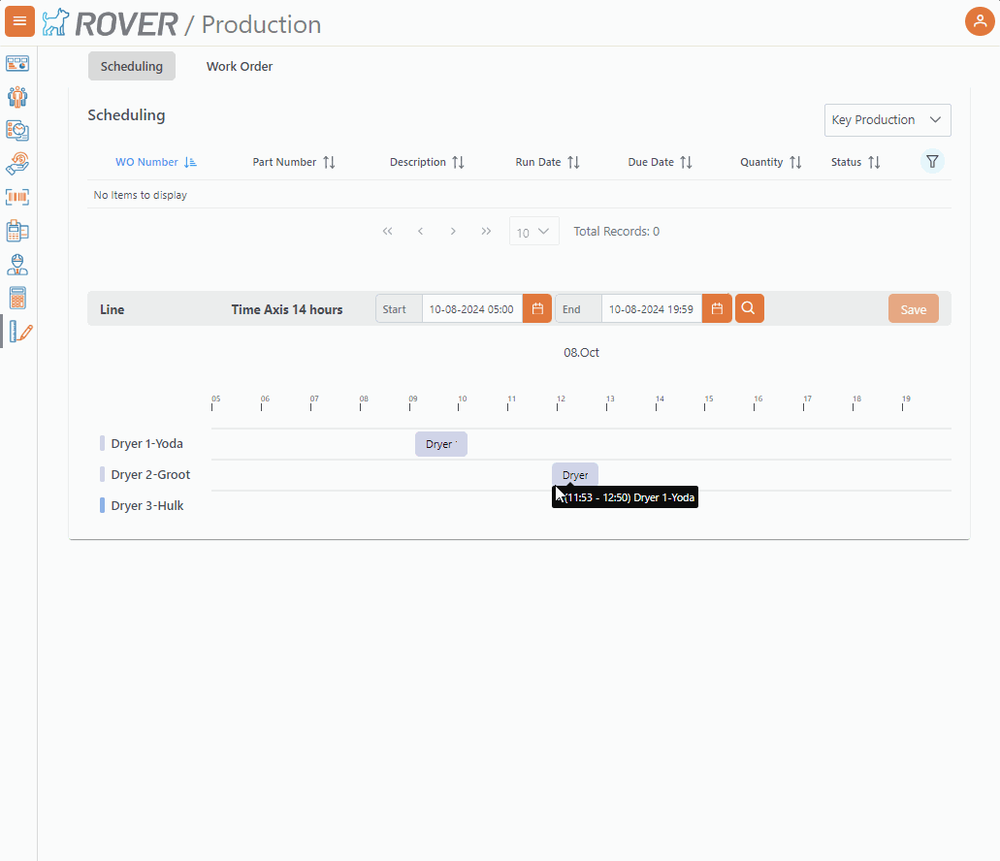

# Rover Web v1.9.0 Release Notes

<badge text= "Version 1.9.0" vertical="middle" />

<PageHeader />

These are the release notes for version 1.9.0 (10/?/2024) of the Rover Web application and can be made available to customers running _Rover ERP_, _IMACS_ and other non-Zumasys owned systems. Contact your _Client Success Manager_, [Sales](mailto:sales@zumasys.com?subject=Rover%20Web%20v1.9.0) or [Support](mailto:help@zumasys.com?subject=Rover%20Web%20v1.9.0) today!

## New Features

- **Rover Web**
  - **Production Scheduling**
    - The Production Scheduling module has made its debut on the web! This initial release provides a basic work order view, Gantt chart to visualize scheduled operations, the option to drag and drop operations onto the Gantt chart, and options to move operations to different work centers. To get set up, contact your _Client Success Manager_ or [Sales](mailto:sales@zumasys.com?subject=Rover%20Web%20Production%20PScheduling).
    - A new option has been added to `WC.E` to enable scheduling for work centers.  This must be checked to allow operations associated with a workcenter to be scheduled in Rover Web.
    
    - Scheduling groups are used to associate multiple work centers that can be used to complete a given operation.  Once defined, scheduling groups are displayed on the Scheduling tab as a drop down in the upper right corner.  Choosing a schedule group will select work orders containing operations associated with a work center in the group.  Additionally, those work centers will be loaded as rows in the Gantt chart to facilitate scheduling.  To create a scheduling group navigate to the schedule tab in `WO.CONTROL`.
    
    - View, filter, and sort work orders in the Work Orders table.  Work Order notes are editable.
    
    - From the scheduling table drag and drop a work order or individual operation into Gantt chart to schedule.
    
    - Modify scheduled operations by dragging or clicking on the operation.  Additional operations can be created and linked to scheduled operations.  These can represent time after operation completion to reset the work center, or prepare it for the next process.
    
  - **Point of Sale**
    - Credit Card payment option is now hidden when in User Mode.
    - Updated Modular security access rights in POS. Cash functions and views will only be enabled for users with the `CASH.E` command. Invoice views will only be enabled for users with the `AR.E` command.  
    - Added `sell_as` property at the `PRICE` level to control how line items are consolidated. Setting `sell_as` to "new" will result in the line item automatically being added as new line, instead of incrementing the quantity of an existing line item.
    - Sales Orders table has now been added to the main menu. You can now filter, sort, and select an order to view or load to edit prior to customer selection.
    - POS now supports host sale payments. Selecting the "Credit Card" Payment Method will only trigger the payment device once payment is submitted. User can also select to allow manual card number entry. Setting the `CC Pin Pad Mode` in `MRK.CONTROL` to "Host Sale" will enable this feature. 
      > Note: Only supported by ERPs in Register Mode
    - POS Payment Options now include help text.
    - Custom Fields in the Order Information view now honor the `required` FDICT flag.
    - Up to two Custom Fields are now displayed in the line item alongside Part Number, Description, Price, and Quantity. Any additional fields will appear in the expanded row.
  - **Accounting**
    - Only users with the `ACCOUNTING` command will have access to the accounting module. Access rights within accounting will now be modular as well. The `GLCHART.E` command will enable the GL tab, the `AR.E` command will enable the AR tab, and the `AP.E` command will enable the AP tab.
   - **Customers**
    - Existing and new contact log dates can now be edited.

## Bug Fixes
  - **Point of Sale**
    - Issue with edited addresses becoming overwritten when loading in orders from the Orders table and draft.
    - Sales Tax amounts from the Parts (Order creation) tab are no longer erroneously displayed in Orders (Select/ship orders), Invoices, or Payment sections.
    - Routing Number help image now displays properly
    - A bug was fixed that prevented all orders from loading after selecting a customer.
  - **Accounting**
    - Discrepancies between the AR aging KPI card and drilldown data in AR data tables have been reconciled. 
<PageFooter />
