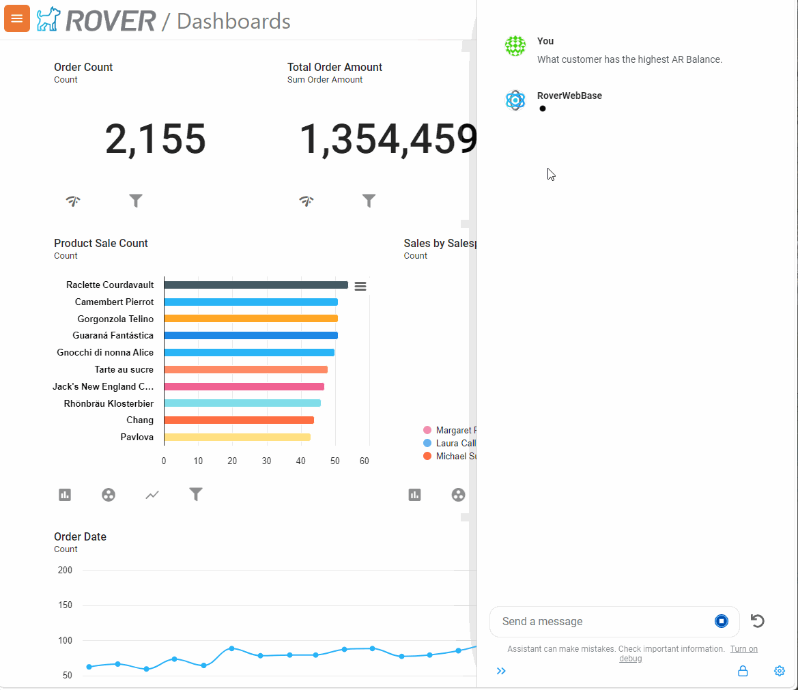
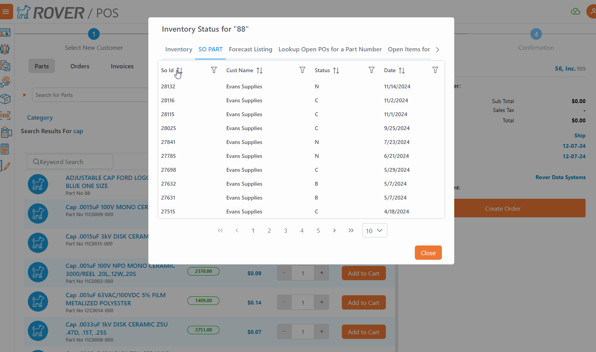
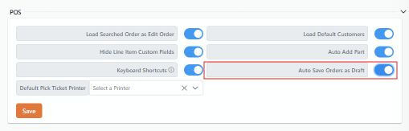
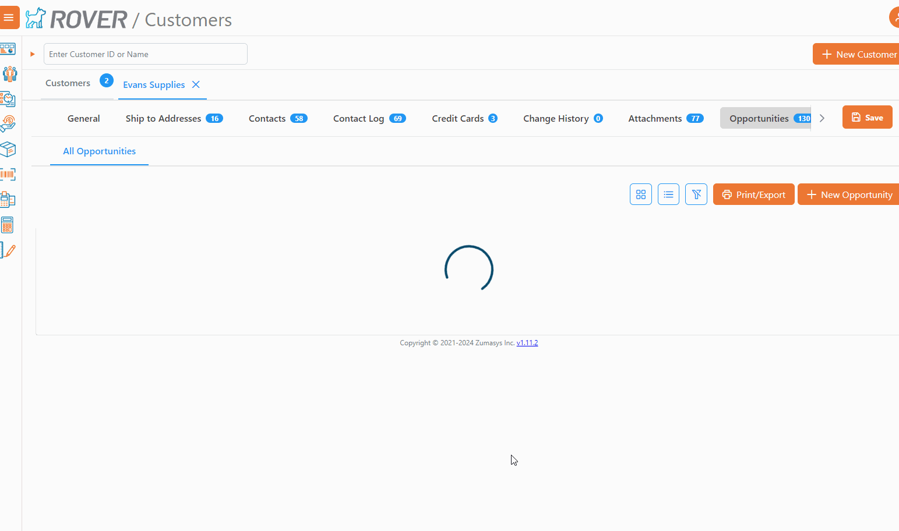
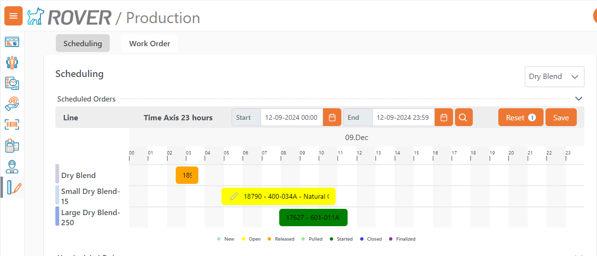

# Rover Web v2.0.0 Release Notes

<badge text= "Version 2.0.0" vertical="middle" />

<PageHeader />

These are the release notes for version 2.0.0 (12/3/2024) of the Rover Web application and can be made available to customers running _Rover ERP_, _IMACS_ and other non-Zumasys owned systems. Contact your _Client Success Manager_, [Sales](mailto:sales@zumasys.com?subject=Rover%20Web%20v2.0.0) or [Support](mailto:help@zumasys.com?subject=Rover%20Web%20v2.0.0) today!

## New Features

- **Rover Web**
    - **Rover AI Assistant**
        - The Rover AI Assistant is now available for Enterprise subscribers who utilize Rover BI. AI Assistant is an end-to-end ERP assistant, able to answer questions about the business and also take instruction to perform a myriad of business actions.
        
    - **Point of Sale**
        - Custom Part Inventory Lookup tables now support sorting and filtering.
        
        - Custom subtotaling has been added to the POS cart summary view, allowing for integration specific subtotal items such as freight, handling charges, etc to be displayed to the user.
          > Note: Currently only supported by select ERPs. 
        - Ability to auto-save orders as draft has been added to the user settings.
        - 
          > Note: This option is only available if draft orders are enabled in `MRK.CONTROL` 
    - **Customer Inquiry**
        - The Opportunities table has been updated to fetch results in smaller batches to improve performance and reliability.
        
        - Improvements to new opportunity creation from within Customer Inquiry.  New opportunites are created without leaving the currently selected customer.  Newly created opportunities are immediately reflected in the opportunities table.
    - **Production Scheduling**
        - There is now an option in `WO.CONTROL` to choose the layout of the scheduling tab in Production Scheduling.  The Gantt chart can now be displayed at the top or bottom of the screen.
        - Also in `WO.CONTROL` there are now settings to allow for custom colors to be applied to Gantt chart items based on the status of the parent Work Order.
        
    - **Inventory**
        - Inventroy Module now supports metadata response information dialog upon record saving. 
        - Inventory Module now supports Form Option Selection upon record saving.

## Bug Fixes

- **Rover Web**
    - **General**
        - Errors during customer search operations are now displayed to the user. 
    - **Point of Sale**
        - When an error occurs during a customer search in POS, the search result list is now cleared.
        - Date Sort for Invoices is now sorting correctly

