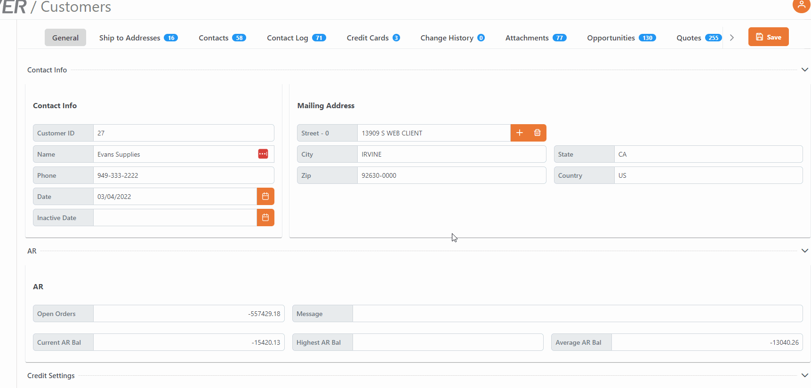

# Rover Web v2.1.0 Draft Release Notes

<badge text= "Version 2.1.0 Draft" vertical="middle" />

<PageHeader />

These are the release notes for version 2.1.0 (TBD) of the Rover Web application and can be made available to customers running _Rover ERP_, _IMACS_ and other non-Zumasys owned systems. Contact your _Client Success Manager_, [Sales](mailto:sales@zumasys.com?subject=Rover%20Web%20v2.1.0) or [Support](mailto:help@zumasys.com?subject=Rover%20Web%20v2.1.0) today!

## New Features

- **Rover Web**
  - **Point of Sale**
    - Added ability to specify `SO` line item fields in Partial Ship table. Requires update to [MRK.CONTROL](../../..//AP-OVERVIEW/AP-ENTRY/AP-E/AP-E-1/CURRENCY-CONTROL/SO-E/MRK-CONTROL/MRK-CONTROL-6/README.md#pos-partial-ship).
  - **Customers Module**
    - The navigation bar now remains fixed at the top while scrolling down the page.
    

## Bug Fixes
