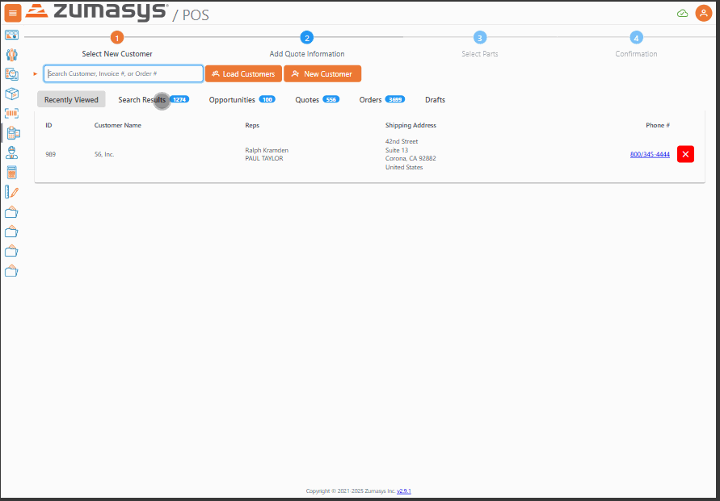
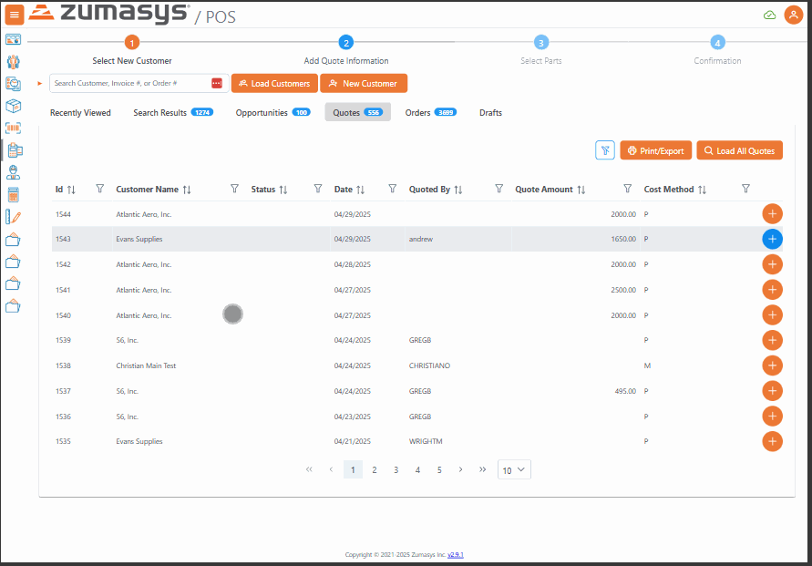
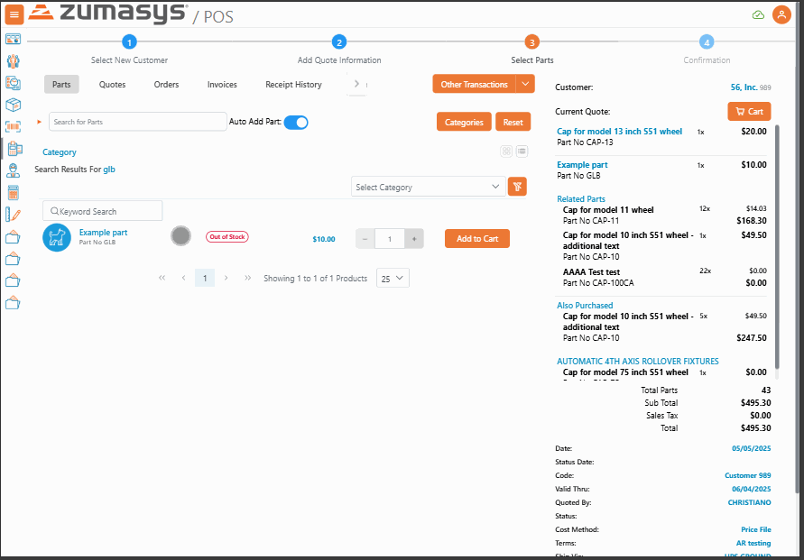
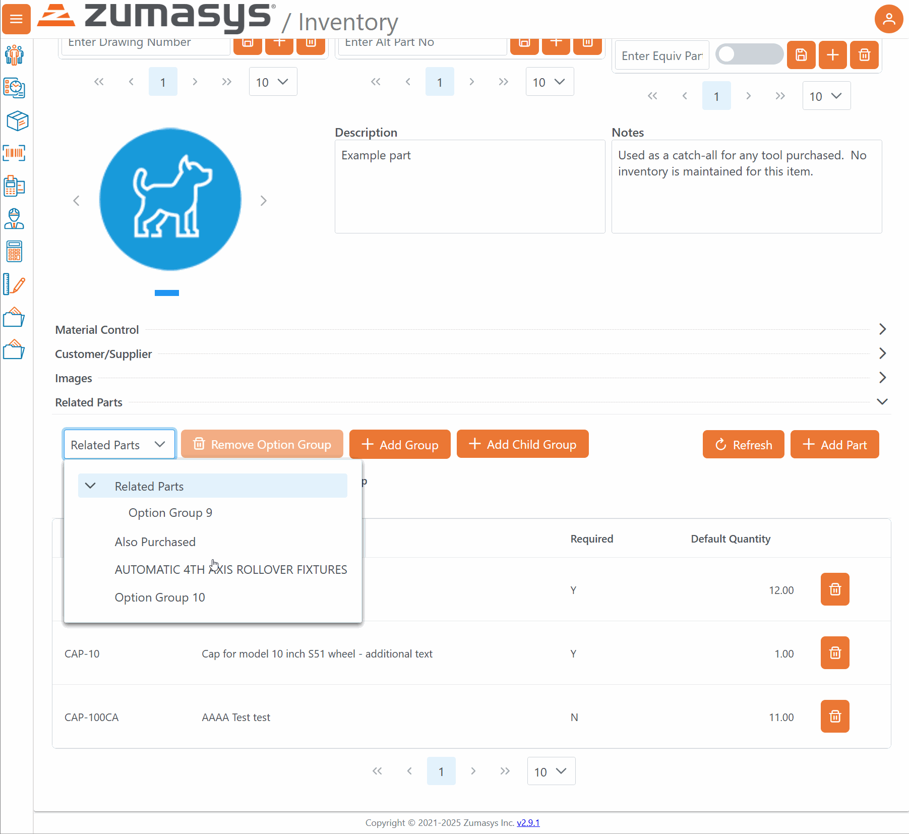
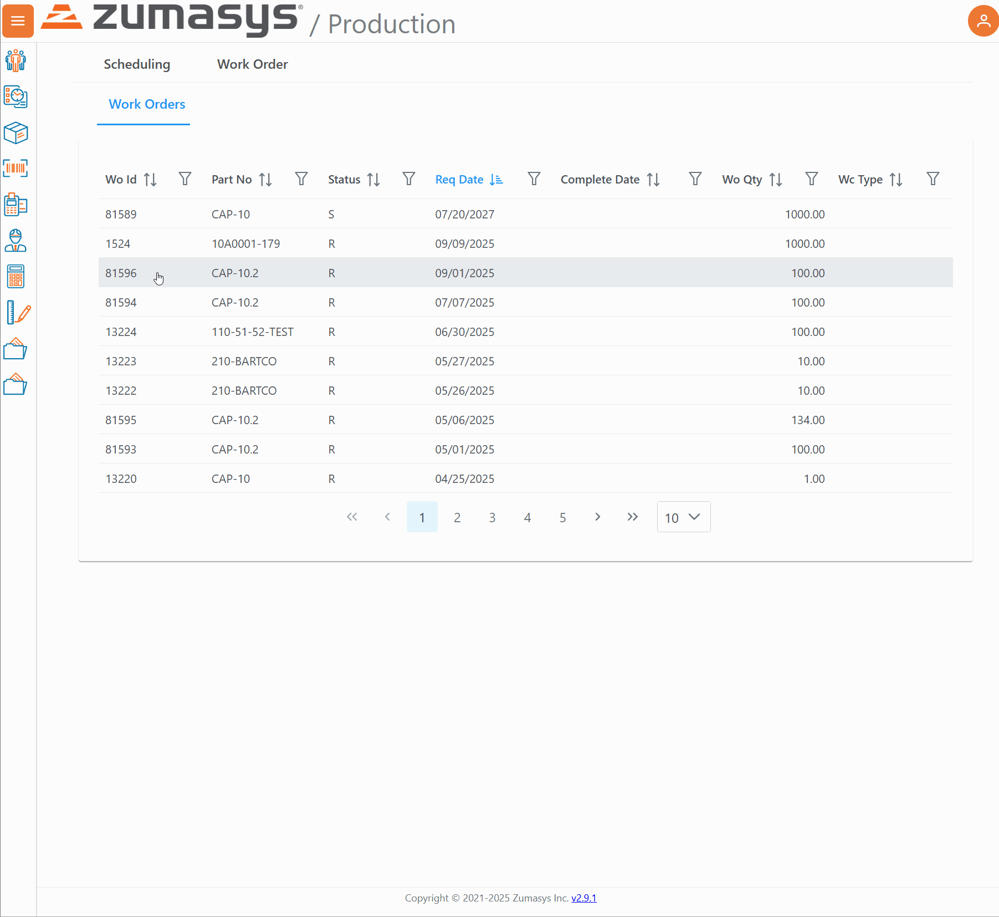

# Rover Web v2.10.0 Draft Release Notes

<badge text= "Version 2.10.0" vertical="middle" />

<PageHeader />

These are the release notes for version 2.10.0 (TBD) of the Rover Web application and can be made available to customers running _Rover ERP_, _IMACS_ and other non-Zumasys owned systems. Contact your _Client Success Manager_, [Sales](mailto:sales@zumasys.com?subject=Rover%20Web%20v2.10.0) or [Support](mailto:help@zumasys.com?subject=Rover%20Web%20v2.10.0) today!

## New Features

### Rover Web

#### Point of Sale

  - Quotes functionality has been added to Point of Sale. You can now create, edit, copy quote, as well as create an order from a quote.
  
  - Selection dialog and action buttons have been added to the opportunities, quotes, and orders tables.
  
  - Parts now support relationships to group and/or required parts to be added to a quote.
  

#### Inventory
  - Related Parts section has been add to the part detail page.  A hierarchy of part relationships can be defined which are then visible in the part detail display in Quote creation in Point of Sale.  Parts can be defined to have other related parts required for purchase, or for selection of related parts to be required.  For example, selection of one or more required accessories when a specific parent part is selected.
  

  Additional documentation for Related Parts functionality is available - [Here](../../../../rover/business-suite/inventory/related-parts/README.md)

#### Production Scheduling

  - Additional workorder fields are now available for view/edit via the main Workorders tab in Production Scheduling.
  

<PageFooter />
