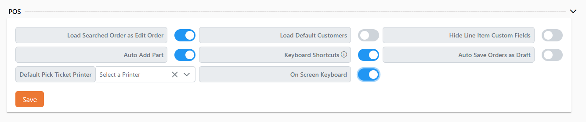
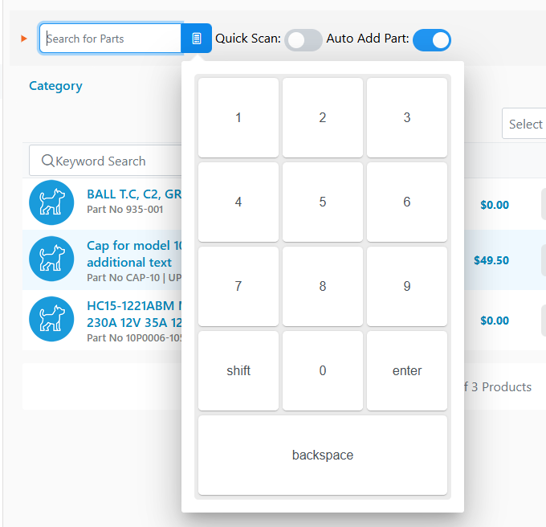
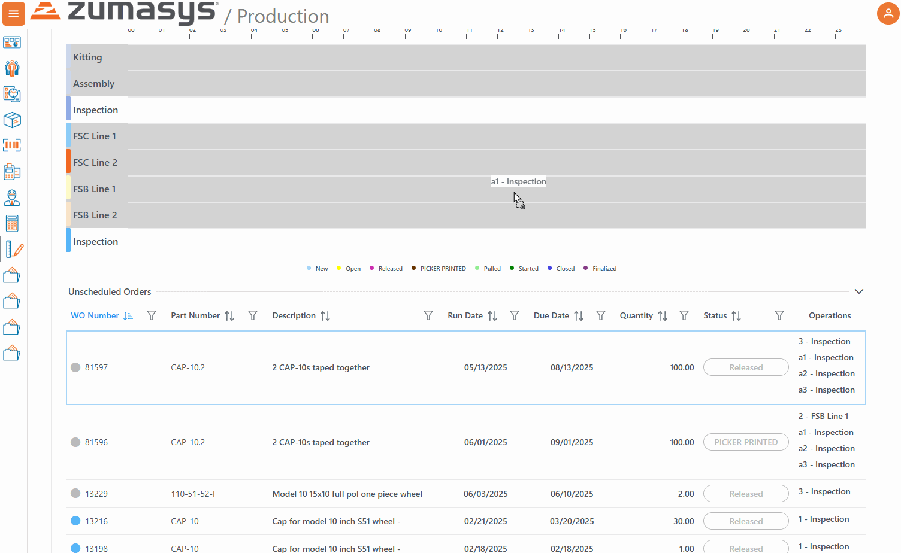

# Rover Web v2.11.0 Draft Release Notes

<badge text= "Version 2.11.0" vertical="middle" />

<PageHeader />

These are the release notes for version 2.11.0 (5/15/2025) of the Rover Web application and can be made available to customers running _Rover ERP_, _IMACS_ and other non-Zumasys owned systems. Contact your _Client Success Manager_, [Sales](mailto:sales@zumasys.com?subject=Rover%20Web%20v2.11.0) or [Support](mailto:help@zumasys.com?subject=Rover%20Web%20v2.11.0) today!

## New Features

### Rover Web

#### Point of Sale

  - Added support for a 10 key keyboard on the parts search input field for ease of use on some mobile screens.
  
  

#### Production Scheduling

 - Multiple changes have been made to the production scheduling chart
    - If adding an operation for a work order that is part of a phase, all associated operations for that phase will be added as well
    - When adding an operation to the schedule, existing conflicting operations will be pushed out to accommodate
    - If an operation has a defined list of alternate work centers, it can only be added to one of those work centers defined. When dragging, other work centers will be grayed-out.
    - If an issue code is set for a work order, an icon will be displayed on the bars in the chart indicating the issue.
    

## Bug Fixes

### Rover Web

#### Point of Sale

  - Addressed an issue with lazy loading of part search results in point of sale.
  - Addressed an issue with duplicate fetch of order list, when enabled, after customer selection.
  - Addressed an issue with incorrect success message when creating an order. Message now correctly states the order was created rather than a quote.
  - Addressed an issue with scanning parts causing duplicate validation requests.

<PageFooter />
