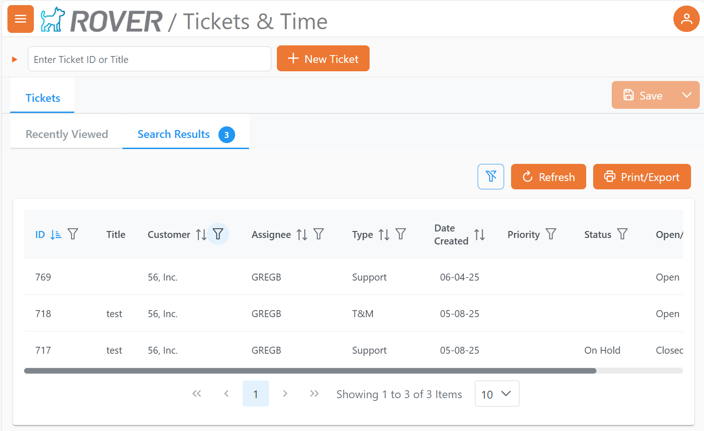
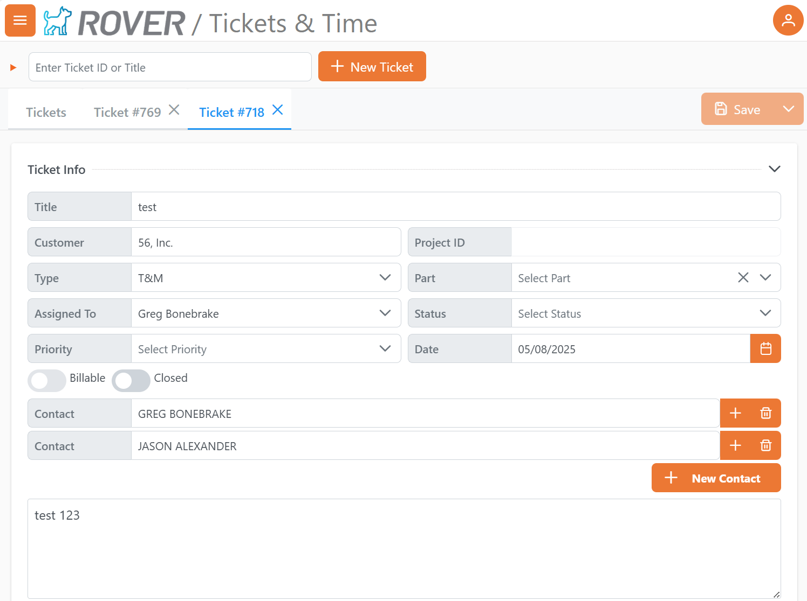
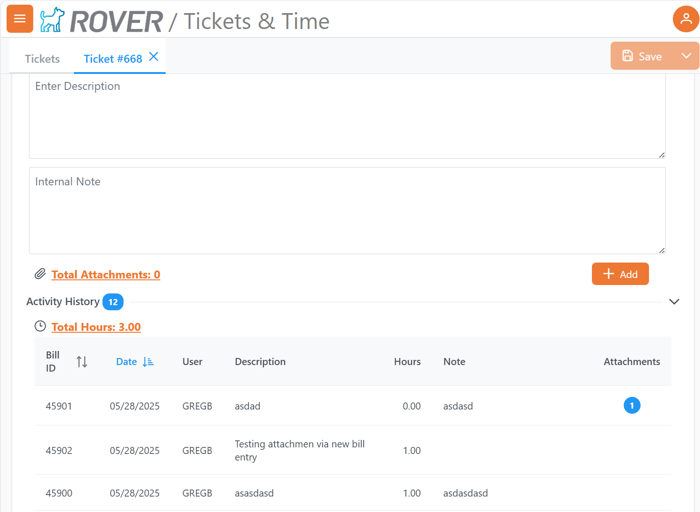
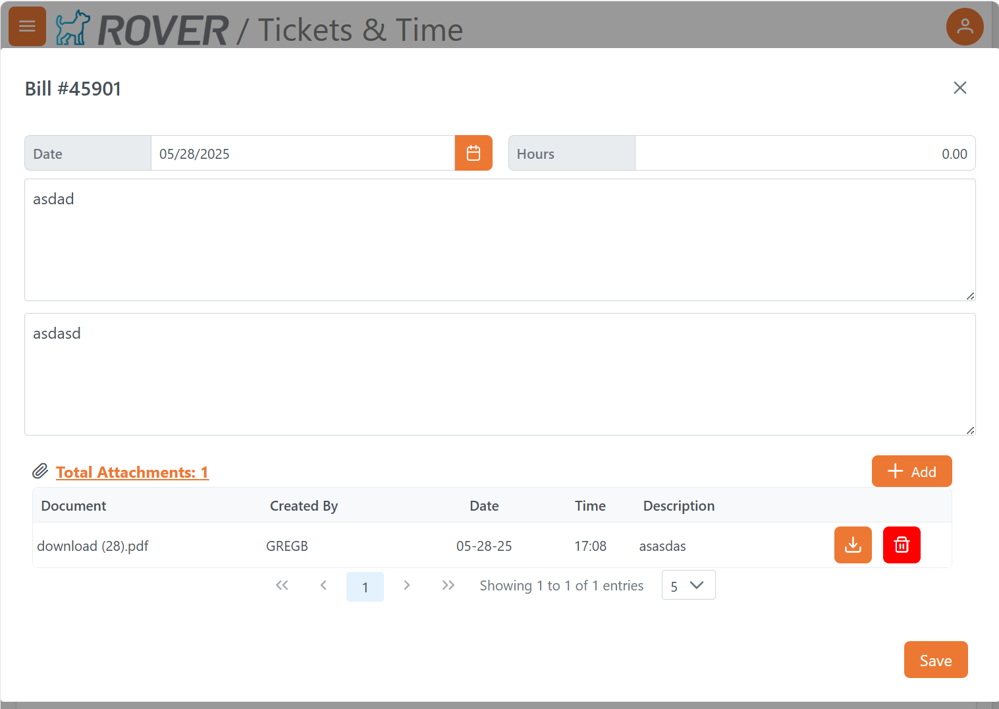

# Rover Web v2.12.0 Release Notes

<badge text= "Version 2.12.0" vertical="middle" />

<PageHeader />

These are the release notes for version 2.12.0 (6/11/2025) of the Rover Web application and can be made available to customers running _Rover ERP_, _IMACS_ and other non-Zumasys owned systems. Contact your _Client Success Manager_, [Sales](mailto:sales@zumasys.com?subject=Rover%20Web%20v2.12.0) or [Support](mailto:help@zumasys.com?subject=Rover%20Web%20v2.12.0) today!

## New Features

### Rover Web

#### Point of Sale
  - Added option in `MRK.CONTROL` to use defined customer search lookup for "Recently Viewed" customer tab.
  - Added option in `MRK.CONTROL` to control behavior of "Apply Overage to Account" for Cash payments.

#### Tickets & Time
- Tickets interface has been updated with "Recently Viewed" Tab.

- Tickets are opened into tabs, multiple tickets can be opened for viewing.

- Ticket create/edit view has been improved, additional fields added.  
- Billing records associated with Tickets now support attachments.

#### Production Scheduling

 - The Production board has been released, allowing for a lookup-driven day by day report of scheduled work orders for work centers.
 

## Bug Fixes

### Rover Web

#### Point of Sale

  - Addressed an issue where order header information may all be blank when entering a second order for a customer without going back to the "Select a Customer" step.
  - The on screen keyboard for parts searches is now hidden after a search is executed.
  - Addressed an issue where pricing overrides may be lost when progressing from part selection to order header entry while quoting.
  - Addressed an issue with routing to Inventory Module via the "Part Details" button in point of sale inventory status.

<PageFooter />
