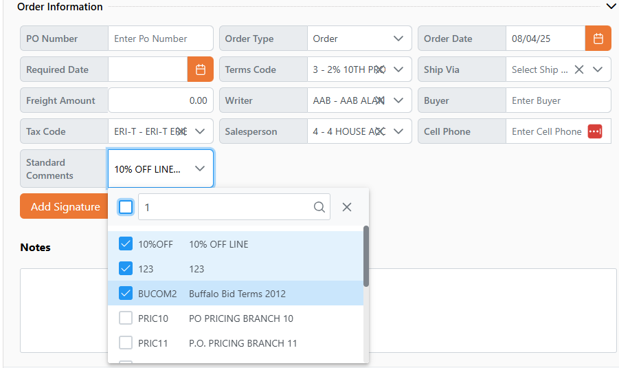

# Rover Web v2.15.0 Draft Release Notes

<badge text= "Version 2.15.0" vertical="middle" />

<PageHeader />

These are the release notes for version 2.15.0 (TBD) of the Rover Web application and can be made available to customers running _Rover ERP_, _IMACS_ and other non-Zumasys owned systems. Contact your _Client Success Manager_, [Sales](mailto:sales@zumasys.com?subject=Rover%20Web%20v2.15.0) or [Support](mailto:help@zumasys.com?subject=Rover%20Web%20v2.15.0) today!

## New Features

### Rover Web

#### General

- Search button has been added to fields with file dictionary references. This allows the ability to search for valid values using the lookups defined for that field.
  > Availability is limited to input fields in Inventory Work Orders, Point of Sale Orders, and Point of Sale Quotes.

- Many Multi-select fields now support filtering for easier selection of items.

- The Recently Viewed Customers display found in multiple modules (Point of Sale, Customer Inquiry, Field Services) will now be limited to 10 customers. Recently viewed lists will be truncated to include the 10 most recent customers the next time a customer not present in the list is viewed. This will improve application performance, especially on mobile devices, and keep results relevant and easily navigable.

- "Follow Up Date" column has been added to Opportunity data tables throughout the application.
## Bug Fixes

### Rover Web

#### Point of Sale

- Improved scanning functionality behaviors when host-side validation is enabled. Pending validations will now be cancelled to allow additional scans to be accepted and validated, preventing data loss.

- Improved behavior during rapid clicking of category options.  Pending requests for products are now cancelled allowing the latest request to fill the results.

- Resolved issues with validation confirmation prompts not being honored.  Validation bypass, when enabled by a backend, is now properly handled.

<PageFooter />
