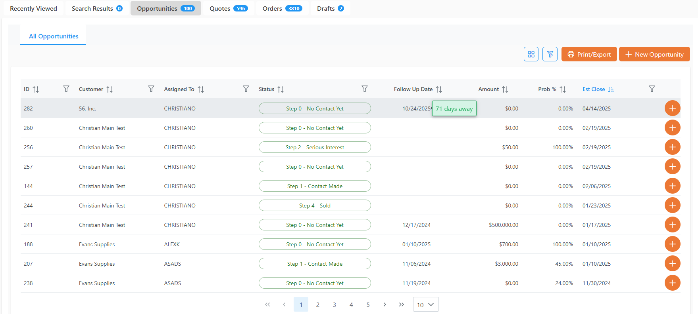
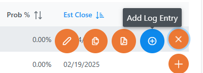

# Rover Web v2.15.0 Release Notes

<badge text= "Version 2.15.0" vertical="middle" />

<PageHeader />

These are the release notes for version 2.15.0 (8/14/2025) of the Rover Web application and can be made available to customers running _Rover ERP_, _IMACS_ and other non-Zumasys owned systems. Contact your _Client Success Manager_, [Sales](mailto:sales@zumasys.com?subject=Rover%20Web%20v2.15.0) or [Support](mailto:help@zumasys.com?subject=Rover%20Web%20v2.15.0) today!

## New Features

### Rover Web

#### General

- Many multi-select fields now include built-in filtering, making it quicker to find and select items.    

  

- The _Recently Viewed Customers_ display found in multiple modules (**Point of Sale**, **Customers**, **Field Services**) will now be limited to 10 customers. Recently viewed lists will be truncated to include the 10 most recent customers the next time a customer not present in the list is viewed. This improves application performance, especially on mobile devices, and keep results relevant and easily navigable.

- Showed some love to the _Sales Opportunities_ table.
  - Added a _Follow Up Date_ column with a hover to show how many days away (or behind) the date is.

    
  - Added a quick action for _Adding Log Entries_ so you no longer have to open an opportunity for editing to log tasks to it.

    

## Bug Fixes

### Rover Web

#### Point of Sale

- Improved scanning functionality behaviors when host-side validation is enabled. Pending validations will now be cancelled to allow additional scans to be accepted and validated, preventing data loss.

- Improved behavior during rapid clicking of category options.  Pending requests for products are now cancelled allowing the latest request to fill the results.

- Resolved issues with validation confirmation prompts not being honored.  Validation bypass, when enabled by a backend, is now properly handled.

<PageFooter />
