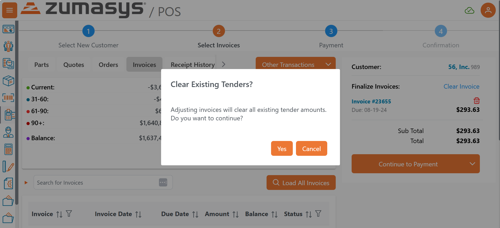

# Rover Web v2.15.1 Release Notes

<badge text= "Version 2.15.1" vertical="middle" />

<PageHeader />

These are the release notes for version 2.15.1 (8/19/2025) of the Rover Web application and can be made available to customers running _Rover ERP_, _IMACS_ and other non-Zumasys owned systems. Contact your _Client Success Manager_, [Sales](mailto:sales@zumasys.com?subject=Rover%20Web%20v2.15.1) or [Support](mailto:help@zumasys.com?subject=Rover%20Web%20v2.15.1) today!

## Bug Fixes

### Rover Web

#### Point of Sale
- Resolves incorrect toast message when updating an existing quote.
- Tenders are maintained consistently between payment, cash deposit, and invoice/order selection.  When tenders are present, changes to invoices or a request to process a cash deposit will warn that tenders will be cleared.

  
- Addressed cases where users wouldn't receive feedback on successful refund credit creation.

<PageFooter />
