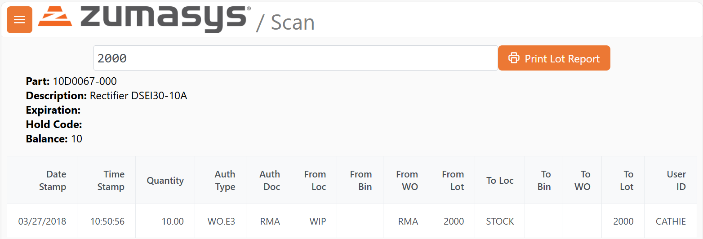
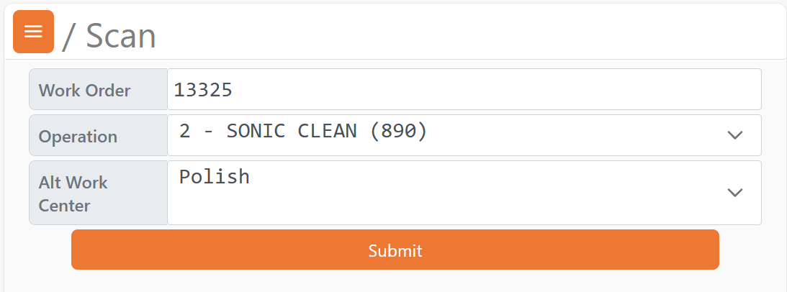

# Rover Web v2.16.0 Release Notes

<badge text= "Version 2.16.0" vertical="middle" />

<PageHeader />

These are the release notes for version 2.16.0 (9/17/2025) of the Rover Web application and can be made available to customers running _Rover ERP_, _IMACS_ and other non-Zumasys owned systems. Contact your _Client Success Manager_, [Sales](mailto:sales@zumasys.com?subject=Rover%20Web%20v2.16.0) or [Support](mailto:help@zumasys.com?subject=Rover%20Web%20v2.16.0) today!

## New Features

### Rover Web

#### Scan

- Dynamic forms support has been added via desktop form FORMSDEF.E.  Custom update/inquiry forms, optimized for mobile scan devices can now be defined in the desktop app and exposed on the web with integrated user based security.  For further information, please reach out to your _Client Success Manager_, [Sales](mailto:sales@zumasys.com?subject=Rover%20Web%20v2.16.0%20FORMSDEF)
- `Lot Check` function has been added to allow for mobile access to lot details and recent lot transaction history.

- `Alternate WC` function has been added to allow for WO operation workcenters to be changed to defined alternate workcenters from mobile devices.

#### General

 - Support has been added to allow back-end configuration of inactivity based session timeouts for users. In Rover, `SECURITY.E` can be used to maintain how long a user may be inactive before being logged out. Other systems may behave differently.

#### Point of Sale

 - Improved and updated support for Offline Mode. Reduced incidence of confusing "Network Error" messages displayed and improved parts search results.
 - An MRK.CONTROL toggle has been added to allow quantity of parts in the cart to be updated from product search results and product detail modals.  When enabled, the "Add to Cart" button will change to "Update" for parts that are in the cart.  This functionality is fully integrated with related parts, allowing quick updates to the quantity of related part items in the cart via the part detail modal where these parts are browseable.

## Bug Fixes

### Rover Web

#### Point of Sale
 
 - Updated messaging on Opportunity entry within Point of Sale when discarding unsaved changes to be clearer and more consistent.

#### Inventory

 - Fixed multiple issues with pagination and changing rows per page in the Parts search results table.

<PageFooter />
