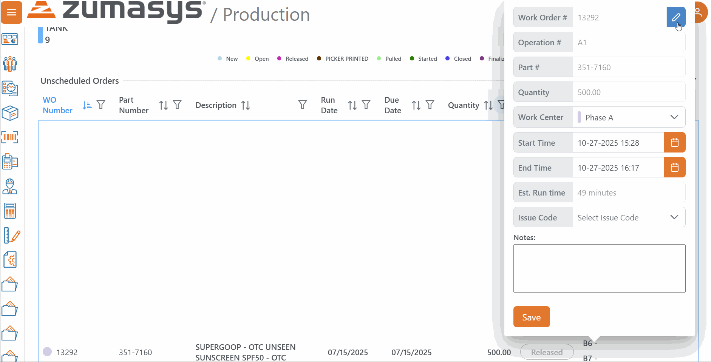

# Rover Web v2.17.0 Release Notes

<badge text= "Version 2.17.0" vertical="middle" />

<PageHeader />

These are the release notes for version 2.17.0 (TBD) of the Rover Web application and can be made available to customers running _Rover ERP_, _IMACS_ and other non-Zumasys owned systems. Contact your _Client Success Manager_, [Sales](mailto:sales@zumasys.com?subject=Rover%20Web%20v2.17.0) or [Support](mailto:help@zumasys.com?subject=Rover%20Web%20v2.17.0) today!

## New Features

### Rover Web

#### Production Scheduling

 - Added a clickable link from the Bar Overlay in work order scheduling to link to the work order details.
 

## Bug Fixes

### Rover Web

#### Production Scheduling

 - Corrected an issue that could cause the Scheduled Orders Gantt Chart's search button to get stuck on a loading spinner

<PageFooter />
