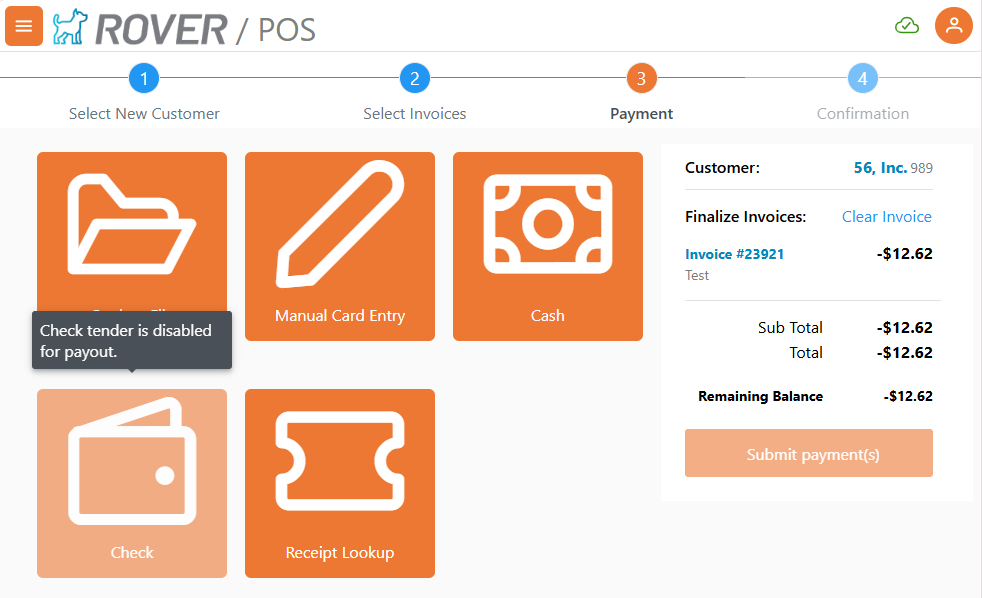
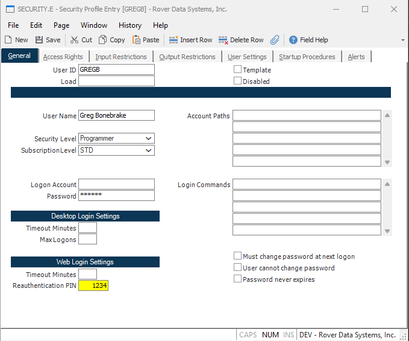

# Rover Web v2.18.0 Release Notes

<badge text= "Version 2.18.0" vertical="middle" />

<PageHeader />

These are the release notes for version 2.18.0 (10/30/2025) of the Rover Web application and can be made available to customers running _Rover ERP_, _IMACS_ and other non-Zumasys owned systems. Contact your _Client Success Manager_, [Sales](mailto:sales@zumasys.com?subject=Rover%20Web%20v2.18.0) or [Support](mailto:help@zumasys.com?subject=Rover%20Web%20v2.18.0) today!

## New Features

### Rover Web

#### General

 - Search button has been added to fields with file dictionary references. This allows the ability to search for valid values using the lookups defined for that field.
  > Availability is limited to input fields in Inventory Work Orders, Point of Sale Orders, and Point of Sale Quotes.

  
 

#### Point of Sale

  - Check tender type during payments allows overpayment. 
  - An MRK.CONTROL toggle has been added to allow Check tender type to be disabled for payout processing.

  

  - SECURITY.E has been updated to include a "Reauthentication PIN" field.  When populated for a user, during payment submission, the user will be prompted to enter their PIN.

  
  

## Bug Fixes

### Rover Web

#### Point of Sale

  - Resolved an issue where a manual part search did not properly cancel an ongoing default search that was triggered when loading the parts view.

<PageFooter />
