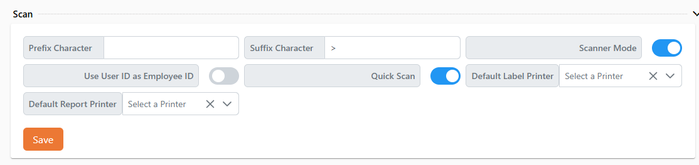
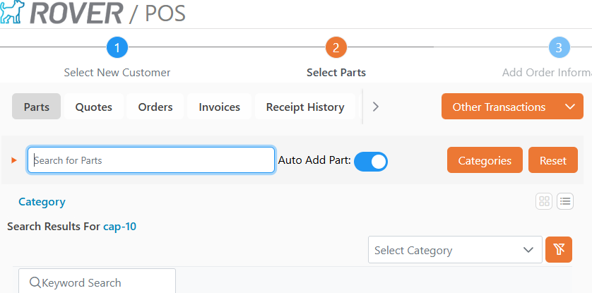
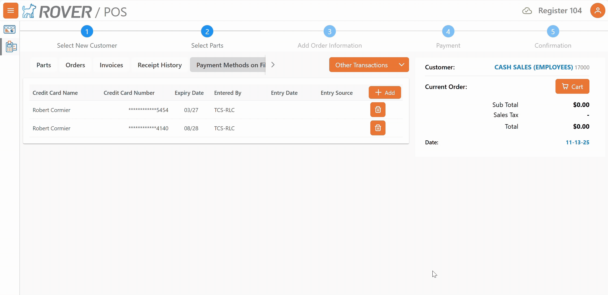
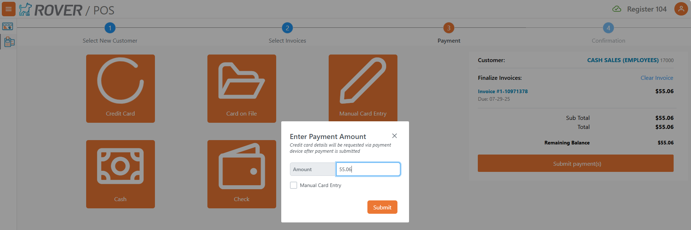
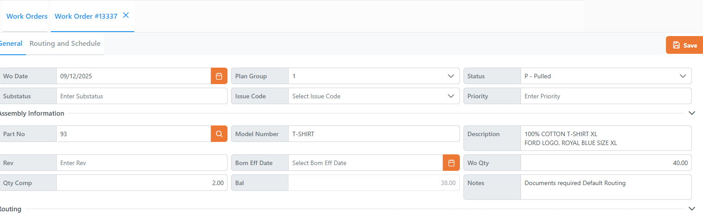
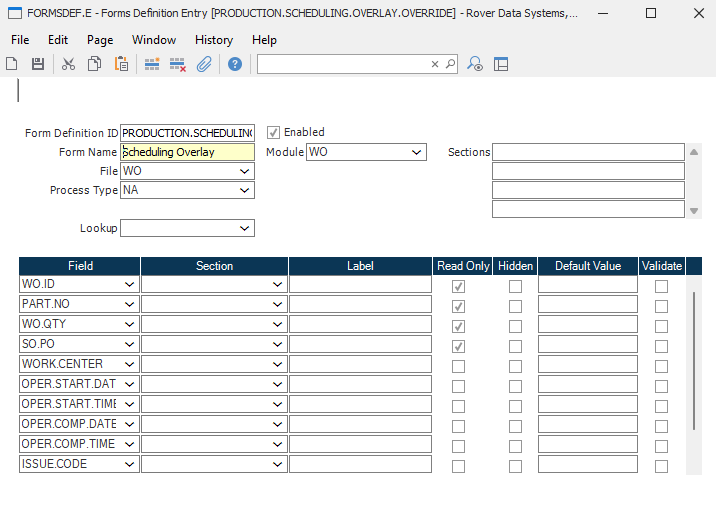
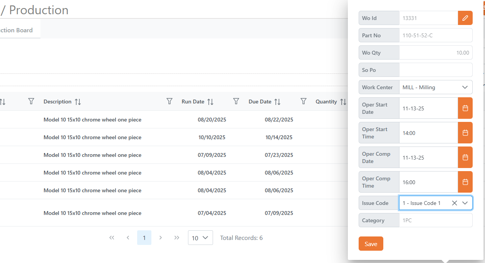

# Rover Web v2.19.0 Release Notes

<badge text= "Version 2.19.0" vertical="middle" />

<PageHeader />

These are the release notes for version 2.19.0 (11/13/2025) of the Rover Web application and can be made available to customers running _Rover ERP_, _IMACS_ and other non-Zumasys owned systems. Contact your _Client Success Manager_, [Sales](mailto:sales@zumasys.com?subject=Rover%20Web%20v2.19.0) or [Support](mailto:help@zumasys.com?subject=Rover%20Web%20v2.19.0) today!

## New Features

### Rover Web

#### General 

#### Point of Sale
 
 - The "Quick Scan" toggle has been moved out of the parts selection screen and into User Settings to simplify experience and avoid accidental clicks.
 
 

 - Entering new payment methods on file now supports credit card pin pad devices.  If the active register has a pin pad attached and defined, clicking "Add" will now present a dialog to input the name and address details.  An optional "Manual" checkbox allows for the card number to be manually keyed on the pin pad.  User based settings control the visibility of the manual checkbox. `allow_manual_cof_pinpad_entry` is the user login response property for this option.
    > Only supported by select ERPs

    
    

- Additional columns have been added to the payment methods on file table to indicate when the card was added, the user who added it, and whether the card was read (pin pad), manual (pin pad, manually keyed), or entered via iframe.

- The "Manual Credit Card" payment button is now hidden by default when a register is in use with a pin pad enabled.  This can be overridden per register with a toggle `cc_allow_iframe` in the register settings.
    > Only supported by select ERPs

- The "Manual" checkbox for pin pad based credit card payments can now be optionally hidden on a per user basis. `allow_manual_payment_pinpad_entry` is the user login response property for this option.
    > Only supported by select ERPs

    

#### Production

 - Quantity and Balance fields have been added to the work order details screen
 

 - The Overlay display when clicking into line items in the Scheduling tab can now be customized using FORMSDEF with the definition ID of `PRODUCTION.SCHEDULING.OVERLAY.OVERRIDE`
 
 

## Bug Fixes

### Rover Web

#### Point of Sale
 - An issue was resolved that caused quote totals to not display consistently.

#### Production

 - An issue was resolved that prevented orders and operations from being scheduled via the pop up menu on the unscheduled orders tab.

<PageFooter />
