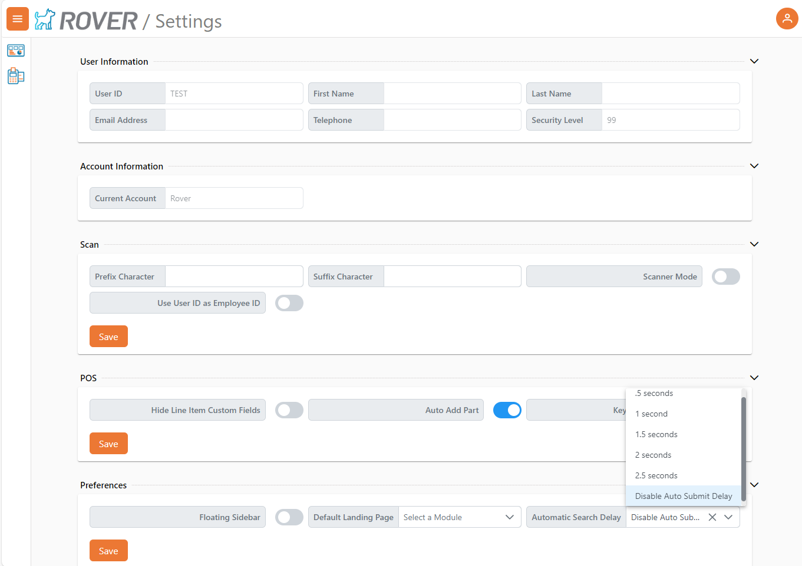
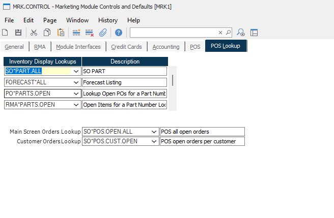
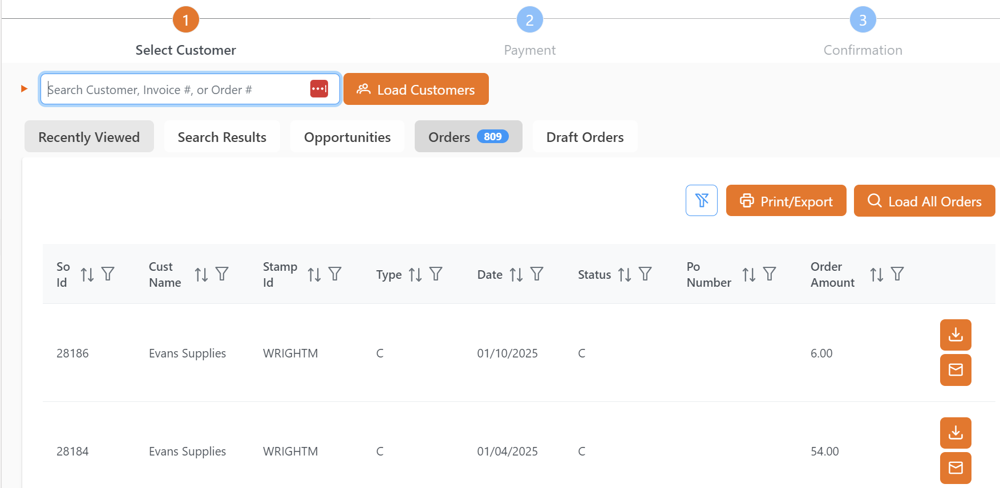
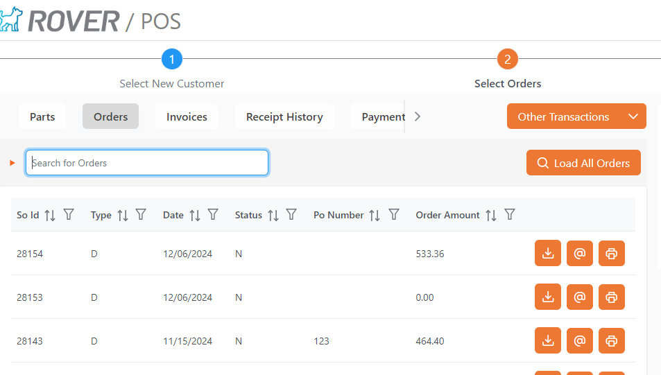

# Rover Web v2.2.0 Draft Release Notes

<badge text= "Version 2.2.0 Draft" vertical="middle" />

<PageHeader />

These are the release notes for version 2.2.0 (1/16/2025) of the Rover Web application and can be made available to customers running _Rover ERP_, _IMACS_ and other non-Zumasys owned systems. Contact your _Client Success Manager_, [Sales](mailto:sales@zumasys.com?subject=Rover%20Web%20v2.2.0) or [Support](mailto:help@zumasys.com?subject=Rover%20Web%20v2.2.0) today!

## New Features

- **Rover Web**
  - **Point of Sale**
    - Customer Ship-To addresses can now be lazy loaded to improve performance for integrations with large numbers of ship-to addresses on individual customer records.
      > Only supported by select ERPs
    - Auto submission of search is now controlled by a User Setting. When disabled, entries into customer and part lookup fields in POS are not automatically submitted after a timeout.
      
    - Payouts are now allowed when more than one credit is selected.
    - Additional options have been added to control when payment overages can remain on account rather then being returned as change.
      > Only supported by select ERPs
    - Support for custom Lookup driven Orders tables on both the main page and within Point of Sale when a customer is selected.
     
     
     
  - **General**
    - Field definition update processing now allows for partial updates.

## Bug Fixes

- **Customer Inquiry**
  - Resolved issues with Opportunities not saving properly, updated UI to more clearly indicate the button for saving an opportunity inside an open customer tab.
