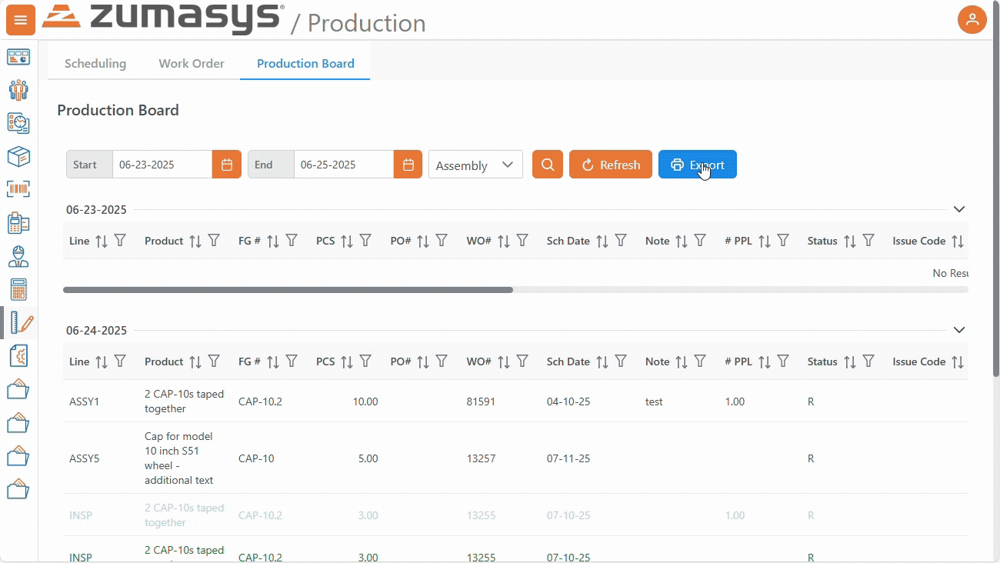

# Rover Web v2.20.0 Release Notes

<badge text= "Version 2.20.0" vertical="middle" />

<PageHeader />

These are the release notes for version 2.20.0 (TBD) of the Rover Web application and can be made available to customers running _Rover ERP_, _IMACS_ and other non-Zumasys owned systems. Contact your _Client Success Manager_, [Sales](mailto:sales@zumasys.com?subject=Rover%20Web%20v2.19.0) or [Support](mailto:help@zumasys.com?subject=Rover%20Web%20v2.19.0) today!

## New Features

### Rover Portal

#### Orders

 - The active customer is now included on related parts API calls to allow for customer specific related part detail to be supplied by the host.
    > Only supported by select ERPs

### Rover Web

#### General 

#### Point of Sale

#### Production

 - Improvements were made to scrolling behavior in the production scheduling gantt chart during drag and drop.   

 - Production Board now support export and print. 

  

## Bug Fixes

### Rover Portal

#### Orders

 - Resolved an issue with address selection during order creation caused by improper handling of customers with no address details defined.

### Rover Web

#### General

 - An issue was resolved impacting date filters on lookup based data tables throughout the application.

<PageFooter />
