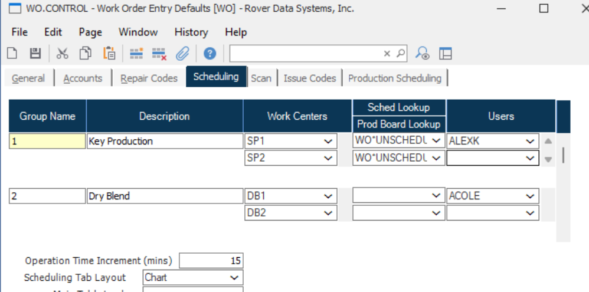
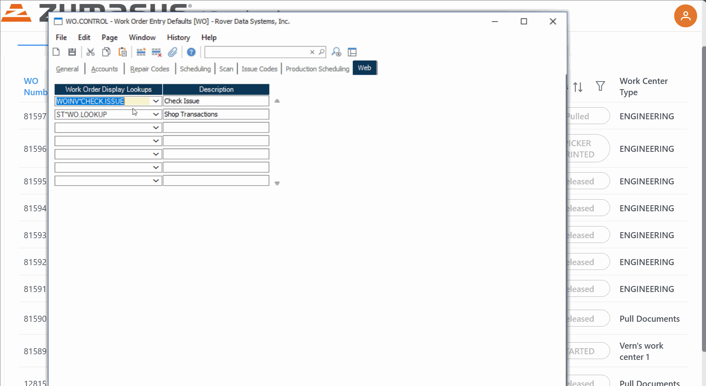

# Rover Web v2.21.0 Release Notes

<badge text= "Version 2.21.0" vertical="middle" />

<PageHeader />

These are the release notes for version 2.21.0 (12/29/2025) of the Rover Web application and can be made available to customers running _Rover ERP_, _IMACS_ and other non-Zumasys owned systems. Contact your _Client Success Manager_, [Sales](mailto:sales@zumasys.com?subject=Rover%20Web%20v2.21.0) or [Support](mailto:help@zumasys.com?subject=Rover%20Web%20v2.21.0) today!

## New Features

### Rover Web

#### Production

 - Added the option in `WO.CONTROL` to restrict scheduling of work orders in the Scheduling board to only allow scheduling by operation, preventing drag/drop at the whole Work Order level.

 - Added support for different Production Board and Unscheduled Orders data lookups to be used for each individual Scheduling Group defined in `WO.CONTROL`. Additionally, scheduling groups can be restricted to specific users.
 

 - Added support for lookup-driven display tabs in the Work Order Details screen.

#### Point of Sale
 
 - Upon creation of a quote, users are now directed to the Quotes table.

## Bug Fixes

### Point of Sale

 - Corrected an issue that would prevent parts from being automatically added to the cart when only one search result was found.

### Production

 - When using a Lookup to display Unscheduled Orders in the Scheduling section, the table now displays "Operations" in the column heading for operations.
 - Corrected an issue that may prevent work orders and operations from correctly dragging and dropping from the unscheduled orders table when using a Lookup.

<PageFooter />
